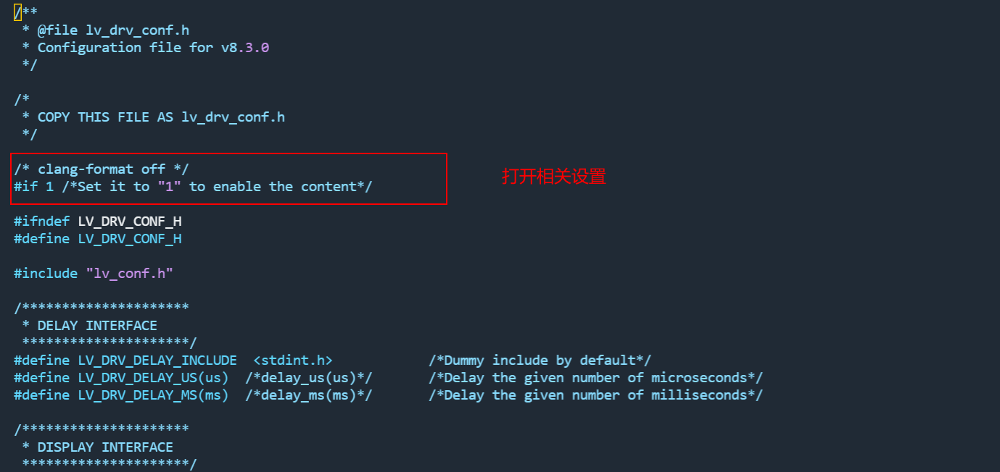
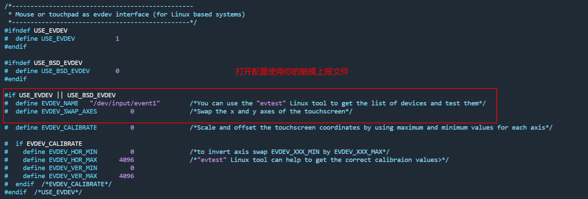
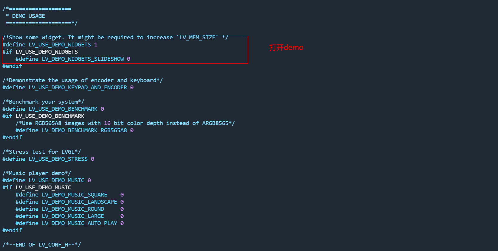
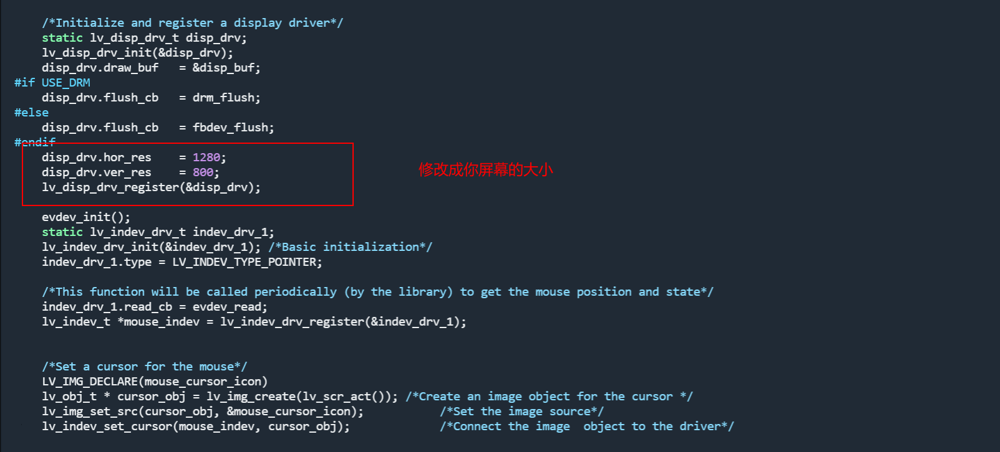
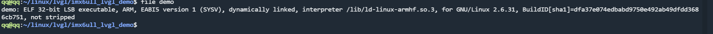

<h1>1 ：准备工作</h1>

硬件：正点原子的Imx6ull开发板

环境：ubuntu18.0

lvgl软件地址：<a href="git@gitee.com:qian-qiang/imx6ull_lvgl_demo.git" target="_blank" rel="noopener">git@gitee.com:qian-qiang/imx6ull_lvgl_demo.git</a>

<h1>2：git 厂库修改文件</h1>

2.1：修改文件lv_drv_config.h

2.2：修改文件lv_conf.h

2.3：修改文件main.c

<h1>3：make</h1>

由于环境的问题 make过程中可能有问题 上百度应该改都能解决 最后生成demo文件&nbsp;

<h1>4：scp到开发板运行即可</h1>

&nbsp;

&nbsp;

