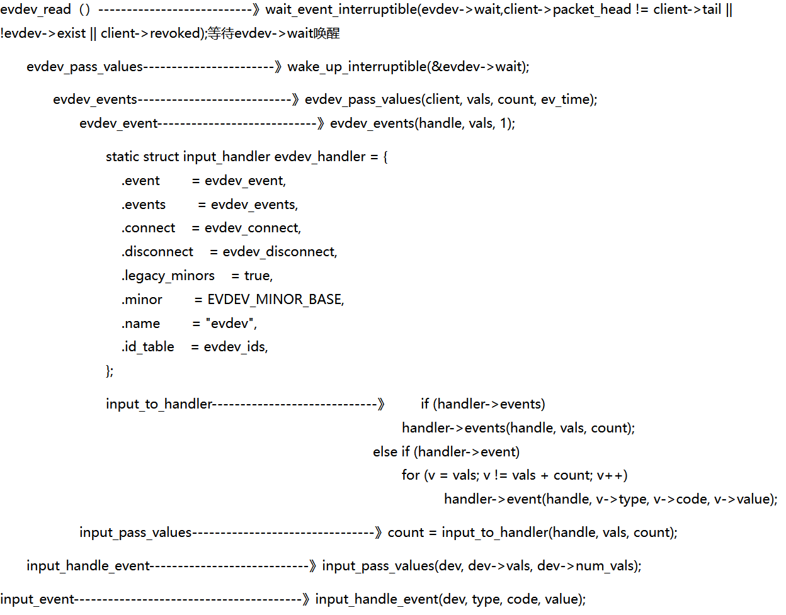

<ul>
<li>
<h5>Input driver ：主要实现对硬件设备的读写访问，中断设置，并把硬件产生的事件转换为核心层定义的规范提交给事件处理层。</h5>
</li>
<li>
<h5>Input core ：承上启下。为设备驱动层提供了规范和接口；通知事件处理层对事件进行处理；</h5>
</li>
<li>
<h5>Event handler ：提供用户编程的接口（设备节点），并处理驱动层提交的数据处理。</h5>
</li>
</ul>

<h1>1输入子系统框架分析</h1>

<h2>1.1设备驱动层（Input driver）</h2>
<ul>
<li>device是纯硬件操作层，包含不同的硬件接口处理，如gpio等</li>
<li>对于每种不同的具体硬件操作，都对应着不同的input_dev结构体</li>
<li>该结构体内部也包含着一个h_list，指向handle</li>
</ul>

<h2>1.2.系统核心层（Input core）</h2>
<ul>
<li>申请主设备号;</li>
<li>提供input_register_device跟input_register_handler函数分别用于注册device跟handler;</li>
<li>提供input_register_handle函数用于注册一个事件处理，代表一个成功配对的input_dev和input_handler;</li>
</ul>

<h2>1.3.事件处理层（Event handler）</h2>
<ul>
<li>不涉及硬件方面的具体操作，handler层是纯软件层，包含不同的解决方案，如键盘，鼠标，游戏手柄等；</li>
<li>对于不同的解决方案，都包含一个名为input_handler的结构体，该结构体内含的主要成员如下：</li>
</ul>
<table>
<thead>
<tr><th>成员</th><th>功能</th></tr>
</thead>
<tbody>
<tr>
<td>.id_table</td>
<td>一个存放该handler所支持的设备id的表（其实内部存放的是EV_xxx事件,用于判断device是否支持该事件）</td>
</tr>
<tr>
<td>.fops</td>
<td>该handler的file_operation</td>
</tr>
<tr>
<td>.connect</td>
<td>连接该handler跟所支持device的函数</td>
</tr>
<tr>
<td>.disconnect</td>
<td>断开该连接</td>
</tr>
<tr>
<td>.event</td>
<td>事件处理函数，让device调用</td>
</tr>
<tr>
<td>h_list</td>
<td>是一个链表，该链表保存着该handler到所支持的所有device的中间站：handle结构体的指针</td>
</tr>
</tbody>
</table>

<h1>2.两条链表连接dev和handler</h1>
<pre>
	<code class="yaml">
#file pwd: drivers/input/input.c
MODULE_AUTHOR("Vojtech Pavlik <vojtech@suse.cz>");
MODULE_DESCRIPTION("Input core");
MODULE_LICENSE("GPL");
#define INPUT_MAX_CHAR_DEVICES        1024
#define INPUT_FIRST_DYNAMIC_DEV        256
static DEFINE_IDA(input_ida);
static LIST_HEAD(input_dev_list);
static LIST_HEAD(input_handler_list);
  </code>
</pre> 
在input.c文件中两个全局链表input_handler_list和input_dev_list，通过handle相互关联：

&nbsp;

<h1>3.输入子系统代码分析</h1>

文件路径：driver/input/input.c （核心层）

<pre>
	<code class="yaml">
static int __init input_init(void)
{
    int err;
    err = class_register(&input_class);  //在/sys/class下创建逻辑（input）类，在类下面挂载input设备
    if (err) {
        pr_err("unable to register input_dev class\n");
        return err;
    }
    err = input_proc_init();　　//在/proc下面建立相关的虚拟文件，proc下创建的文件可以看作是虚拟文件对内核读写的一种操作
    if (err)
        goto fail1;
    err = register_chrdev_region(MKDEV(INPUT_MAJOR, 0),//在/dev下创建input设备号
                     INPUT_MAX_CHAR_DEVICES, "input");
    if (err) {
        pr_err("unable to register char major %d", INPUT_MAJOR);
        goto fail2;
    }
    return 0;
 fail2:    input_proc_exit();
 fail1:    class_unregister(&input_class);
    return err;
}
static void __exit input_exit(void)
{
    input_proc_exit();
    unregister_chrdev_region(MKDEV(INPUT_MAJOR, 0),
                 INPUT_MAX_CHAR_DEVICES);
    class_unregister(&input_class);
}
subsys_initcall(input_init);
module_exit(input_exit);
  </code>
</pre> 

现在基本框架已经建成，如何往input系统里面注册dev和hanlder呢？

<h2>3.1注册dev</h2>
<pre>
	<code class="yaml">
/**
 * struct input_dev - represents an input device
 * @name: name of the device
 * @phys: physical path to the device in the system hierarchy
 * @uniq: unique identification code for the device (if device has it)
 * @id: id of the device (struct input_id)
 * @propbit: bitmap of device properties and quirks
 * @evbit: bitmap of types of events supported by the device (EV_KEY,
 *    EV_REL, etc.)
 * @keybit: bitmap of keys/buttons this device has
 * @relbit: bitmap of relative axes for the device
 * @absbit: bitmap of absolute axes for the device
 * @mscbit: bitmap of miscellaneous events supported by the device
 * @ledbit: bitmap of leds present on the device
 * @sndbit: bitmap of sound effects supported by the device
 * @ffbit: bitmap of force feedback effects supported by the device
 * @swbit: bitmap of switches present on the device
 * @hint_events_per_packet: average number of events generated by the
 *    device in a packet (between EV_SYN/SYN_REPORT events). Used by
 *    event handlers to estimate size of the buffer needed to hold
 *    events.
 * @keycodemax: size of keycode table
 * @keycodesize: size of elements in keycode table
 * @keycode: map of scancodes to keycodes for this device
 * @getkeycode: optional legacy method to retrieve current keymap.
 * @setkeycode: optional method to alter current keymap, used to implement
 *    sparse keymaps. If not supplied default mechanism will be used.
 *    The method is being called while holding event_lock and thus must
 *    not sleep
 * @ff: force feedback structure associated with the device if device
 *    supports force feedback effects
 * @repeat_key: stores key code of the last key pressed; used to implement
 *    software autorepeat
 * @timer: timer for software autorepeat
 * @rep: current values for autorepeat parameters (delay, rate)
 * @mt: pointer to multitouch state
 * @absinfo: array of &struct input_absinfo elements holding information
 *    about absolute axes (current value, min, max, flat, fuzz,
 *    resolution)
 * @key: reflects current state of device's keys/buttons
 * @led: reflects current state of device's LEDs
 * @snd: reflects current state of sound effects
 * @sw: reflects current state of device's switches
 * @open: this method is called when the very first user calls
 *    input_open_device(). The driver must prepare the device
 *    to start generating events (start polling thread,
 *    request an IRQ, submit URB, etc.)
 * @close: this method is called when the very last user calls
 *    input_close_device().
 * @flush: purges the device. Most commonly used to get rid of force
 *    feedback effects loaded into the device when disconnecting
 *    from it
 * @event: event handler for events sent _to_ the device, like EV_LED
 *    or EV_SND. The device is expected to carry out the requested
 *    action (turn on a LED, play sound, etc.) The call is protected
 *    by @event_lock and must not sleep
 * @grab: input handle that currently has the device grabbed (via
 *    EVIOCGRAB ioctl). When a handle grabs a device it becomes sole
 *    recipient for all input events coming from the device
 * @event_lock: this spinlock is is taken when input core receives
 *    and processes a new event for the device (in input_event()).
 *    Code that accesses and/or modifies parameters of a device
 *    (such as keymap or absmin, absmax, absfuzz, etc.) after device
 *    has been registered with input core must take this lock.
 * @mutex: serializes calls to open(), close() and flush() methods
 * @users: stores number of users (input handlers) that opened this
 *    device. It is used by input_open_device() and input_close_device()
 *    to make sure that dev->open() is only called when the first
 *    user opens device and dev->close() is called when the very
 *    last user closes the device
 * @going_away: marks devices that are in a middle of unregistering and
 *    causes input_open_device*() fail with -ENODEV.
 * @dev: driver model's view of this device
 * @h_list: list of input handles associated with the device. When
 *    accessing the list dev->mutex must be held
 * @node: used to place the device onto input_dev_list
 * @num_vals: number of values queued in the current frame
 * @max_vals: maximum number of values queued in a frame
 * @vals: array of values queued in the current frame
 * @devres_managed: indicates that devices is managed with devres framework
 *    and needs not be explicitly unregistered or freed.
 */
struct input_dev {
    const char *name;
    const char *phys;
    const char *uniq;
    struct input_id id;
    unsigned long propbit[BITS_TO_LONGS(INPUT_PROP_CNT)];
    unsigned long evbit[BITS_TO_LONGS(EV_CNT)];
    unsigned long keybit[BITS_TO_LONGS(KEY_CNT)];
    unsigned long relbit[BITS_TO_LONGS(REL_CNT)];
    unsigned long absbit[BITS_TO_LONGS(ABS_CNT)];
    unsigned long mscbit[BITS_TO_LONGS(MSC_CNT)];
    unsigned long ledbit[BITS_TO_LONGS(LED_CNT)];
    unsigned long sndbit[BITS_TO_LONGS(SND_CNT)];
    unsigned long ffbit[BITS_TO_LONGS(FF_CNT)];
    unsigned long swbit[BITS_TO_LONGS(SW_CNT)];
    unsigned int hint_events_per_packet;
    unsigned int keycodemax;
    unsigned int keycodesize;
    void *keycode;
    int (*setkeycode)(struct input_dev *dev,
              const struct input_keymap_entry *ke,
              unsigned int *old_keycode);
    int (*getkeycode)(struct input_dev *dev,
              struct input_keymap_entry *ke);
    struct ff_device *ff;
    unsigned int repeat_key;
    struct timer_list timer;
    int rep[REP_CNT];
    struct input_mt *mt;
    struct input_absinfo *absinfo;
    unsigned long key[BITS_TO_LONGS(KEY_CNT)];
    unsigned long led[BITS_TO_LONGS(LED_CNT)];
    unsigned long snd[BITS_TO_LONGS(SND_CNT)];
    unsigned long sw[BITS_TO_LONGS(SW_CNT)];
    int (*open)(struct input_dev *dev);
    void (*close)(struct input_dev *dev);
    int (*flush)(struct input_dev *dev, struct file *file);
    int (*event)(struct input_dev *dev, unsigned int type, unsigned int code, int value);
    struct input_handle __rcu *grab;
    spinlock_t event_lock;
    struct mutex mutex;
    unsigned int users;
    bool going_away;
    struct device dev;
    struct list_head    h_list;
    struct list_head    node;
    unsigned int num_vals;
    unsigned int max_vals;
    struct input_value *vals;
    bool devres_managed;
};
#define to_input_dev(d) container_of(d, struct input_dev, dev)
  </code>
</pre> 

&nbsp;

&nbsp;
<pre>
	<code class="yaml">
/**
 * input_register_device - register device with input core
 * @dev: device to be registered
 *
 * This function registers device with input core. The device must be
 * allocated with input_allocate_device() and all it's capabilities
 * set up before registering.
 * If function fails the device must be freed with input_free_device().
 * Once device has been successfully registered it can be unregistered
 * with input_unregister_device(); input_free_device() should not be
 * called in this case.
 *
 * Note that this function is also used to register managed input devices
 * (ones allocated with devm_input_allocate_device()). Such managed input
 * devices need not be explicitly unregistered or freed, their tear down
 * is controlled by the devres infrastructure. It is also worth noting
 * that tear down of managed input devices is internally a 2-step process:
 * registered managed input device is first unregistered, but stays in
 * memory and can still handle input_event() calls (although events will
 * not be delivered anywhere). The freeing of managed input device will
 * happen later, when devres stack is unwound to the point where device
 * allocation was made.
 */
int input_register_device(struct input_dev *dev)
{
    struct input_devres *devres = NULL;
     /* 输入事件的处理接口指针，用于和设备的事件类型进行匹配 */
    struct input_handler *handler;
    unsigned int packet_size;
    const char *path;
    int error;
    if (dev->devres_managed) {
        devres = devres_alloc(devm_input_device_unregister,
                      sizeof(struct input_devres), GFP_KERNEL);
        if (!devres)
            return -ENOMEM;
        devres->input = dev;
    }
    /* Every input device generates EV_SYN/SYN_REPORT events. */
    __set_bit(EV_SYN, dev->evbit);
    /* KEY_RESERVED is not supposed to be transmitted to userspace. */
    __clear_bit(KEY_RESERVED, dev->keybit);
    /* Make sure that bitmasks not mentioned in dev->evbit are clean. */
    input_cleanse_bitmasks(dev);
    packet_size = input_estimate_events_per_packet(dev);
    if (dev->hint_events_per_packet < packet_size)
        dev->hint_events_per_packet = packet_size;
    dev->max_vals = dev->hint_events_per_packet + 2;
    dev->vals = kcalloc(dev->max_vals, sizeof(*dev->vals), GFP_KERNEL);
    if (!dev->vals) {
        error = -ENOMEM;
        goto err_devres_free;
    }
    /*
     * If delay and period are pre-set by the driver, then autorepeating
     * is handled by the driver itself and we don't do it in input.c.
     */
    if (!dev->rep[REP_DELAY] && !dev->rep[REP_PERIOD]) {
        dev->timer.data = (long) dev;
        dev->timer.function = input_repeat_key;
        dev->rep[REP_DELAY] = 250;
        dev->rep[REP_PERIOD] = 33;
    }
    if (!dev->getkeycode)
        dev->getkeycode = input_default_getkeycode;
    if (!dev->setkeycode)
        dev->setkeycode = input_default_setkeycode;
    error = device_add(&dev->dev);
    if (error)
        goto err_free_vals;
    path = kobject_get_path(&dev->dev.kobj, GFP_KERNEL);
    pr_info("%s as %s\n",
        dev->name ? dev->name : "Unspecified device",
        path ? path : "N/A");
    kfree(path);
    error = mutex_lock_interruptible(&input_mutex);
    if (error)
        goto err_device_del;
    /* 重要:把设备挂到全局的input子系统设备链表input_dev_list上 */
    list_add_tail(&dev->node, &input_dev_list);
    /* 核心重点，input设备在增加到input_dev_list链表上之后，会查找
     * input_handler_list事件处理链表上的handler进行匹配，这里的匹配
     * 方式与设备模型的device和driver匹配过程很相似*/
    list_for_each_entry(handler, &input_handler_list, node)
        input_attach_handler(dev, handler);/*遍历input_handler_list，通过input_match_device试图与每一个handler进行匹配 匹配上了就使用connect连接*/
    /*
    static int input_attach_handler(struct input_dev *dev, struct input_handler *handler)
    {
        const struct input_device_id *id;
        int error;

        id = input_match_device(handler, dev);
        if (!id)
            return -ENODEV;
        error = handler->connect(handler, dev, id);
        if (error && error != -ENODEV)
            pr_err("failed to attach handler %s to device %s, error: %d\n",
                   handler->name, kobject_name(&dev->dev.kobj), error);
        return error;
    }
    */
    input_wakeup_procfs_readers();
    mutex_unlock(&input_mutex);
    if (dev->devres_managed) {
        dev_dbg(dev->dev.parent, "%s: registering %s with devres.\n",
            __func__, dev_name(&dev->dev));
        devres_add(dev->dev.parent, devres);
    }
    return 0;
err_device_del:
    device_del(&dev->dev);
err_free_vals:
    kfree(dev->vals);
    dev->vals = NULL;
err_devres_free:
    devres_free(devres);
    return error;
}
EXPORT_SYMBOL(input_register_device);
  </code>
</pre> 
<h2>3.2注册handler</h2>

一般handler不需要我们自己写 内核里面已经有了很多的hanlder基本够用

下面以Evdev为例，来分析事件处理层。 
vim drivers/input/evdev.c

<pre>
	<code class="yaml">
static const struct input_device_id evdev_ids[] = {
    { .driver_info = 1 },    /* Matches all devices */
    { },            /* Terminating zero entry */
};
MODULE_DEVICE_TABLE(input, evdev_ids);
static struct input_handler evdev_handler = {
    .event        = evdev_event,
    .events        = evdev_events,
    .connect    = evdev_connect,
    .disconnect    = evdev_disconnect,
    .legacy_minors    = true,
    .minor        = EVDEV_MINOR_BASE,
    .name        = "evdev",
    .id_table    = evdev_ids,
};
static int __init evdev_init(void)
{
    return input_register_handler(&evdev_handler);
}
static void __exit evdev_exit(void)
{
    input_unregister_handler(&evdev_handler);
}
module_init(evdev_init);
module_exit(evdev_exit);
MODULE_AUTHOR("Vojtech Pavlik <vojtech@ucw.cz>");
MODULE_DESCRIPTION("Input driver event char devices");
MODULE_LICENSE("GPL");  
  </code>
</pre>  

注册的handler可以在proc/bus/input/danlder中查看到

<pre>
	<code class="yaml">
/**
* input_register_handler - register a new input handler
* @handler: handler to be registered
*
* This function registers a new input handler (interface) for input
* devices in the system and attaches it to all input devices that
* are compatible with the handler.
*/
int input_register_handler(struct input_handler *handler)
{
     struct input_dev *dev;
     int error;
     error = mutex_lock_interruptible(&input_mutex);
     if (error)
         return error;
 
     INIT_LIST_HEAD(&handler->h_list);
 　　/* `重要`:把设备处理器挂到全局的input子系统设备链表input_handler_list上 */ 
     list_add_tail(&handler->node, &input_handler_list);
 　　/*遍历input_dev_list，试图与每一个input_dev进行匹配*/
     list_for_each_entry(dev, &input_dev_list, node)
         input_attach_handler(dev, handler);　　　　/*static int input_attach_handler(struct input_dev *dev, struct input_handler *handler)
{
    const struct input_device_id *id;
    int error;
    ........
    ........
    input_wakeup_procfs_readers();
    mutex_unlock(&input_mutex);
    return 0;
}
EXPORT_SYMBOL(input_register_handler);
  </code>
</pre>  

这个过程和注册dev及其相似

<h2>3.3 handler的connect函数</h2><pre>
	<code class="yaml">
static int evdev_connect(struct input_handler *handler, struct input_dev *dev,
             const struct input_device_id *id)
{
    struct evdev *evdev;
    int minor;
    int dev_no;
    int error;
    /*申请一个新的次设备号*/
    minor = input_get_new_minor(EVDEV_MINOR_BASE, EVDEV_MINORS, true);
    /* 这说明内核已经没办法再分配这种类型的设备了 */
    if (minor < 0) {
        error = minor;
        pr_err("failed to reserve new minor: %d\n", error);
        return error;
    }
    /* 开始给evdev事件层驱动分配空间了 */
    evdev = kzalloc(sizeof(struct evdev), GFP_KERNEL);
    if (!evdev) {
        error = -ENOMEM;
        goto err_free_minor;
    }
        /* 初始化client_list列表和evdev_wait队列 */
    INIT_LIST_HEAD(&evdev->client_list);
    spin_lock_init(&evdev->client_lock);
    mutex_init(&evdev->mutex);
    init_waitqueue_head(&evdev->wait);
    evdev->exist = true;
    dev_no = minor;
    /* Normalize device number if it falls into legacy range */
    if (dev_no < EVDEV_MINOR_BASE + EVDEV_MINORS)
        dev_no -= EVDEV_MINOR_BASE;
    /*设置设备节点名称，/dev/eventX 就是在此时设置*/
    dev_set_name(&evdev->dev, "event%d", dev_no);
    /* 初始化evdev结构体，其中handle为输入设备和事件处理的关联接口 */
    evdev->handle.dev = input_get_device(dev);
    evdev->handle.name = dev_name(&evdev->dev);
    evdev->handle.handler = handler;
    evdev->handle.private = evdev;
      /*设置设备号，应用层就是通过设备号，找到该设备的*/
    evdev->dev.devt = MKDEV(INPUT_MAJOR, minor);
    evdev->dev.class = &input_class;
    evdev->dev.parent = &dev->dev;
    evdev->dev.release = evdev_free;
    device_initialize(&evdev->dev);
     /* input_dev设备驱动和handler事件处理层的关联，就在这时由handle完成 */
    error = input_register_handle(&evdev->handle);
    if (error)
        goto err_free_evdev;
    cdev_init(&evdev->cdev, &evdev_fops);
    evdev->cdev.kobj.parent = &evdev->dev.kobj;
    error = cdev_add(&evdev->cdev, evdev->dev.devt, 1);
    if (error)
        goto err_unregister_handle;
    /*将设备加入到Linux设备模型，它的内部将找到它的bus，然后让它的bus
    给它找到它的driver，在驱动或者总线的probe函数中，一般会在/dev/目录
    先创建相应的设备节点，这样应用程序就可以通过该设备节点来使用设备了
    ，/dev/eventX 设备节点就是在此时生成
    */
    error = device_add(&evdev->dev);
    if (error)
        goto err_cleanup_evdev;
    return 0;
 err_cleanup_evdev:
    evdev_cleanup(evdev);
 err_unregister_handle:
    input_unregister_handle(&evdev->handle);
 err_free_evdev:
    put_device(&evdev->dev);
 err_free_minor:
    input_free_minor(minor);
    return error;
}
  </code>
</pre>   

over

<h1>4.应用层的角度分析到底层</h1>

显然，就是input_dev通过输入核心为驱动层提供统一的接口，<code>input_event</code>，来向事件处理层上报数据并唤醒。

