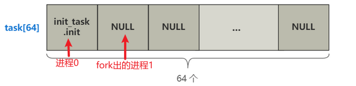

<blockquote>

linux内核版本0.11

</blockquote>
<h1>1：main</h1>

首先选出一号选手main函数，代码上和线程相关的主要是以下代码

<pre>
	<code class="yaml">
    void main(void) {    
    move_to_user_mode();
    if (!fork()) {
        init();
    }
    for(;;) pause();
}</code>
</pre>
<h1>&nbsp;2：<strong>move_to_user_mode</strong></h1>

这行代码的意思直接说非常简单，就是<strong>从内核态转变为了用户态</strong>

&nbsp;

<pre>
	<code class="yaml">
	#define move_to_user_mode() \
	__asm__ ("movl %%esp,%%eax\n\t" \
	"pushl $0x17\n\t" \
	"pushl %%eax\n\t" \
	"pushfl\n\t" \
	"pushl $0x0f\n\t" \
	"pushl $1f\n\t" \
	"iret\n" \
	"1:\tmovl $0x17,%%eax\n\t" \
	"movw %%ax,%%ds\n\t" \
	"movw %%ax,%%es\n\t" \
	"movw %%ax,%%fs\n\t" \
	"movw %%ax,%%gs" \
	:::"ax")
</code>
</pre>
<h1>&nbsp;3：fork</h1>

fork函数是被系统调用使用的 具体路径如下：

main.c:static inline _syscall0（int,fork）将fork绑定到_sys_fork

　　system_call.s:_sys_fork:（调用函数_find_empty_process和_copy_process）

总结作用：

1：在task链表中找到一个进程空位并存放当前的进程（_find_empty_process）

2：创建一个tsak_struct

3：设置task_struct（_copy_process）

这里就出现一个概念：由于我们现在只有 0 号进程，且 task[] 除了 0 号索引位置，其他地方都是空的，所以这个方法运行完，last_pid 就是 1，也就是新进程被分配的 pid 就是 1

<h1>4:init()</h1>
<pre>
	<code class="yaml">
	void init(void)
	{
		int pid,i;
		setup((void *) &amp;drive_info);
		(void) open("/dev/tty0",O_RDWR,0); //打开tty0 标准输入控制台
		(void) dup(0);//打开tty0 标准输出控制台
		(void) dup(0);//打开标准错误控制台
		printf("%d buffers = %d bytes buffer space\n\r",NR_BUFFERS,
			NR_BUFFERS*BLOCK_SIZE);
		printf("Free mem: %d bytes\n\r",memory_end-main_memory_start);
		//又创建一个进程（2号进程） 　　　　 if (!(pid=fork())) {
			close(0);
			if (open("/etc/rc",O_RDONLY,0)) ///etc/rc文件
				_exit(1);
			execve("/bin/sh",argv_rc,envp_rc);//执行sh
			_exit(2);
		}
		if (pid&gt;0)
			while (pid != wait(&amp;i))//等待父进程退出
				/* nothing */;
		while (1) { 　　　　　　　　 //又创建一个进程 主要是害怕上面的进程创建失败 再创建一次
			if ((pid=fork())&lt;0) {
				printf("Fork failed in init\r\n");
				continue;
			}
			if (!pid) {
				close(0);close(1);close(2);
				setsid();
				(void) open("/dev/tty0",O_RDWR,0);
				(void) dup(0);
				(void) dup(0);
				_exit(execve("/bin/sh",argv,envp));
			}
			while (1)
				if (pid == wait(&amp;i))  //等待父进程退出 但是零号进程不可能退出
					break;
			printf("\n\rchild %d died with code %04x\n\r",pid,i);
			sync();
		}
		_exit(0);	/* NOTE! _exit, not exit() */
	}
</code>
</pre>

&nbsp;总结

1：打开标准输出 输入 错误控制台的句柄

2：创建2号进程 并在中执行etc/rc文件 执行sh程序

3：零号进程不可能退出 如果退出就执行for(;;) pause();

&nbsp;

目前为止main函数的执行完成 具体逻辑如下：

&nbsp;

<strong>Q:进程如何调度的</strong>

不知道你是否还记得，定时器和时钟中断，再mian函数的前面执行了讲的 sched_init 函数。

<pre>
	<code class="yaml">
	schedule.c
	#define HZ 100
</pre>

这个间隔时间被设置为 10 ms，也就是 100 Hz。 发起的中断叫时钟中断，其中断向量号被设置为了timer_interrupt 。这样，中断来临时，CPU 会查找到中断处理函数，并跳转过去执行。

<pre>
	<code class="yaml">
	system_call.s
	_timer_interrupt:
    ...
    // 增加系统滴答数
    incl _jiffies
    ...
    // 调用函数 do_timer
    call _do_timer
    ...
</code>
</pre>

&nbsp;这个函数做了两件事，一个是将<strong>系统滴答数</strong>这个变量 <strong>jiffies</strong> 加一，一个是调用了另一个函数 <strong>do_timer</strong>。

<pre>
	<code class="yaml">
	sched.c
	void do_timer(long cpl) {
    ...
    // 当前线程还有剩余时间片，直接返回
    if ((--current-&gt;counter)&gt;0) return;
    // 若没有剩余时间片，调度
    schedule();
}
</code>
</pre>

&nbsp;do_timer 最重要的部分就是上面这段代码，非常简单。

首先将当先进程的时间片 -1，然后判断：

如果时间片仍然大于零，则什么都不做直接返回。

如果时间片已经为零，则调用 schedule()，很明显，这就是进行进程调度的主干。

<pre>
	<code class="yaml">
	void schedule(void) {
		int i, next, c;
		struct task_struct ** p;
		...
		while (1) {
			c = -1;
			next = 0;
			i = NR_TASKS;
			p = &amp;task[NR_TASKS];
			while (--i) {
				if (!*--p)
					continue;
				if ((*p)-&gt;state == TASK_RUNNING &amp;&amp; (*p)-&gt;counter &gt; c)
					c = (*p)-&gt;counter, next = i;
			}
			if (c) break;
			for(p = &amp;LAST_TASK ; p &gt; &amp;FIRST_TASK ; --p)
				if (*p)
					(*p)-&gt;counter = ((*p)-&gt;counter &gt;&gt; 1) +
							(*p)-&gt;priority;
		}
		switch_to(next);
}
</code>
</pre>

&nbsp;很简答，这个函数就做了三件事：

<strong>1.</strong> 拿到剩余时间片（counter的值）最大且在 runnable 状态（state = 0）的进程号 next。

<strong>2.</strong> 如果所有 runnable 进程时间片都为 0，则将所有进程（注意不仅仅是 runnable 的进程）的 counter 重新赋值（counter = counter/2 + priority），然后再次执行步骤 1。

<strong>3.</strong> 最后拿到了一个进程号 next，调用了 switch_to(next) 这个方法，就切换到了这个进程去执行了。

&nbsp;总结一下：

罪魁祸首的，就是那个每 10ms 触发一次的定时器滴答。

而这个滴答将会给 CPU 产生一个时钟中断信号。

而这个中断信号会使 CPU 查找中断向量表，找到操作系统写好的一个时钟中断处理函数 do_timer。

do_timer 会首先将当前进程的 counter 变量 -1，如果 counter 此时仍然大于 0，则就此结束。

但如果 counter = 0 了，就开始进行进程的调度。

进程调度就是找到所有处于 RUNNABLE 状态的进程，并找到一个 counter 值最大的进程，把它丢进 switch_to 函数的入参里。

switch_to 这个终极函数，会保存当前进程上下文，恢复要跳转到的这个进程的上下文，同时使得 CPU 跳转到这个进程的偏移地址处。

接着，这个进程就舒舒服服地运行了起来，等待着下一次时钟中断的来临。

&nbsp;

&nbsp;

&nbsp;

&nbsp;

