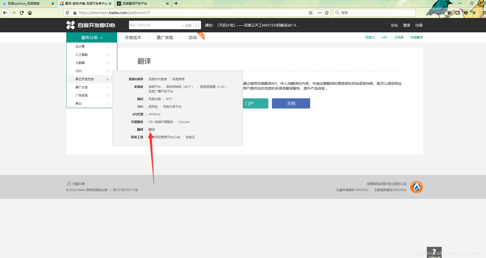
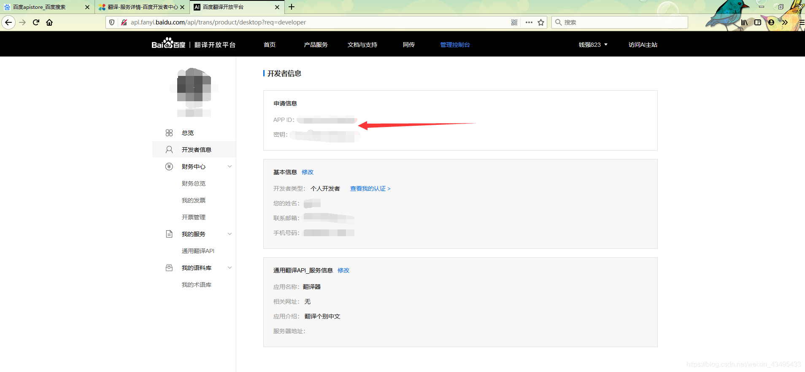
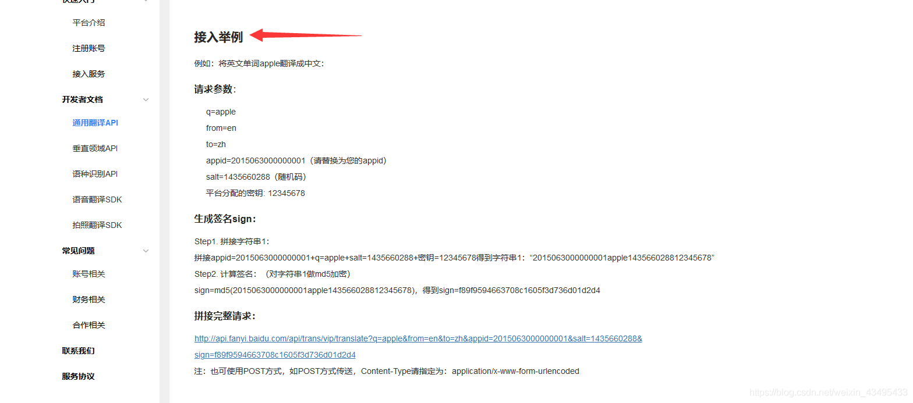

  API 在python中就相当于一串代码，我们直接调用结果就够了，今天我们使用百度API打造自己的翻译小可爱。
  百度搜索：百度apistore
  
  进入后点击翻译
  
  接下来各位就可以探索了，注册的艰巨任务就交给你们了。
  注册后出现以下数据就ok了
  我们参考百度api的文档与支持里面的开发者文档的通用翻译API里面有使用的方法，如图
  大概的看下说明文档一下代码就可以很好的理解了 ，接下来直接代码分析
  

```python
import random
import hashlib
import urllib
import requests
import json                                               #安装相应的库


src = 'zh'                                                #翻译的源语言
obj = 'en'                                                #翻译的目标语言
appid = 'xxxxxxxxxxx'                                     #这里输入你注册后得到的appid
secretKey = 'xxxxxxxxxx'                                  #这里输入你注册后得到的密匙       

myurl = 'http://api.fanyi.baidu.com/api/trans/vip/translate'                  #必须加上的头
word= input('请输入你要翻译的中文：')                                           #输入你要翻译的中文
salt = random.randint(31256, 66253)                                           #产生随计数

sign = appid + word + str(salt) + secretKey                                   #文档的step1拼接字符串
m1 = hashlib.md5()
m1.update(sign.encode('utf-8'))
sign = m1.hexdigest()                                                         #文档的step2计算签名
myur1 = myurl  + '?q=' + urllib.parse.quote(
    word) + '&from=' + src + '&to=' + obj + '&appid='+ appid + '&salt=' + str(salt) + '&sign=' + sign
print (myur1)                                                                 #生成的url并打印出来
english_data = requests.get(myur1)                                            #请求url
js_data = json.loads(english_data.text)                                       #下载json数据
content = js_data['trans_result'][0]['dst']                                   #提取json数据里面的dst
print (content)                                                               #打印出翻译的英文
```

这是运行的结构；其中翻译的url点击进去就会跳到浏览器里面 如图：

里面的数据其实是字典结构的我们使用json的库提取其中的dst就是我们需要的翻译结果

