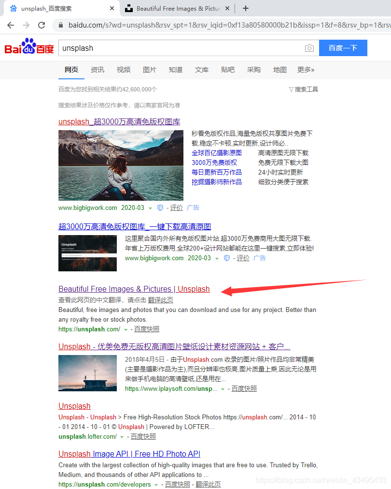
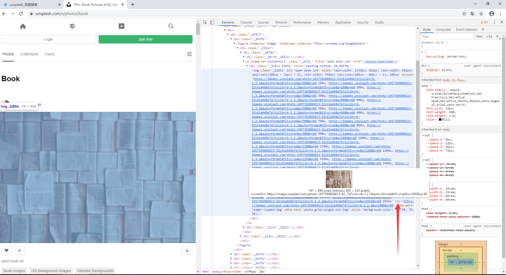

废话不多说直接上货

```python
from bs4 import BeautifulSoup          #网页解析库
import requests                        #网页请求库
import json                            #json数据解析库
import random                          #随机数产生库
import hashlib                         #MD5加密算法的模块
import urllib                          #python自带的http请求库

list = []                              #存放图片的网站

headers ={
    'accept':'text/html,application/xhtml+xml,application/xml;q=0.9,image/webp,*/*;q=0.8',
    'User-Agent':'Mozilla/5.0 (Windows NT 10.0; Win64; x64; rv:73.0) Gecko/20100101 Firefox/73.0'
}                                      #我用的是Firefox浏览器伪造请求头
def baidu_translate(text, fromLang='zh', toLang='en'):                    #中文翻译函数（不懂请看下面链接）
    appid = 'xxxxxxxxxxxxxx'                                              #每个账号的appid
    secretKey = 'xxxxxxxxxxxxx'                                           #每个账号的钥匙

    myurl = 'http://api.fanyi.baidu.com/api/trans/vip/translate'          #百度翻译必须带上的头部
    q = text                                                              #需要翻译的中文
    salt = random.randint(32768, 65536)                                   #salt是产生的随机数

    sign = appid + q + str(salt) + secretKey                              #拼接字符串1
    m1 = hashlib.md5()                                                 
    m1.update(sign.encode('utf-8'))                             
    sign = m1.hexdigest()                                                 #mdk5加密生成的计算签名
    myur1 = myurl  + '?q=' + urllib.parse.quote(
        q) + '&from=' + fromLang + '&to=' + toLang + '&appid='+ appid + '&salt=' + str(salt) + '&sign=' + sign                                     #拼接字符串1+mdk5加密生成的计算签名生产的翻译网页
    return myur1                                                          #函数返回翻译网页

url_path = 'https://unsplash.com/s/photos/'         #我爬取的是国外的unsplash网站的图片
word= input('请输入你要下载的图片：')                                      #输入中文要下载的图片
english_data = requests.get(baidu_translate(word))                       #请求百度翻译api的翻译                                          
js_data = json.loads(english_data.text)                                  #下载翻译网页返回的json数据                          
content = js_data['trans_result'][0]['dst']                              #提取其中的英文翻译
url = url_path + content + '/'                      #将英文翻译添加到图片网站上形成你要访问的图片主页

wb_data = requests.get(url,headers=headers)                              #请求图片网站数据
soup = BeautifulSoup(wb_data.text,'lxml')                                #解析数据
imgs = soup.select('a > div > img')                                      #定位到图片的网页地址

for img in imgs:                                                         #将所有的图片url都下载到list中
    photo = img.get('src')                                               #提取src节点的数据
    list.append(photo)                                                   #得到图片的url

path = 'C:/Users/qq/Pictures/Camera Roll/'                               #我的保存路径
for item in list:                                                        #读取每个图片的url
        data = requests.get(item,headers=headers)                        #请求url
        fp = open(path+item.split('?')[0][-27:]+'.jpg','wb')             #图片的名字
        fp.write(data.content)                                           #下载图片
        fp.close()                                                       #下载完成关闭图片
       


```
下面说下重点
1.百度翻译的实现过程，请看下面的文章：[百度API的使用方法](https://blog.csdn.net/weixin_43495433/article/details/104608087)
2.图片网站和图片的url：
   图片网站是指查找图片的网站!
   这个是图片的url