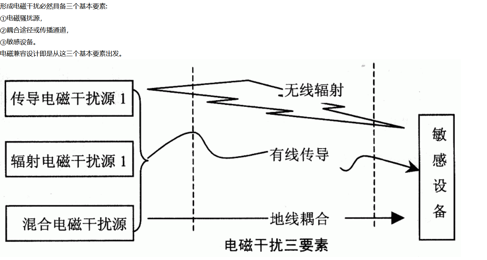
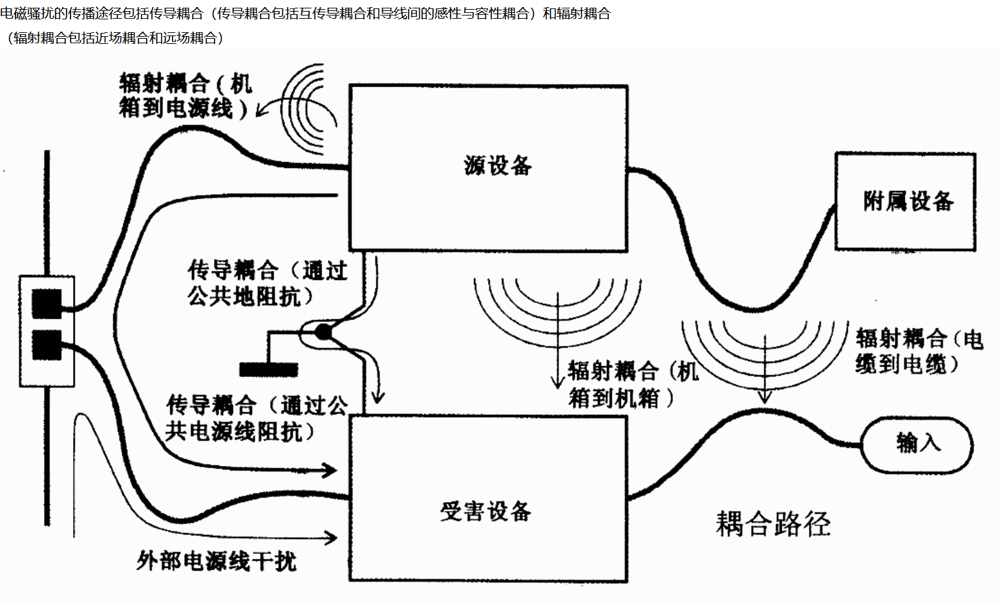
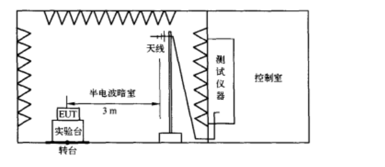
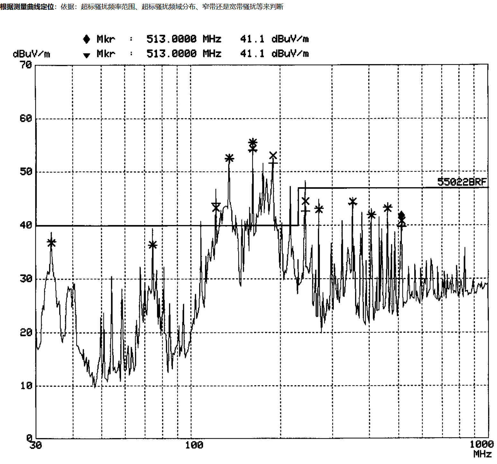
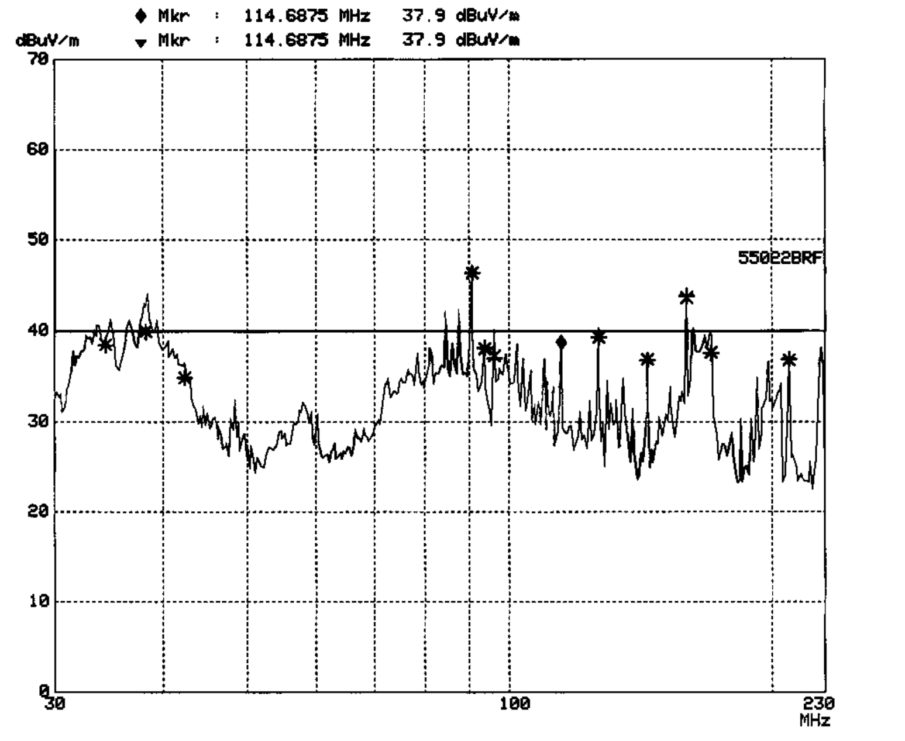
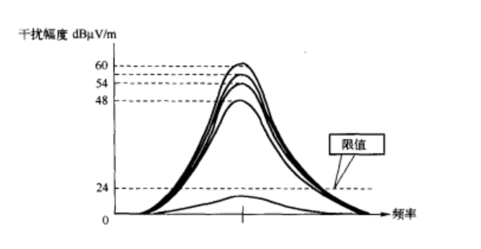
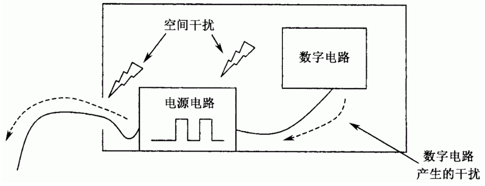
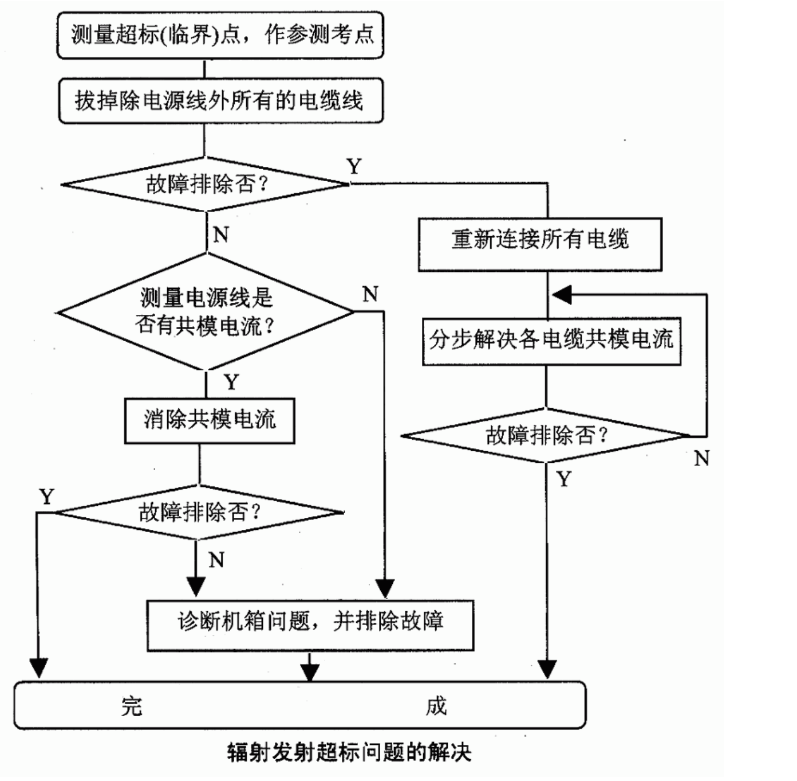

<blockquote>EMC=EMI+EMS</blockquote>
<h1>1：理论概念</h1>
<h2>1.1时域和频域</h2>

建议通过示波器的FFT变换去了解时域和频域的概念

<h2>1.2分贝</h2>

电磁兼容测试中常用单位：

&nbsp; 　　功率：Pdb=10lg(p1/p2) P2与P1应采用相同的单位。应该明确dB为两个量的比值，是无量纲的。 &nbsp;　　 电压:&nbsp; 同上 电压分贝常用&mu;V为单位 &nbsp; 　　电流：同上 以&mu;A为单位的电流。

　　&nbsp; 电场强度与磁场强度：H=E/Z  &nbsp; 　　功率密度：S=E X H&nbsp;&nbsp;&nbsp; 功率密度的基本单位为W/m2(电场强度V／m;磁场强度A/m), 功率密度的物理作用比较难理解 提供一个关系来理解：后面的db数值和一个叫自由空间波阻抗的概念有关

<pre>
	<code class="yaml">
在自由空间，功率密度S与电场强度E的关系化为分贝：
SdB（W/m2）=EdB（V/m） &ndash; 25.8dB    
SdB（mW/cm2）=EdB（&mu;V/m） &ndash; 155.8dB  
SdB（&mu;W/cm2）=EdB（&mu;V/m） &ndash; 125.8dB
    </code>
</pre>
<h2>&nbsp;1.3电场和磁场</h2>

高中概念E/H场正交同时传播 建议了解下<strong>天线模型</strong>

<h2>&nbsp;1.4共模和差模</h2>

电压和电流的变化通过通过导线传输时有两中形态，即&ldquo;差模&rdquo;和&ldquo;共模&rdquo; 。 这里我们把这两根线比喻成两个小人，一个MM，一个GG。来张图，形象点

这里是两个人MM和GG，他们俩都会飞，他们手牵手飞到离地面10米的位置，那他们对地的高度即为共模信号，当他们俩一个想飞高点一个想飞低点时，这时候他们牵着飞手就会感受到拉力，这就是差模信号。也就是说这两个人是对差模信号有响应的，对共模信号没有响应。理论上讲这两个人只对差模有响应而对共模没有响应。但你让这俩人往地底下飞试试，那就苦命鸳鸯，撞死了。地下不行就去遨游太空啊，行，还是苦命鸳鸯，没空气憋死了。所以共模信号也有一定的共模范围的。差模信号也有一定差模范围。

借助上面的比喻来系统理解下几个基础的概念：

<pre>
	<code class="yaml">
借助上面的比喻来系统理解下几个基础的概念：
共模电压：在每一导体和所规定的参照点之间（往往是大地或机架）出现的相量电压平均值。或者说同时加在电压表两测量端和规定公共端之间的那部分输出电压。

差模电压：一组规定的带电导体中任意两根之间的电压。使差模电压又称对称电压。

共模干扰：干扰电压在信号线及其回线（一般称为信号地线）上的幅度相同，这里的电压以附近任何一个物体（大地、金属机箱、参考地线板等）为参考电位，干扰电流回路则是在导线与参考物体构成的回路中流动。
简明说就是信号线到地的回路干扰。

差模干扰：干扰电压存在于信号线及其回线（一般称为信号地线）之间，干扰电流回路则是在导线与参考物体构成的回路中流动。
简明说就是信号线到信号线的回路干扰。
    </code>
</pre>
<h1>2：简介</h1>
<h2>2.1：电磁干扰形成的三要素</h2>

形成电磁干扰必然具备三个基本要素: ①电磁骚扰源， ②耦合途径或传播通道， ③敏感设备。 电磁兼容设计即是从这三个基本要素出发。 

所以我们可以从3个路径来解决emc问题：1干掉干扰源 2解决传播途径问题 3优化敏感设备

<h2>2.2：电磁骚扰的传播途径</h2>

电磁骚扰的传播途径包括传导耦合（传导耦合包括互传导耦合和导线间的感性与容性耦合）和辐射耦合 （辐射耦合包括近场耦合和远场耦合） 

<h1>3：EMC测试类型</h1>
<blockquote>

由于前几天做的是辐射测试这里只对EMI的辐射发射测试做分析介绍

</blockquote>

EMI测试项目包括：

1、辐射发射测试

2、传导发射测试

3、骚扰功率测试

4、电流谐波测试

5、电源谐波测量

6、闪烁测试

EMS测试项目包括：

1、静电放电抗扰度

2、射频电磁场抗扰度

3、电快速瞬变脉冲群抗扰度

4、冲击（包括雷击和浪涌）抗扰度

5、射频场感应传导抗扰度

6、工频磁场抗扰度试验

7、电压跌落短时中断和电压渐降抗扰度

具体测试方法请看《EMC设计与测试案列分析》

<h1>4：辐射发射测试</h1>
<h2>4.1辐射发射测试的目的</h2>

　　因为EMC设计及EMC问题的分析是建立在EMC测试的基础上的，所以有必要对EMC测试做简单的阐述。测试电子，电气和机电设备及其部件的辐射发射，包括来自所有组件、电缆及连接线上的辐射发射。它用来鉴定其辐射是否符合标准的要求，以致在正常使用过程中影响同一环境中的其他设备。

<h2>4.2 常用的辐射发射测试设备</h2>

根据常用传导骚扰测试标准CISPR16及EN55022的要求，辐射发射测试主要需要以下设备：

（1） EMI自动测试控制系统（电脑及其界面单元）；(2) EMI测试接收机;

（3）各式天线（主动、被动棒状天线、大小形状环路天线、功率双锥天线、对数螺旋天线、喇叭天线）及天线控制单元等；

&nbsp; (4)半电波暗室或开阔场。

EMI测试接收机是EMC测试中最常用的基本测试仪器，基于测试接收机的频率响应特性要求，按CISPR16标准规定，测试接收机应有四种基本检波方式，即准峰值检波、均方根值检波、峰值检波及平均值检波。然而，大多数电磁干扰都是脉冲干扰，它们对音频影响的客观效果随着重复频率的增高而增大，具有特定时间常数的准峰值检波器的输出特性，可以近似反映这种影响。

<h2>4.3 辐射发射的测试方法</h2>

下图是符合CISPR16及EN55022标准要求的辐射发射测试布置图。辐射发射测试时，被测设备（EUT）置于半电波暗室内部，并在转台上旋转，以找到最大的辐射点。辐射信号由接收天线接收后，通过电缆传到电波暗室外的接收机。

<h1>5：整改</h1>

<em><strong>常见的电磁兼容整改措施：</strong></em> &nbsp;　　对常见的电磁兼容问题，我们通过综合采用以下几个方面的整改措施，一般可以解决大部分的问题： 屏蔽问题： &nbsp;　　可以在屏蔽体的装配面处涂导电胶，或者在装配面处加导电衬垫，甚至采用导电金属胶带进行补救。 &nbsp;　　导电衬垫可以是编织的金属丝线、硬度较低易于塑型的软金属(铜、铅等)、包装金属层的橡胶、导电橡胶或者是梳状簧片接触指状物等。 布局布线问题： &nbsp;　　在不影响性能的前提下，适当调整设备电缆走向和排列，做到不同类型的电缆相互隔离。 电缆问题： &nbsp;　　改变普通的小信号或高频信号电缆为带屏蔽的电缆，改变普通的大电流信号或数据传输信号电缆为对称绞线电缆。

接地问题： 　　加强接地的机械性能，降低接地电阻。同时对于设备整体要有单独的低阻抗接地。 接口问题： &nbsp;　　在设备电源输入线上加装或串联电源滤波器。 关键部位的处理： &nbsp;　　在可能的情况下，对重要器件进行屏蔽、隔离处理，如加装接地良好的金属隔离板或小的屏蔽罩等。 电路和电源问题： &nbsp;　　在各器件电源输入端并联小电容，以旁路电源带来的高频干扰。

现在就对我们遇到的问题做分析：电磁骚扰发射：分为传导发射（连续发射和断续发射）和辐射发射（骚扰场强和骚扰功率）

<em><strong>针对电磁骚扰发射测试常见问题对策及整改措施</strong></em>

1：产品内主要电磁骚扰源分析（电源/电机/电路板/高频器件？）

2：骚扰源定位（这里我们出现了一个错误后面介绍）

3：产品连续传导发射超标问题及对策

4：产品断续传导发射超标问题及对策

5：产品辐射骚扰超标问题及对策

6：骚扰功率干扰的产生和对策

<h2>5.1：主要电磁骚扰源</h2>

a:设备开关电源的开关回路：骚扰源主频几十kHz到百余kHz，高次谐波可延伸到数十MHz。 b:设备直流电源的整流回路：工频线性电源工频整流噪声频率上限可延伸到数百kHz；开关电源高频整流噪声频率上限可延伸到数十MHz。 &nbsp;c:电动设备直流电机的电刷噪声：噪声频率上限可延伸到数百MHz。 &nbsp;d:电动设备交流电机的运行噪声：高次谐波可延伸到数十MHz。 &nbsp;e:变频调速电路的骚扰发射：开关调速回路骚扰源频率从几十kHz到几十MHz。 &nbsp;f:设备运行状态切换的开关噪声：由机械或电子开关动作产生的噪声频率上限可延伸到数百MHz。 &nbsp;g:智能控制设备的晶振及数字电路电磁骚扰：骚扰源主频几十kHz到几十MHz，高次谐波可延伸到数百MHz。 &nbsp;等等.................

<h2>5.2：骚扰源定位</h2>

<strong>根据测量曲线定位</strong>：依据：超标骚扰频率范围、超标骚扰频域分布、窄带还是宽带骚扰等来判断  

<strong>根据被测设备工作方式和内部结构定位</strong>：

a:有没有使用标准不建议使用的半波整流和对称/非对称电源调整电路? b:内部结构中电路板布局是否合理? c:内部电缆走线是否合理?

d:内部滤波器（滤波电路）安装是否合理? e:内部电路接地和搭接方式是否合理? f:机箱屏蔽是否满足对应产品的需求?

 <strong>根据功能模块工作情况进行故障定位</strong> a:若设备的各个模块可以暂停和恢复工作，可以通过逐个暂停这些模块的工作来判断骚扰来源。 b:若模块不可以独立暂停和恢复工作，可以通过与该设备其它功能模块一起组合进行暂停和恢复工作，从而判断骚扰的大概来源。 c:若模块不可以独立暂停和恢复工作，也可以通过用待判断模块与其它合格设备的相关功能模块组合并测量的方式，从而判断骚扰的大概来源。 d:对怀疑骚扰超标的模块，可以用与合格模块置换的方式来进行骚扰判定。 但是需要注意的是不能测试完一个模块发现没有起到作用又将这个模块恢复到初始状态 这个时候应该保持更改不变 继续下一个模块的排查，我们在最初的排查过程中就犯了这个错误，导致浪费了测试时间。 下面去个例子说明：

　　假设一个系统在测试时出现了辐射发射超标，使系统不能满足EMC标准中对辐射发射的限值。经过初步分析，原因可能有4个，它们分别是：

（1）主机与键盘之间的互连电缆（电缆1）上的共模电流产生的辐射；

（2）主机与打印机之间的互连电缆（电缆2）上的共模电流产生的辐射；

（3）机箱面板与机箱基体之间的缝隙（开口1）产生的泄漏；

（4）某显示窗口（开口2）产生的泄漏。

在诊断时，首先在电缆1上套一个铁氧体磁环，以减小共模辐射，结果发现频谱仪屏幕上显示的信号并没有明显减小。于是认为电缆1不是一个主要的泄漏源，将铁氧体磁环取下，套在电缆2上，结果发现频谱仪屏幕上显示的信号还没有明显减小。结果得出结论，电缆不是泄漏源。

再对机箱上的泄漏进行检查。用屏蔽胶带将开口1堵上，发现频谱仪屏幕上显示的信号没有明显减小。认为开口1不是主要泄漏源，将屏蔽胶带取下，堵到开口2上。结果频谱仪上的显示信号还没有减小。之所以会发生这个问题，是因为测试人员忽视了频谱分析仪上显示的信号幅度是以dB为单位显示的。下面看一下为什么会有这种现象。

假设这4个泄漏源所占的成分各占1／4，并且在每个辐射源上采取的措施能够将这个辐射源完全抑制掉，则采取以上4个措施中的一个时，频谱仪上显示信号降低的幅度&Delta;A为

&Delta;A=20lg(4/3)=2.5 dB

幅度减小这么少，显然是微不足道的。但这却已经将泄漏减少了25％。

正确的方法是，在对一个可能的泄漏源采取了抑制措施后，即使没有明显的改善，也不要将这个措施去掉，继续对可能的泄漏源采取措施。当采取到某个措施时，如果干扰幅度降低很多，并不一定说明这个泄漏源是主要的，而仅说明这个干扰源是最后一个。按照这个步骤对4个泄漏源逐个处理的结果如图

在前面的叙述中，假定对某个泄漏源采取措施后，这个泄漏源被100％消除掉，如果这样，当最后一个泄漏源去掉后，电磁干扰的减小应为无限大。实际这是不可能的。在采取任何一个措施时，都不可能将干扰源100％消除。泄漏源去掉的程度可以是99％，或99.9％，甚至99.99％以上，而绝不可能是100％，所以当最后一个泄漏源去掉后，尽管改善很大，但仍是有限值。

<h2>5.3：连续传导发射超标问题及对策</h2>

<strong>连续传导骚扰的主要来源：</strong>

a:开关电源的开关频率及谐波骚扰 b:电源整流回路的整流噪声 c:交流电机的运行噪声

d:直流电机的电刷噪声

e:智能控制设备的晶振

f:数字电路电磁骚扰 <strong>导致射频传导发射超标的原因如图所示:</strong> 

（1）开关电源或DC/DC变换器工作在脉冲状态，它们本身会产生很强的干扰，这种干扰既有共模分量，也有差模分量。对于一般开关电源和变换器，在1MHz以下以差模干扰为主，在1MHz以上以共模干扰为主。 （2）数字电路的工作电流是瞬变的，虽然在每个电路芯片的旁边和线路板上都安装了解耦电容，但还是会有一部分瞬变电流反映在电源中，沿着电源线传导发射。 （3）机箱内的线路板、电缆都是辐射源，这些辐射能量会感应进电源线和电源电路本身，形成传导发射。需要注意的是，当机箱内各种频率的信号耦合进电源电路时，由于电源内有许多二极管、三极管电路，会使这些不同频率的信号相互发生混频、调制，甚至对干扰进行放大，从而导致严重的干扰。 <strong>解决方法：</strong>

在电源线入口处安装电源线滤波器是保证通过射频传导发射试验的唯一方法（滤波器的安装位置也很重要）。 如果仅做150kHz~30MHz范围内的传导发射试验，一般的电源线滤波器就可以满足要求，大部分电源线滤波器在100kHz以上都已有较大的插入损耗。由于30MHz以上的高频性能不良会导致辐射发射的问题，所以应加以注意。如果需要做30~300MHz频率范围内的骚扰功率发射试验或30~1GHz频率范围内的辐射骚扰，选择滤波器时必须注意滤波器的高频特性。

对电源线的处理： （1）检查电源线附近有无信号电缆存在，有无可能是因为信号电缆与电源线之间的耦合使电源线的传导骚扰发射超标（这种情况多见于超标频率的频段较高的情况下）。如有，或拉大两者间的距离，或采取屏蔽措施。 （2）加装电源线滤波器（如果已经有滤波器。则换用高性能的滤波器），要特别注意安装位置（尽可能放在机箱中电源线入口端）和安装情况，要保证滤波器外壳与机箱搭接良好、接地良好。 （3）虽经采取措施，设备传导骚扰发射仍未达标。此时可考虑在设备内部线路连接接地端子的地方串入一个电感。由于这部分连接属单点接地，平时无电流流过，因此这个电感可以做得较大，而无需担心有铁芯的饱和问题。 采取这一措施的理由是设备传导骚扰发射测试实际上是对地电压测试（电源线对大地的骚扰电压测试），电源线上有工作电流流过，故滤波器的滤波电感值受制于工作电流，不能做得很大，滤波器的插入损耗也就有限，特别是低频端损耗更加有限。新方案里的附加电感正好可以弥补这一缺憾，从而取得更好的传导骚扰抑制能力。 对信号线的处理： （1）注意信号线周围有无其他辐射能量（附近的布线及印刷板的布局）被引到信号线上。如有，或拉大两者的距离，或采取屏蔽措施，或考虑改变设备内部布局和印刷板的布局。 （2）在信号线上套铁氧体磁环（或铁氧体磁夹）。 （3）对信号线进行共模滤波，必要时采用滤波连接器（或滤波阵列板）。注意滤波器的参数，传导骚扰发射超标的频率比辐射骚扰发射超标的频率应低些，因此取用的元件参数应当偏大一些

<h2>5.4：断续传导发射超标问题及对策</h2>

<strong>断续传导骚扰的主要来源：</strong>

a:恒温控制器具，程序自动的机器和其他电气控制或操作的器具的开关操作会产生断续骚扰。此类操作一般通过继电器和程控电子/机械开关等实现。此类骚扰一般由继电器、开关的触点抖动及非纯阻负载通断所产生的电涌冲击形成。 <strong>解决方法：</strong> 从内部电路和结构上考虑，减少其断续骚扰，使其满足测量要求。 从电源电路和电源结构入手，在电源中采取适当的措施，对内部电路产生的断续骚扰加以抑制，使其满足测量标准的要求。 a:在开关触点或开关模块两端并联高频电容或RC、DRC吸波网络，吸收开关抖动脉冲及非阻性负载的浪涌脉冲。 同时应留意这些元器件的耐压和功率承受能力应满足设备正常工作的要求。 b:对被供电设备内通过程控开关控制的非阻性部件的供电回路上增加限流电路或软启动装置，抑制其启动浪涌冲击。 c:对被供电设备内通过开关量控制的感性部件应增加反向浪涌吸收元件，以吸收部件断电时产生的反向感应高压浪涌冲击。 d:在被供电设备的电源输入端增加高频吸收回路，抑制其高频骚扰向电源反向注入。

<h2>5.5：辐射骚扰超标问题及对策</h2>

<strong>辐射骚扰的主要骚扰来源:</strong> a:开关电源的开关频率及谐波骚扰 b:交流电机的运行噪声、直流电机的电刷噪声 c:电磁感应设备的电磁骚扰 d:智能控制设备的晶振及数字电路电磁骚扰等

导致辐射发射试验失败的原因有两种可能最大：

　　一种是设备外壳的屏蔽性能不完善； 　　另一种是射频骚扰经由电源线和其他线缆的逸出。  <strong>解决方法：</strong> 

当我们通过骚扰定位方式找到辐射骚扰超标点的骚扰源后，即可采用相对应的骚扰源抑制措施。 一般来说： 首先抑制骚扰源，这可以通过优化电路设计、电路结构和排版，加强滤波和正确的接地来达到。 其次是要切断耦合途径，这可以通过正确的机壳屏蔽和传输线滤波达到。 <strong>首先说下机箱问题：</strong>

一、金属机箱屏蔽性能不完善（非金属机箱还没碰到不做讨论） 对于金属机箱屏蔽性能不完善引起的辐射骚扰发射超标，应采取以下措施： 1）机箱的缝隙过大，或机箱配合上存在问题 　处理意见： （1）清除结合面上的油漆、氧化层及表面玷污； （2）增加结合面上的紧固件数目及接触表面的平整度； （3）采取永久性的接缝（要连续焊接）； （4）采用导电衬垫来改善接触表面的接触性能。 2）其他功能性开孔过大 处理意见： （1）通风口采用防尘板，必要时采用波导通风板，但后者成本昂贵； （2）显示窗口采用带有屏蔽作用的透明材料；或采用隔舱，并对信号线采取滤波措施； （3）对键盘等采用隔舱，并对信号线采取滤波措施。 3）机箱内部布线不当，电磁骚扰透过缝隙逸出 处理意见： &nbsp; 将印刷板及设备内部布线等可能产生辐射骚扰的布局，远离缝隙或功能性开孔的部位， &nbsp; 或采取增加屏蔽的补救措施或重新布局。 <strong>其次说下线缆问题：</strong> 1）对电源线的处理 （1）加装电源线滤波器（如果己经有滤波器，则换用高性能的滤波器），要特别注意安装位置（尽可能放在机箱中电源线入口端）和安装情况，要保证滤波器外壳与机箱搭接良好、接地良好； （2）如果不合格的频率比较高，可考虑在电源线入口的部分套装铁氧体磁环。 2）对信号线的处理 （1）在信号线上套铁氧体磁环（或铁氧体磁夹）； （2）对信号线滤波（共模滤波），必要时将连接器改用滤波阵列板或滤波连接器； （3）换用屏蔽电缆，屏蔽电缆的屏蔽层与机箱尽量采用360&deg;搭接方式，必要时在屏蔽线上再套铁氧体磁环

<h2>5.6：骚扰功率干扰的产生和对策</h2>

<strong>骚扰功率的主要来源：</strong>

a:电源线滤波装置的高频插入损耗不足

<strong>解决方法：</strong>

（1）滤波器电路没有屏蔽，这种情况经常发生在将滤波电路安装在线路板上的场合，高频干扰直接耦合进滤波电路，造成滤波器失效； （2）滤波器本身高频性能不良，在100MHz以上插入损耗很小； （3）使用非屏蔽机箱，导致滤波器的金属外壳无处端接；<strong> </strong>（4）使用非屏蔽机箱，干扰直接耦合到电源线和信号线上，滤波器实际上没有起作用； （5）在屏蔽机箱中，滤波器离电源进口过远、造成干扰直接耦合到电源线和信号线上； （6）在屏蔽机箱中，滤波器外壳与金属机箱之间连接阻抗过大（没有直接搭接，而是通过长导线连接）； （7）滤波器的输入线与输出线靠得很近，发生耦合，导致滤波器的高频插人损耗不足。<strong>  </strong>

<strong>参考书籍:&lt;EMC（电磁兼容）设计与测试案例分析 郑军奇编著 电子工业出版社&gt;</strong>

<strong>看书的时候整理了一下导图无私分享下：</strong>

<pre class="brush:csharp;gutter:true;">git@gitee.com:qian-qiang/book-map.git
</pre>

&nbsp;

