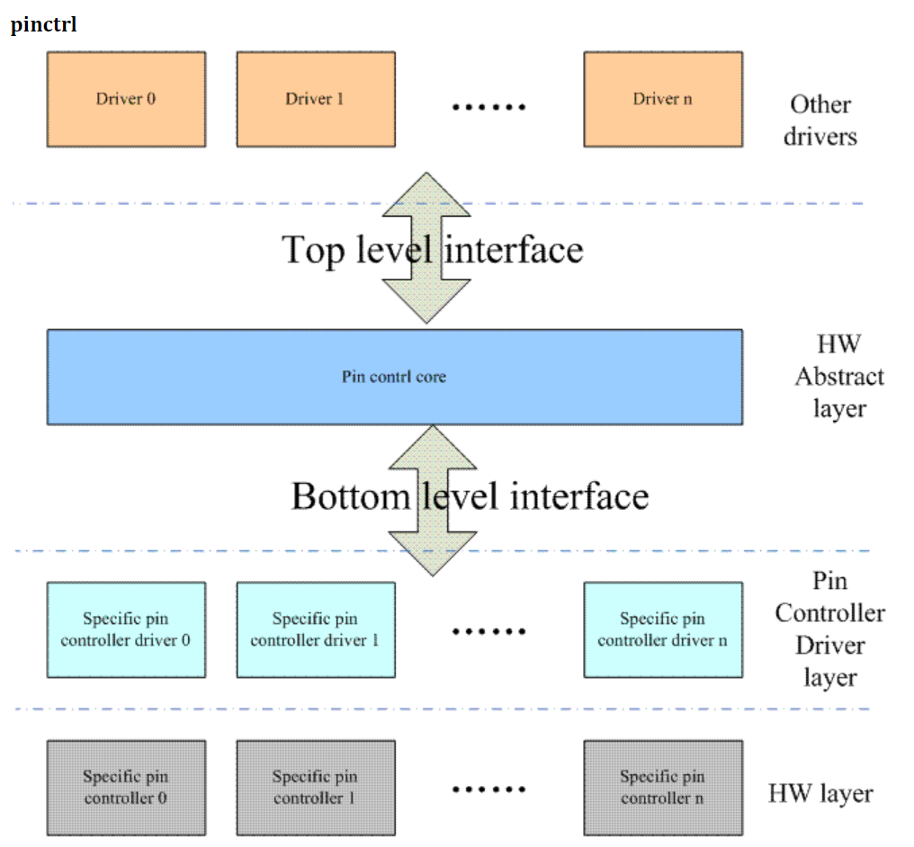
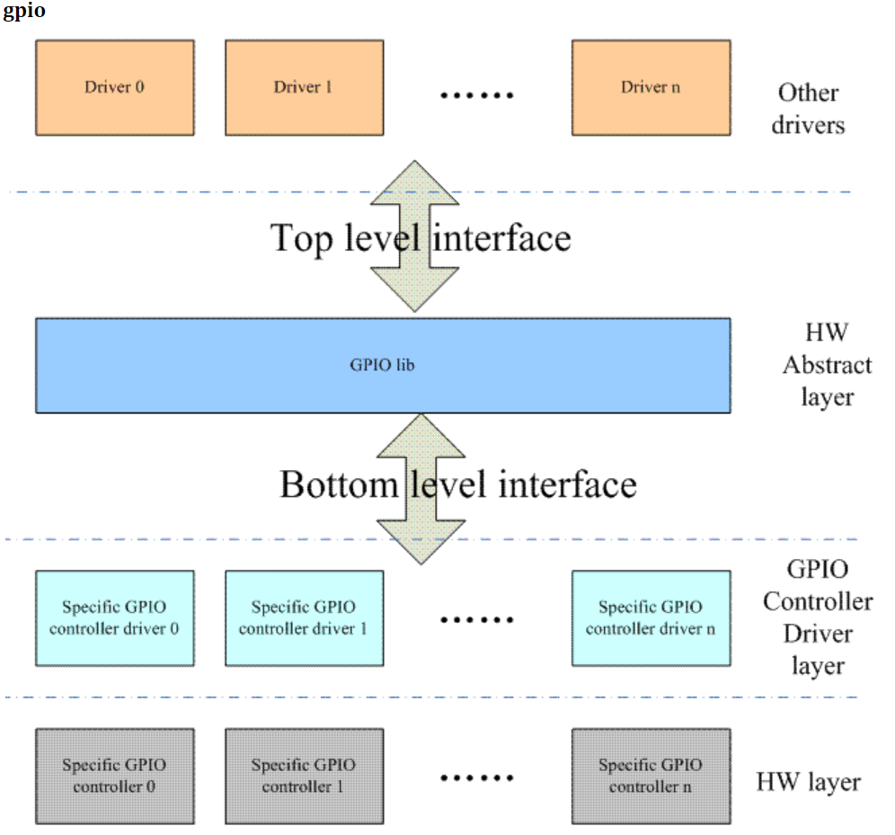
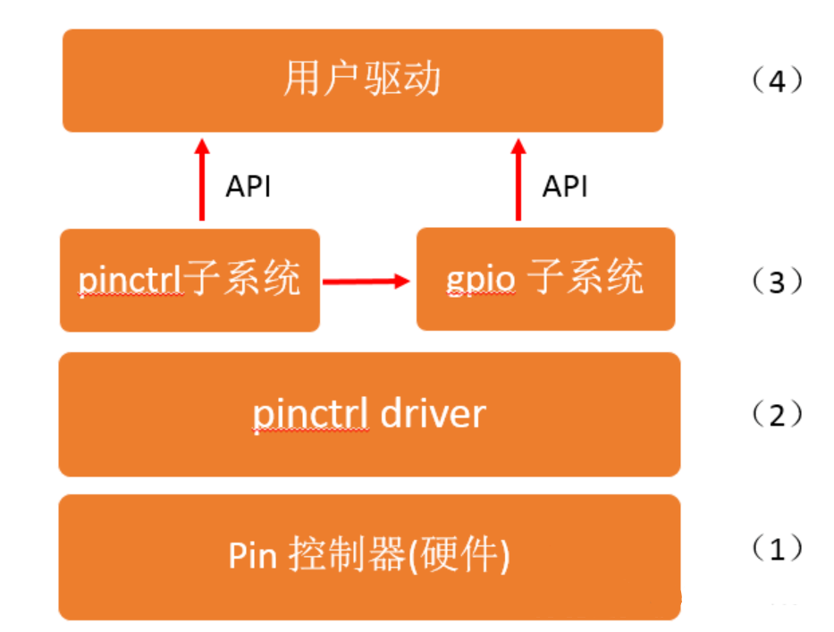
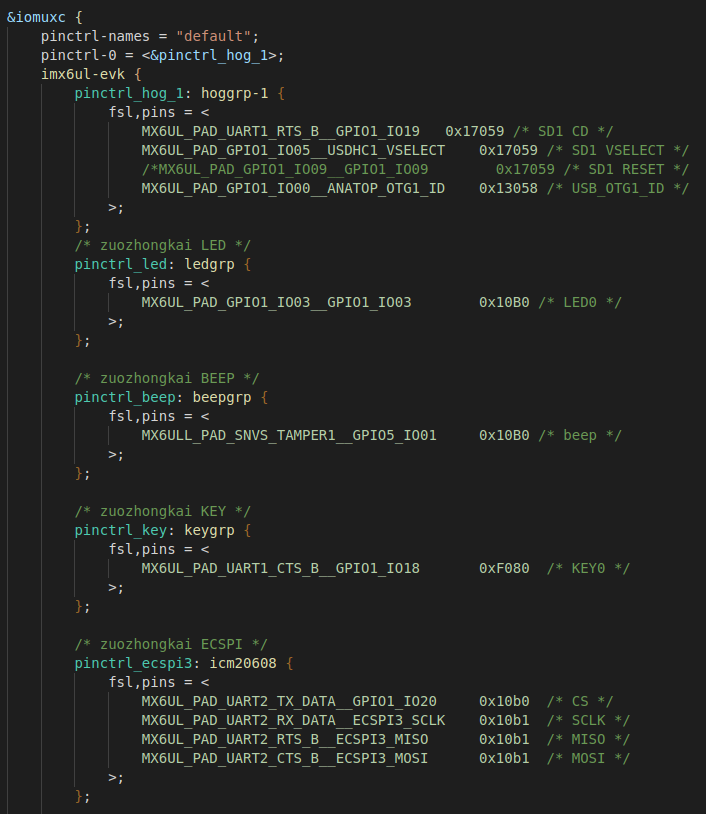
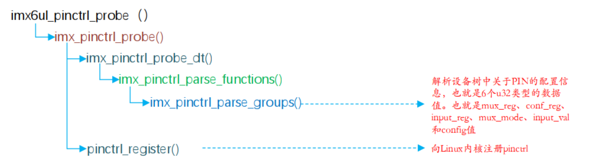

# A：在linux中你会如何设计gpio的管理系统？
# Q：分层 分模块

> 概念：设备树/platform驱动/pinctrl（pic）/gpio

## 分层： 应用层->pin contrl core->pin contrl driverx->hw layer



应用层：就是为某种设备写的驱动调用了pic的接口
pin contrl core：pic的核心管理层，解决pic的内部问题
pin contrl driverx：每个芯片的架构可能不同，就有不同的实现方式给到pic中
hw layer：硬件最底层的实现

## 模块： pin contrl模块 gpio模块 I2C模块 PWM模块....

pin contrl模块是最核心的模块，gpio模块 I2C模块 PWM模块等都是调用了pin contrl模块的api


你以为两者是分离的，实际上不是的，gpio模块是基于pinctrl模块的，gpio的API接口的实现很多都是基于pinctrl模块的函数

# A：现在是不是能实现外设的管理和控制了，接下来你会如何设计代码？
# Q：我也不知道 分析源码

## 源码架构



在此框架中，（1）、（2）、（3）由半导体厂商搞定，半导体厂商会利用 Linux 提供的框架，根据自己的芯片，客制化代码。普通的驱动工程师就是调用 API 即可，就算是写驱动了。
着重讲解（2），所以由图我们知道，pinctrl 子系统和 gpio 子系统都依赖于（2）的驱动。

## 设计思路

### 抽象出pinctrl的类
类的成员经过总结应该设计有：A:操作函数 B:和设备树相关的部分 C：gpio相关的部分

于是linux出现了这样的数据结构


pinctrl_dev（kernel/drivers/pinctrl/core.h）是 pinctrl 子系统的根源结构体，它主要包含三条路：

1、pinctrl_desc：这里包含了pinctrl 子系统三个最重要的结构体，有三个操作函数集，pinctrl_ops 包含了对 PIN 的操作函数集，pinmux_ops 包含了对 PIN 的复用函数集，pinconf_ops 包含了对 PIN 的配置函数，大家可以在自己平台中点进去看看自己平台实现了哪个函数，如何实现的。

2、pinctrl 结构体：这里包含了 PIN 控制器所控制 PIN 的状态 state，state 里面包含了 setting，这个 setting 就是在设备树中对PIN的设置，大家点进去看相关数据结构就可以看到自己在设备树中用到的字符串。

3、gpio 相关的结构体，我们说过 pinctrl 子系统和 gpio 子系统是耦合的，我们从结构体就可以看得出来，它包含了最重要的结构体 gpio_chip。

### pinctrl子系统源码

kernel/drivers/pinctrl/core.c 文件初始化pinctrl子系统
>1：初始化阶段开启调试文件目录 /sys/kernel/debug/pinctrl# ls
20e0000.iomuxc  2290000.iomuxc-snvs  pinctrl-devices  pinctrl-handles  pinctrl-maps
2:提供pinctrl_register函数
3:形成pinctrl核心层 提供API

### 芯片厂商的pinctrl驱动

drivers/pinctrl/freescale/pinctrl-imx6ul.c 文件

imx6ul_pinctrl_of_match.compatible 就是你设备树定义的数据 如果匹配上了就执行imx6ul_pinctrl_probe函数


so 看下probe干了啥：


`imx_pinctrl_probe`函数是i.MX平台的引脚控制器驱动的探测函数，用于在设备探测阶段进行引脚控制器的初始化和注册。

该函数的主要步骤如下：

1. 验证传入的`info`参数和相关字段是否有效，包括`pins`和`npins`字段。
2. 为`imx_pinctrl_desc`和`ipctl`分配内存，并进行初始化。
3. 为引脚寄存器数组`info->pin_regs`分配内存，并进行初始化。
4. 获取引脚控制器的物理内存资源并进行映射。
5. 如果设备树中定义了"fsl,input-sel"属性，读取并映射输入选择寄存器的物理地址。
6. 设置`imx_pinctrl_desc`的相关字段，如名称、引脚数组、操作函数等。
7. 调用`imx_pinctrl_probe_dt`函数解析设备树中的属性并配置引脚控制器。
8. 设置`ipctl`的相关字段。
9. 调用`pinctrl_register`函数注册引脚控制器设备。
10. 如果注册成功，打印初始化完成的信息。
11. 返回操作结果，成功返回0，否则返回相应的错误码。

总体来说，`imx_pinctrl_probe`函数完成了引脚控制器设备的初始化、资源分配、设备树属性解析以及注册到内核的引脚控制器子系统中的过程。

就不继续深入研究，有兴趣自己看代码，介绍下pinctrl_register（）函数

`pinctrl_register`函数用于注册一个引脚控制器设备，并返回一个指向注册设备的指针。

函数的具体步骤如下：

1. 检查传入的`pctldesc`参数是否有效，包括检查描述符指针和名称是否为空。
2. 使用`kzalloc`为引脚控制器设备分配内存，并进行初始化。
3. 设置引脚控制器设备的相关字段，如所有者、描述符、驱动程序数据等。
4. 初始化引脚描述符的radix树和GPIO范围链表。
5. 初始化互斥锁。
6. 检查引脚控制器核心操作函数的正确性。
7. 如果实现了引脚复用功能，检查引脚复用操作函数的正确性。
8. 如果实现了引脚配置功能，检查引脚配置操作函数的正确性。
9. 注册所有的引脚。
10. 将引脚控制器设备添加到全局引脚控制器设备列表中。
11. 获取引脚控制器设备的默认状态和睡眠状态，并进行相应的设置。
12. 初始化引脚控制器设备的debugfs调试文件系统。
13. 返回注册后的引脚控制器设备结构体指针。

如果在注册过程中出现错误，将释放已分配的内存，并返回`NULL`。

总之，`pinctrl_register`函数完成了引脚控制器设备的注册，包括分配内存、设置相关字段、注册引脚、添加到全局列表以及初始化调试功能等操作。

### 使用pinctrl的API

经过前面的设备厂商提供的pinctrl驱动代码，注册到pinctrl中后就可以调用pinctrl的API了。
要调用`pinctrl`的API，你需要按照以下步骤进行操作：

1. 引入相关头文件：
   ```c
   #include <linux/pinctrl/pinctrl.h>
   ```

2. 获取指向`struct pinctrl_dev`的指针，该指针代表已注册的引脚控制器设备。

   - 如果你已经有一个指向设备结构体（如`struct device`）的指针 `dev`，可以通过以下方式获取 `struct pinctrl_dev` 指针：
     ```c
     struct pinctrl_dev *pctldev = dev_get_drvdata(dev);
     ```
   - 如果你知道设备的名称，可以使用以下函数获取 `struct pinctrl_dev` 指针：
     ```c
     struct pinctrl_dev *pctldev = pinctrl_get(pinctrl_dev_name);
     ```

3. 使用获得的 `struct pinctrl_dev` 指针调用相应的 `pinctrl` API 函数。例如，要选择引脚控制器设备上的某个引脚状态，可以使用 `pinctrl_select_state` 函数：
   ```c
   int ret = pinctrl_select_state(pctldev, state_name);
   ```

   其中，`state_name` 是要选择的引脚状态的名称。具体的 API 函数和参数将取决于你要执行的具体操作，例如配置引脚功能、设置引脚属性等。

   请注意，在使用 `pinctrl` API 之前，你需要确保已正确初始化和注册了引脚控制器设备，并且你具有适当的权限来执行相关操作。

## GPIO模块
   GPIO模块的核心层调用了很多的pinctrl的函数，可以去看下源码的设计，设计思路和pinctrl是一样的就不重复了。
   可以看下这篇文章的调用方式：[手把手教你使用 gpio 子系统 API](https://mp.weixin.qq.com/s/iquUV-xzx1c08spOeW-vPg)。

