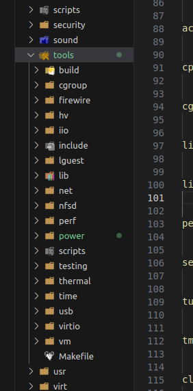
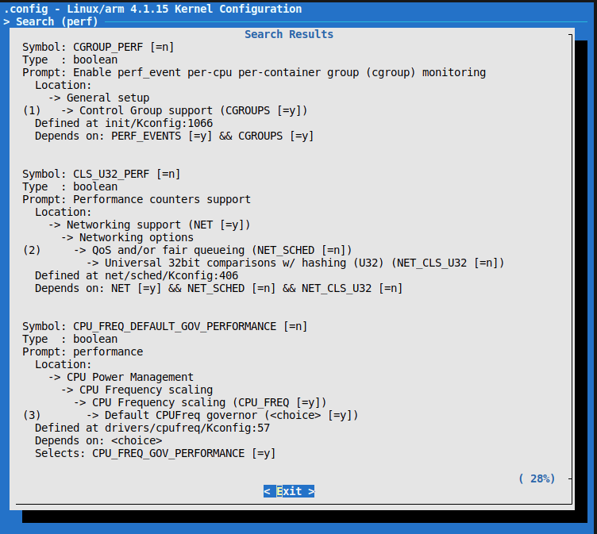

# Q：tool目录在linux内核中是干嘛的
# A：顾名思义工具文件夹

> 提示：我们的代码架构是不是应该也将工具集中在一个目录

## tool目录结构

首先看下文件夹的makefile文件[链接](https://elixir.bootlin.com/linux/v4.3.6/source/tools/Makefile)
文件内容：
    1：help告诉你有哪些工具和编译删除的方法
    2：各工具的编译命令

## 编译命令解析
### make -C tools/ acpi_install
以 acpi 工具为例
help提示编译命令为：make -C tools/ acpi_install
就会执行makefile文件命令：
```
acpi: FORCE  
    $(call descend,power/$@)
```

descend是一个函数在tools/scripts/Makefile，
根据提供的代码，`descend`函数的定义如下：

```tools/scripts/Makefile.include
descend = \
    +mkdir -p $(OUTPUT)$(1) && \
    $(MAKE) $(COMMAND_O) subdir=$(if $(subdir),$(subdir)/$(1),$(1)) $(PRINT_DIR) -C $(1) $(2)
```

这个函数是一个Makefile的宏定义。它定义了一个命令序列，用于在指定的目录中执行进一步的构建操作。下面是对该函数的解释：

1. `mkdir -p $(OUTPUT)$(1)`：创建目录`$(OUTPUT)$(1)`，如果该目录不存在。`$(OUTPUT)`是一个变量，表示输出目录的路径，`$(1)`表示传递给`descend`函数的第一个参数，即目录名。
2. `$(MAKE) $(COMMAND_O)`：使用`$(MAKE)`命令调用Make工具，`$(COMMAND_O)`是一个变量，可能包含一些Make工具的选项或参数。
3. `subdir=$(if $(subdir),$(subdir)/$(1),$(1))`：这行代码用于设置`subdir`变量的值。`subdir`可能是一个已定义的变量，如果它有值，则将其与`$(1)`（目录名）连接起来作为新的子目录路径。如果`subdir`没有定义，则将`$(1)`作为子目录路径。
4. `$(PRINT_DIR)`：这个变量可能包含打印目录信息的选项或命令。
5. `-C $(1)`：指定Make工具在目录`$(1)`中执行构建操作。
6. `$(2)`：这个参数是传递给`descend`函数的第二个参数，可能包含其他的选项或命令。

综上所述，通过调用`$(call descend, power/acpi)`，将执行以下操作：

1. 创建目录`$(OUTPUT)power/acpi`，如果该目录不存在，即生成在tools/power/acpi目录下
2. 在`power/acpi`目录中执行Make工具，并传递`subdir=power/acpi`和其他可能的选项或命令。

### [tools/power/acpi/Makefile](https://elixir.bootlin.com/linux/v4.2.7/source/tools/power/acpi/Makefile)
这个makefile文件跟简单就是编译链接相应的文件设置保存路径等最后生成acpidump可执行文件，再将可执行文件拷贝到开发板或则文件系统中即可使用

### 工具介绍
以下是对所列工具的简要介绍：

1. ACPI工具（acpi）：提供与ACPI（高级配置和电源接口）相关的功能和信息，用于管理和监视系统的电源管理和配置。

2. cgroup工具（cgroup）：用于管理和控制Linux控制组（cgroup）的工具，cgroup用于限制、分配和监控进程组的资源（如CPU、内存、磁盘I/O等）。

3. cpupower（cpupower）：用于管理和调整x86 CPU功耗和性能的工具，可以控制CPU频率、功耗模式以及其他与CPU相关的设置。

4. firewire工具（firewire）：用于IEEE-1394（FireWire）总线的用户空间工具，用于监视和分析IEEE-1394网络流量。

5. hv工具（hv）：用于在Hyper-V客户端环境中使用的工具集，提供与Hyper-V虚拟化平台相关的功能和管理。

6. lguest（lguest）：一个最小化的32位x86虚拟化平台，用于运行客户操作系统作为虚拟机。

7. perf工具（perf）：Linux性能测量和分析工具，用于收集系统和应用程序的性能数据，进行性能分析和优化。

8. selftests（selftests）：包含各种内核自测（self-test）工具和测试套件，用于测试和验证Linux内核的功能和稳定性。

9. turbostat（turbostat）：用于报告Intel CPU空闲状态和频率的工具，提供有关CPU功耗、频率调节和性能的信息。

10. USB测试工具（usb）：用于测试和诊断USB设备和功能的工具集，用于调试和分析USB相关问题。

11. virtio（virtio）：用于虚拟化环境中的vhost测试模块，提供对虚拟I/O设备（如磁盘、网络等）的性能测试和评估。

12. 网络工具（net）：包含各种杂项网络工具，用于网络配置、监视和故障排除，如网络接口管理、路由设置、网络诊断等。

13. VM工具（vm）：包含各种杂项虚拟机（VM）工具，用于管理和操作虚拟机，如创建、配置、迁移虚拟机等。

14. x86_energy_perf_policy（x86_energy_perf_policy）：英特尔能效策略工具，用于管理和优化英特尔CPU的能效策略设置。

15. tmon工具（tmon）：用于热监视和调整的工具，用于监测系统温度、风扇速度和其他与热管理相关的参数，并进行热优化和调整。

这些工具提供了一系列功能，用于管理、调整和监视不同方面的系统资源和配置，以及进行性能优化、调试和故障排除。具体使用方法可以参考各自工具的文档和手册。eg:man acpidump。

### menuconfig配置

配置第一个即可 注意打开depends


