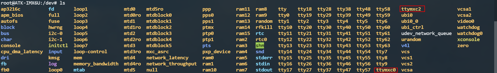
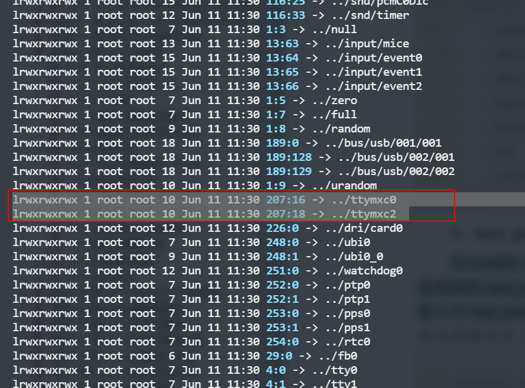
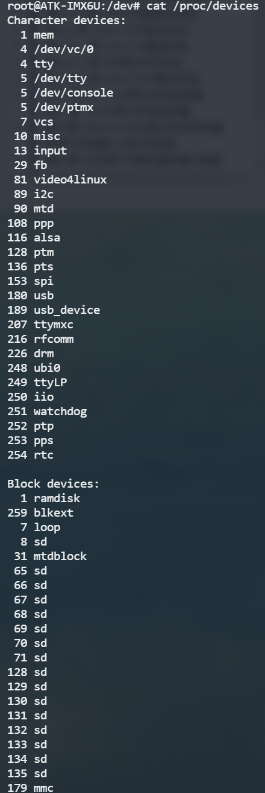
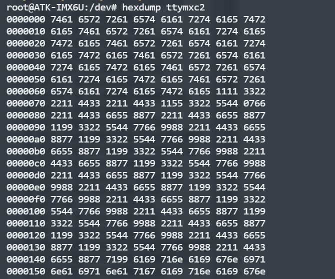

#  Q：linux中如何控制串口？
#  A：模块化设计

## 第一步：设置设备树中关于串口的信息（设备树模块）
```
    uart1: serial@02020000 {
        compatible = "fsl,imx6ul-uart",
                    "fsl,imx6q-uart", "fsl,imx21-uart";
        reg = <0x02020000 0x4000>;
        interrupts = <GIC_SPI 26 IRQ_TYPE_LEVEL_HIGH>;
        clocks = <&clks IMX6UL_CLK_UART1_IPG>,
                <&clks IMX6UL_CLK_UART1_SERIAL>;
        clock-names = "ipg", "per";
        status = "disabled";
    };
    uart3: serial@021ec000 {
        compatible = "fsl,imx6ul-uart",
                    "fsl,imx6q-uart", "fsl,imx21-uart";
        reg = <0x021ec000 0x4000>;
        interrupts = <GIC_SPI 28 IRQ_TYPE_LEVEL_HIGH>;
        clocks = <&clks IMX6UL_CLK_UART3_IPG>,
                <&clks IMX6UL_CLK_UART3_SERIAL>;
        clock-names = "ipg", "per";
        dmas = <&sdma 29 4 0>, <&sdma 30 4 0>;
        dma-names = "rx", "tx";
        status = "disabled";
    };   
```

## 第二步：驱动获取设备树生成设备（驱动模块）

drivers/tty/serial/imx.c文件中有如下内容：
 ```
static struct platform_device_id imx_uart_devtype[] = {
	{
		.name = "imx1-uart",
		.driver_data = (kernel_ulong_t) &imx_uart_devdata[IMX1_UART],
	}, {
		.name = "imx21-uart",
		.driver_data = (kernel_ulong_t) &imx_uart_devdata[IMX21_UART],
	}, {
		.name = "imx6q-uart",
		.driver_data = (kernel_ulong_t) &imx_uart_devdata[IMX6Q_UART],
	}, {
		/* sentinel */
	}
};
MODULE_DEVICE_TABLE(platform, imx_uart_devtype);
```

```
static struct uart_driver imx_reg = {
	.owner          = THIS_MODULE,
	.driver_name    = DRIVER_NAME,  //"IMX-uart"
	.dev_name       = DEV_NAME,     //"ttymxc"
	.major          = SERIAL_IMX_MAJOR, //207
	.minor          = MINOR_START,      //16
	.nr             = ARRAY_SIZE(imx_ports),    //8
	.cons           = IMX_CONSOLE,      //NULL
};
```

platform平台对比到相同的设备树中的compatible到驱动中的name的时候就执行probe函数：

<details><summary>static int serial_imx_probe（struct platform_device *pdev）</summary>
<pre><code>
{
	struct imx_port *sport;
	void __iomem *base;
	int ret = 0;
	struct resource *res;
	int txirq, rxirq, rtsirq;
	sport = devm_kzalloc(&pdev->dev, sizeof(*sport), GFP_KERNEL);
	if (!sport)
		return -ENOMEM;
	ret = serial_imx_probe_dt(sport, pdev);
	if (ret > 0)
		serial_imx_probe_pdata(sport, pdev);
	else if (ret < 0)
		return ret;
	res = platform_get_resource(pdev, IORESOURCE_MEM, 0);
	base = devm_ioremap_resource(&pdev->dev, res);
	if (IS_ERR(base))
		return PTR_ERR(base);
	rxirq = platform_get_irq(pdev, 0);
	txirq = platform_get_irq(pdev, 1);
	rtsirq = platform_get_irq(pdev, 2);
	sport->port.dev = &pdev->dev;
	sport->port.mapbase = res->start;
	sport->port.membase = base;
	sport->port.type = PORT_IMX,
	sport->port.iotype = UPIO_MEM;
	sport->port.irq = rxirq;
	sport->port.fifosize = 32;
	sport->port.ops = &imx_pops;
	sport->port.rs485_config = imx_rs485_config;
	sport->port.rs485.flags =
		SER_RS485_RTS_ON_SEND | SER_RS485_RX_DURING_TX;
	sport->port.flags = UPF_BOOT_AUTOCONF;
	init_timer(&sport->timer);
	sport->timer.function = imx_timeout;
	sport->timer.data     = (unsigned long)sport;
	sport->clk_ipg = devm_clk_get(&pdev->dev, "ipg");
	if (IS_ERR(sport->clk_ipg)) {
		ret = PTR_ERR(sport->clk_ipg);
		dev_err(&pdev->dev, "failed to get ipg clk: %d\n", ret);
		return ret;
	}
	sport->clk_per = devm_clk_get(&pdev->dev, "per");
	if (IS_ERR(sport->clk_per)) {
		ret = PTR_ERR(sport->clk_per);
		dev_err(&pdev->dev, "failed to get per clk: %d\n", ret);
		return ret;
	}
	sport->port.uartclk = clk_get_rate(sport->clk_per);
	if (sport->port.uartclk > IMX_MODULE_MAX_CLK_RATE) {
		ret = clk_set_rate(sport->clk_per, IMX_MODULE_MAX_CLK_RATE);
		if (ret < 0) {
			dev_err(&pdev->dev, "clk_set_rate() failed\n");
			return ret;
		}
	}
	sport->port.uartclk = clk_get_rate(sport->clk_per);
	if (txirq > 0) {
		ret = devm_request_irq(&pdev->dev, rxirq, imx_rxint, 0,
				       dev_name(&pdev->dev), sport);
		if (ret)
			return ret;

		ret = devm_request_irq(&pdev->dev, txirq, imx_txint, 0,
				       dev_name(&pdev->dev), sport);
		if (ret)
			return ret;
	} else {
		ret = devm_request_irq(&pdev->dev, rxirq, imx_int, 0,
				       dev_name(&pdev->dev), sport);
		if (ret)
			return ret;
	}
	imx_ports[sport->port.line] = sport;
	platform_set_drvdata(pdev, sport);
	return uart_add_one_port(&imx_reg, &sport->port);
}
</code></pre></details>

`serial_imx_probe`函数是针对i.MX系列平台设备的串口驱动的探测函数。该函数的功能是在系统启动时，当检测到与i.MX系列平台相关的串口设备时，自动初始化和注册相应的串口驱动程序。

具体功能包括：

1. 识别并验证与i.MX平台相关的串口设备资源。通过检查设备树（device tree）或其他平台特定的数据结构，确定该平台上的串口设备的物理地址、中断号、时钟等信息，并进行验证。

2. 为每个串口设备分配和初始化相应的`struct uart_port`结构体。该结构体用于表示一个串口设备的相关参数和状态信息，如设备的基地址、中断号、波特率等。

3. 注册串口驱动程序。调用`uart_add_one_port`函数将初始化好的`struct uart_port`结构体注册到串口子系统中，以便操作系统可以管理和操作该串口设备。

4. 执行其他平台特定的初始化操作。根据i.MX平台的要求，可能需要进行其他特定于该平台的初始化步骤，如设置GPIO引脚、时钟源等。

总而言之，`serial_imx_probe`函数的功能是在系统启动时，自动探测和初始化i.MX平台上的串口设备，并注册相应的串口驱动程序，以便后续操作系统和用户空间程序可以与这些串口设备进行通信和交互。

数据结构的关系：
内核串口驱动结构uart_driver（imx_reg）在 imx_serial_init 函数中向 Linux 内核注册了 imx_reg。
当 UART 设备和驱动匹配成功以后 serial_imx_probe 函数就会执行，此函数的重点工作就
是初始化 uart_port，然后将其添加到对应的 uart_driver 中。imx驱动自己创建了imx_port 结构体里面有一个成员就是uart_port，最后通过uart_add_one_port注册。

所以在dev目录下就会有： 对应到uart1->ttymxc0和uart3->ttymxc2
设备号：
设备：

## 第三步：使用串口（应用模块）
通过串口发送数据到ttymxc2,执行cat /dev/ttymxc2： 应该是和串口发送的十六进制数据是一样的。所以所有的操作都应该是基于此文件或则设备相关的硬件信号。

### 方法一：轮询
1. 打开串口
```
fd = open(port, O_RDWR | O_NOCTTY | O_NDELAY);
if (fd == -1) 
{
    perror("open_port: Unable to open serial port");
    return -1;
}
```
2. 配置串口
```
tcgetattr(fd, &options);
cfsetispeed(&options, B115200);
cfsetospeed(&options, B115200);
options.c_cflag |= (CLOCAL | CREAD);
options.c_cflag &= ~PARENB;
options.c_cflag &= ~CSTOPB;
options.c_cflag &= ~CSIZE;
options.c_cflag |= CS8;
options.c_cflag &= ~CRTSCTS;
tcsetattr(fd, TCSANOW, &options);
```
其中，tcgetattr 和 tcsetattr 函数用于获取和设置串口参数。cfsetispeed 和 cfsetospeed 函数用于设置串口的输入和输出波特率，这里设置为 115200。options.c_cflag 表示控制标志位，用于配置串口控制参数，具体含义如下：

    CLOCAL：忽略调制解调器的状态线，只允许本地使用串口。

    CREAD：允许从串口读取数据。

    PARENB：启用奇偶校验。&= ~PARENB则为禁用校验。

    CSTOPB：使用两个停止位而不是一个。&= ~CSTOPB停止位为1。

    CSIZE：表示字符长度的位掩码。在这里设置为 0，表示使用默认的 8 位数据位。

    CS8：表示使用 8 位数据位。

    CRTSCTS：启用硬件流控制，即使用 RTS 和 CTS 状态线进行流控制。

在示例程序中，我们将 CLOCAL 和 CREAD 标志位置为 1，表示允许本地使用串口，并允许从串口读取数据。我们将 PARENB、CSTOPB 和 CRTSCTS 标志位都设置为 0，表示不启用奇偶校验、使用一个停止位和禁用硬件流控制。最后，我们将 CSIZE 标志位设置为 0，然后将 CS8 标志位设置为 1，以表示使用 8 位数据位。
3. 读写
```
read(fd, buf, sizeof(buf)); // 返回接收个数
write(fd, buf, strlen(buf)); // 返回发送长度,负值表示发送失败
```
4. 关闭串口
```
close(fd);
```
完整示例
<details><summary>轮询code</summary>
<pre><code>
    int main()
    {
        int fd;
        char buf[255];
        int n;
        fd = open_port("/dev/ttyUSB0");
        if (fd == -1) {

            printf("open err\n");
            exit(1);
        }
        while (1)
        {
            n = read(fd, buf, sizeof(buf));
            if (n > 0) {
                printf("Received: %.*s\n", n, buf);
            }
            strcpy(buf, "Hello, world!\n");
            n = write(fd, buf, strlen(buf));
            if (n < 0) {
                perror("write failed\n");
            }
            usleep(10 * 1000);
        }
        close(fd);
        printf("close uart\n");
        return 0;
    }

    int open_port(const char *port)
    {
        int fd;
        struct termios options;
        fd = open(port, O_RDWR | O_NOCTTY | O_NDELAY);
        if (fd == -1) {
            perror("open_port: Unable to open serial port");
            return -1;
        }
        tcgetattr(fd, &options);
        cfsetispeed(&options, B115200);
        cfsetospeed(&options, B115200);
        options.c_cflag |= (CLOCAL | CREAD);
        options.c_cflag &= ~PARENB;
        options.c_cflag &= ~CSTOPB;
        options.c_cflag &= ~CSIZE;
        options.c_cflag |= CS8;
        options.c_cflag &= ~CRTSCTS;
        tcsetattr(fd, TCSANOW, &options);
        return fd;
    }
</code></pre></details>

### 方法二：中断读取示例
上面给出的串口示例是使用轮询的方式读取串口数据，这种方式在某些场景下可能会占用大量 CPU 资源。实际上，对于 Linux 系统来说，还可以使用中断方式接收串口数据，这样可以大大减少 CPU 的占用率，并且能够更快地响应串口数据。

要使用中断方式接收串口数据，可以使用 select 函数来监听串口文件描述符的可读事件。当串口数据可读时，select 函数将返回，并且可以调用 read 函数来读取串口数据。这种方式可以避免轮询操作，只有在串口数据可读时才会执行读取操作，因此能够减少 CPU 的占用率。

以下是一个简单的使用中断方式接收串口数据的示例程序：
<details><summary>中断读取code</summary>
<pre><code>
#include <stdio.h>
#include <stdlib.h>
#include <unistd.h>
#include <fcntl.h>
#include <termios.h>
#include <sys/select.h>

int main() {
    int fd;
    struct termios options;
    fd_set rfds;

    // 打开串口设备
    fd = open("/dev/ttyUSB0", O_RDWR | O_NOCTTY);
    if (fd < 0) {
        perror("open");
        return -1;
    }

    // 配置串口参数
    tcgetattr(fd, &options);
    options.c_cflag = B9600 | CS8 | CLOCAL | CREAD;
    options.c_iflag = IGNPAR;
    options.c_oflag = 0;
    options.c_lflag = 0;
    options.c_cc[VTIME] = 0;
    options.c_cc[VMIN] = 1;
    tcsetattr(fd, TCSANOW, &options);

    while (1) {
        // 使用 select 函数监听串口文件描述符的可读事件
        FD_ZERO(&rfds);
        FD_SET(fd, &rfds);
        select(fd + 1, &rfds, NULL, NULL, NULL);

        // 读取串口数据
        char buf[256];
        int n = read(fd, buf, sizeof(buf));
        if (n > 0) {
            printf("Received data: %.*s\n", n, buf);
        }
    }

    // 关闭串口设备
    close(fd);

    return 0;
}
</code></pre></details>
需要注意的是，在使用中断方式接收串口数据时，需要对串口文件描述符设置为非阻塞模式，以便在 select 函数返回时立即读取串口数据。可以使用 fcntl 函数来设置文件描述符的标志位，如下所示：
```
// 设置串口文件描述符为非阻塞模式
int flags = fcntl(fd, F_GETFL, 0);
fcntl(fd, F_SETFL, flags | O_NONBLOCK);
```

### 方法三：信号的方式接收数据
<details><summary>信号的方式接收code</summary>
<pre><code>
#include <stdio.h>
#include <stdlib.h>
#include <unistd.h>
#include <fcntl.h>
#include <termios.h>
#include <signal.h>

int fd;

void sigio_handler(int sig) {
    char buf[256];
    int n = read(fd, buf, sizeof(buf));
    if (n > 0) {
        printf("Received data: %.*s\n", n, buf);
    }
}

int main() {
    struct termios options;
    struct sigaction sa;

    // 打开串口设备
    fd = open("/dev/ttyS0", O_RDWR | O_NOCTTY);
    if (fd < 0) {
        perror("open");
        return -1;
    }

    // 配置串口参数
    tcgetattr(fd, &options);
    options.c_cflag = B9600 | CS8 | CLOCAL | CREAD;
    options.c_iflag = IGNPAR;
    options.c_oflag = 0;
    options.c_lflag = 0;
    options.c_cc[VTIME] = 0;
    options.c_cc[VMIN] = 1;
    tcsetattr(fd, TCSANOW, &options);

    // 设置串口文件描述符为异步通知模式
    /* 将串口文件描述符设置为当前进程的拥有者，从而接收该文件描述符相关的信号。*/
    fcntl(fd, F_SETOWN, getpid()); 
    int flags = fcntl(fd, F_GETFL, 0); // 先获取当前配置, 下面只更改O_ASYNC标志
    /* 将串口文件描述符设置为非阻塞模式，从而允许该文件描述符异步地接收数据和信号。*/
    fcntl(fd, F_SETFL, flags | O_ASYNC);

    // 设置 SIGIO 信号的处理函数
    sa.sa_handler = sigio_handler;
    sigemptyset(&sa.sa_mask);
    sa.sa_flags = 0;
    /* 设置了 SIGIO 信号的处理函数为 sigio_handler，从而在该信号被触发时读取串口数据并进行处理。*/
    sigaction(SIGIO, &sa, NULL);

    while (1) {
        // 等待 SIGIO 信号
        sleep(1);
    }

    // 关闭串口设备
    close(fd);

    return 0;
}
</code></pre></details>
上述代码中，使用了 fcntl 函数将串口文件描述符设置为异步通知模式，并使用 SIGIO 信号来通知程序串口数据已经可读。当程序接收到 SIGIO 信号时，会调用 sigio_handler 函数来读取并处理串口数据。

在这段代码中，sigemptyset（&sa.sa_mask）;的作用是将信号处理函数在执行时要屏蔽的信号集合清空，即将其设置为空集。

每个进程都有一个信号屏蔽字，它表示了当前被阻塞的信号集合。当一个信号被阻塞时，它将被加入到信号屏蔽字中，而当信号被解除阻塞时，它将被从信号屏蔽字中移除。如果信号处理函数在执行时需要屏蔽其他的信号，则可以使用sigaddset等函数将需要屏蔽的信号添加到信号屏蔽字中。但是，在本例中，我们需要处理的信号是SIGIO，它通常不需要被屏蔽，因此我们使用sigemptyset函数将信号屏蔽字清空，以确保在处理SIGIO信号时不会屏蔽任何其他信号。

在Linux系统中，使用sigaction函数注册信号处理函数时，可以设置一些标志来指定信号处理的行为。例如，可以使用SA_RESTART标志来指定当系统调用被信号中断时自动重启该系统调用。在本例中，由于我们并不需要设置任何标志，因此将sa.sa_flags字段设置为0即可。这表示信号处理函数不需要任何特殊的行为，只需要按照默认的方式处理信号即可。

### 方法四：使用线程接收串口数据
<details><summary>使用线程接收code</summary>
<pre><code>
#include <stdio.h>
#include <stdlib.h>
#include <unistd.h>
#include <fcntl.h>
#include <termios.h>
#include <pthread.h>

void *read_thread(void *arg) {
    int fd = *(int *)arg;
    char buf[256];
    int n;

    while (1) {
        // 读取串口数据
        n = read(fd, buf, sizeof(buf));
        if (n > 0) {
            printf("Received data: %.*s\n", n, buf);
        }
    }

    return NULL;
}

int main() {
    int fd;
    struct termios options;
    pthread_t tid;

    // 打开串口设备
    fd = open("/dev/ttyS0", O_RDWR | O_NOCTTY);
    if (fd < 0) {
        perror("open");
        return -1;
    }

    // 配置串口参数
    tcgetattr(fd, &options);
    options.c_cflag = B9600 | CS8 | CLOCAL | CREAD;
    options.c_iflag = IGNPAR;
    options.c_oflag = 0;
    options.c_lflag = 0;
    options.c_cc[VTIME] = 0;
    options.c_cc[VMIN] = 1;
    tcsetattr(fd, TCSANOW, &options);

    // 创建读取线程
    if (pthread_create(&tid, NULL, read_thread, &fd) != 0) {
        perror("pthread_create");
        return -1;
    }

    while (1) {
        // 主线程的其他处理逻辑
        sleep(1);
    }

    // 关闭串口设备
    close(fd);

    return 0;
}
</code></pre></details>
上述代码中，创建了一个读取线程，不断读取串口数据并进行处理。主线程可以在读取线程运行的同时进行其他处理逻辑。