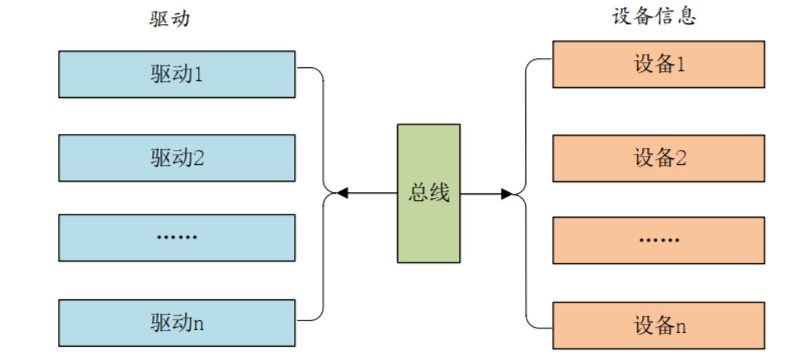
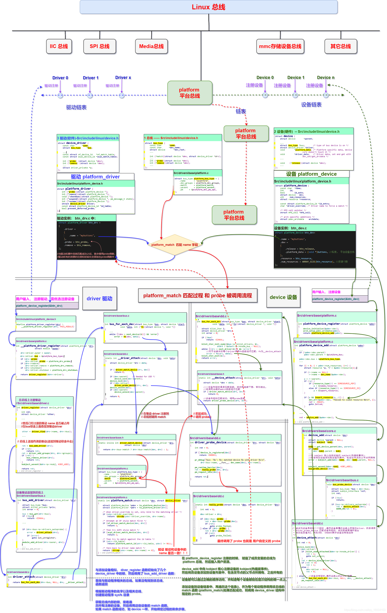

#  Q：如果你的项目中出现大量的外设你会如何设接代码（外设>10000+）
#  A：外设驱动分工+分层系统设计

# 外设驱动分工
先讨论分工，分工很简单不同职能的工程师输出自己部分的设备和驱动的代码，首先区分两个观点
1：设备代码（include/linux/platform_device.h--> platform_device结构体）
    这个结构体 `platform_device` 是用于描述平台设备的数据结构。它包含以下字段：

    - `name`: 平台设备的名称。
    - `id`: 平台设备的标识符。
    - `id_auto`: 表示标识符是否自动分配的标志。
    - `dev`: 嵌套的 `struct device` 结构，用于表示设备的通用属性和行为。
    - `num_resources`: 平台设备所使用的资源数量。
    - `resource`: 指向资源数组的指针，描述平台设备所需的资源。
    - `id_entry`: 指向匹配平台设备的 id 表项的指针。
    - `driver_override`: 强制指定驱动程序名称以进行匹配的字符串。
    - `mfd_cell`: 指向多功能设备 (MFD) 单元的指针，如果该平台设备属于 MFD 子系统。
    - `archdata`: 架构特定的数据，用于存储与特定架构相关的平台设备信息。

2：驱动代码（include/linux/platform_device.h--> platform_driver结构体）
    这个结构体 `platform_driver` 是用于描述平台驱动程序的数据结构。它包含以下字段：

    - `probe`: 平台设备的探测函数，在设备与驱动程序匹配成功时调用，用于初始化和配置设备。
    - `remove`: 平台设备的移除函数，在设备与驱动程序解绑时调用，用于清理和释放设备资源。
    - `shutdown`: 平台设备的关机函数，在系统关机时调用，用于执行设备的关机处理。
    - `suspend`: 平台设备的挂起函数，在设备进入挂起状态时调用，用于执行设备的挂起操作。
    - `resume`: 平台设备的恢复函数，在设备从挂起状态恢复时调用，用于执行设备的恢复操作。
    - `driver`: 嵌套的 `struct device_driver` 结构，用于表示驱动程序的通用属性和行为。
    - `id_table`: 指向平台设备 id 表的指针，用于指定与该驱动程序匹配的平台设备。
    - `prevent_deferred_probe`: 阻止延迟探测的标志，用于指示驱动程序是否允许延迟探测机制。

这样就可以系统工程师输出代码的同时，驱动工程师同时输出驱动，如果系统已经定义好标准的设备接口的话。应用工程师就可以在没有驱动的情况也可以开始应用层的工作。前提是系统的接口定义的足够清晰，重点是对需求的理解透彻，分析出所有的需求结构。

# 分层系统设计
现在设备和设备的驱动有了，剩下就是系统工程师的事情了，系统采用分层的设计.剩下的就是你会如何去设计这条linux的总线，对设备和驱动的匹配。最简单的设计思路就是建立两条链表，设备链表和驱动链表，在设备和驱动中设置一个成员相同用于匹配上设备和驱动，匹配成功就将设备回调函数注册成驱动中的函数。基本是这么实现的不详细讨论，linux中很复杂还有一大堆其他的工作。下面贴出一张网图画得很清楚：
详细的代码注释可以看我的[github仓库](https://gitee.com/qian-qiang/imx6ull_linux)

# 进阶设计：使用设备树作为设备代码
platform 驱动框架分为总线、设备和驱动，其中总线不需要我们这些驱动程序员去管理，这
个是 Linux 内核提供的，我们在编写驱动的时候只要关注于设备和驱动的具体实现即可。在没
有设备树的 Linux 内核下，我们需要分别编写并注册 platform_device 和 platform_driver，分别代
表设备和驱动。在使用设备树的时候，设备的描述被放到了设备树中，因此 platform_device 就
不需要我们去编写了，我们只需要实现 platform_driver 即可。在编写基于设备树的 platform 驱
动的时候我们需要注意一下几点
    1、在设备树中创建设备节点
    2、编写 platform 驱动的时候要注意兼容属性
    3、编写 platform 驱动