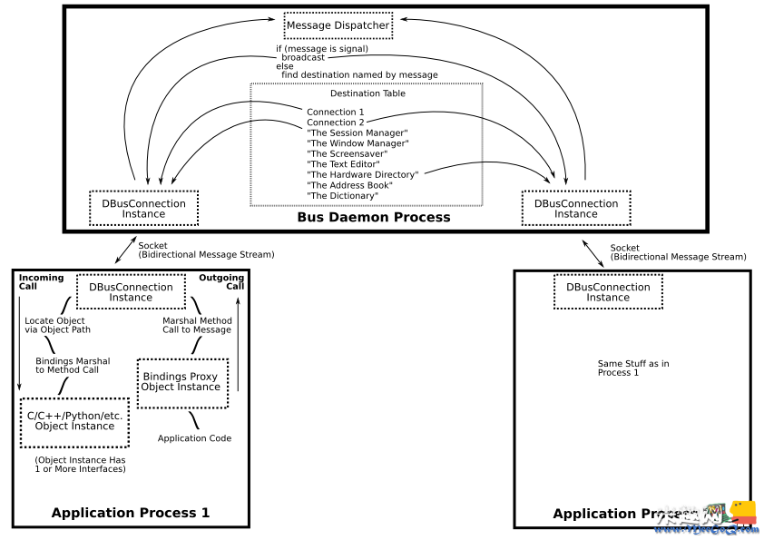

# dbus-daemon线程的作用
`dbus-daemon` 是 D-Bus 通信系统的守护进程，用于在 Linux 和其他类 Unix 系统上提供进程间通信 (IPC) 功能。D-Bus 是一个跨进程通信机制，使得不同进程之间可以进行消息传递，共享数据以及调用方法。`dbus-daemon` 线程的作用包括以下几个方面：

1. **进程间通信：** `dbus-daemon` 提供了一种在不同进程之间进行通信的机制。不同进程可以通过 D-Bus 发送和接收消息，从而实现数据共享和交互。

2. **总线系统：** D-Bus 通过一种称为总线系统的方式来组织通信。`dbus-daemon` 提供了总线系统，允许多个进程在同一个总线上进行通信。总线可以分为系统总线和会话总线，分别用于系统级进程间通信和用户会话级进程间通信。

3. **服务发布与发现：** `dbus-daemon` 允许进程注册自己提供的服务，以便其他进程能够发现并调用这些服务。这有助于实现解耦和模块化的系统设计。

4. **对象和接口管理：** D-Bus 通过对象和接口的概念来组织数据和方法。`dbus-daemon` 确保对象和接口的正确注册和管理，以便进程可以通过合适的接口与其他对象交互。

5. **权限和安全：** `dbus-daemon` 管理进程之间的通信权限，以确保只有授权的进程能够相互通信。这有助于维护系统的安全性。

6. **解析地址：** `dbus-daemon` 用于解析 D-Bus 地址，以便确定要发送消息的目标进程。


DBus 本身是构建在 Socket 机制之上。真正的通信还是由 Socket 来完成的。DBus 则是在这之上，制定了一些通信的协议，并提供了更高一层的接口，以更方便应用程序之间进行数据的交互。

# dbus-daemon源码
以等级5启动内核
```shell
root@ATK-IMX6U:/etc/rc5.d# ls -l
total 0
lrwxrwxrwx 1 root root 20 Jun 10 18:21 S01networking -> ../init.d/networking
lrwxrwxrwx 1 root root 22 Jun 10 18:21 S01xserver-nodm -> ../init.d/xserver-nodm
lrwxrwxrwx 1 root root 16 Jun 10 18:21 S02dbus-1 -> ../init.d/dbus-1
lrwxrwxrwx 1 root root 17 Jun 10 18:21 S05connman -> ../init.d/connman
lrwxrwxrwx 1 root root 18 Jun 10 18:21 S10dropbear -> ../init.d/dropbear
lrwxrwxrwx 1 root root 17 Jun 10 18:21 S12rpcbind -> ../init.d/rpcbind
lrwxrwxrwx 1 root root 21 Jun 10 18:21 S15mountnfs.sh -> ../init.d/mountnfs.sh
lrwxrwxrwx 1 root root 21 Jun 10 18:21 S15watchdog.sh -> ../init.d/watchdog.sh
lrwxrwxrwx 1 root root 19 Jun 10 18:21 S19nfscommon -> ../init.d/nfscommon
lrwxrwxrwx 1 root root 14 Jun 10 18:21 S20apmd -> ../init.d/apmd
lrwxrwxrwx 1 root root 13 Jun 10 18:21 S20atd -> ../init.d/atd
lrwxrwxrwx 1 root root 17 Jun 10 18:21 S20hostapd -> ../init.d/hostapd
lrwxrwxrwx 1 root root 20 Jun 10 18:21 S20hwclock.sh -> ../init.d/hwclock.sh
lrwxrwxrwx 1 root root 19 Jun 10 18:21 S20nfsserver -> ../init.d/nfsserver
lrwxrwxrwx 1 root root 16 Jun 10 18:21 S20syslog -> ../init.d/syslog
lrwxrwxrwx 1 root root 22 Jun 10 18:21 S21avahi-daemon -> ../init.d/avahi-daemon
lrwxrwxrwx 1 root root 15 Jun 10 18:21 S22ofono -> ../init.d/ofono
lrwxrwxrwx 1 root root 15 Jun 10 18:21 S64neard -> ../init.d/neard
lrwxrwxrwx 1 root root 16 Jun 10 18:21 S80vsftpd -> ../init.d/vsftpd
lrwxrwxrwx 1 root root 15 Jun 10 18:21 S90crond -> ../init.d/crond
lrwxrwxrwx 1 root root 15 Jun 10 18:21 S92nginx -> ../init.d/nginx
lrwxrwxrwx 1 root root 18 Jun 10 18:21 S99rc.local -> ../init.d/rc.local
lrwxrwxrwx 1 root root 22 Jun 10 18:21 S99rmnologin.sh -> ../init.d/rmnologin.sh
lrwxrwxrwx 1 root root 23 Jun 10 18:21 S99stop-bootlogd -> ../init.d/stop-bootlogd
```
etc\init.d\dbus-1:
```shell
#! /bin/sh
### BEGIN INIT INFO
# Provides:          dbus
# Required-Start:    $remote_fs $syslog
# Required-Stop:     $remote_fs $syslog
# Default-Start:     2 3 4 5
# Default-Stop:      1
# Short-Description: D-Bus systemwide message bus
# Description:       D-Bus is a simple interprocess messaging system, used
#                    for sending messages between applications.
### END INIT INFO
#
# -*- coding: utf-8 -*-
# Debian init.d script for D-BUS
# Copyright © 2003 Colin Walters <walters@debian.org>

# set -e

# Source function library.
#这行代码导入了 /etc/init.d/functions 文件，该文件通常包含了一些用于 init 脚本的通用函数。
#可以用来处理日志、进程管理等任务。
. /etc/init.d/functions

DAEMON=/usr/bin/dbus-daemon # 设置了 D-Bus 守护进程的路径
NAME=dbus-1
DAEMONUSER=messagebus           # 必须与 /etc/dbus-1/system.conf 中的设置相匹配
PIDFILE=/var/run/messagebus.pid # 必须与 /etc/dbus-1/system.conf 中的设置相匹配
UUIDDIR=/var/lib/dbus
DESC="system message bus"
EVENTDIR=/etc/dbus-1/event.d

#检查给定的变量 $DAEMON 所表示的文件是否存在并且是否可执行
test -x $DAEMON || exit 0

# Source defaults file; edit that file to configure this script.
ENABLED=1
PARAMS=""
if [ -e /etc/default/dbus ]; then
  . /etc/default/dbus
fi

test "$ENABLED" != "0" || exit 0

start_it_up()
{
  mkdir -p "`dirname $PIDFILE`"
  if [ -e $PIDFILE ]; then
    PIDDIR=/proc/$(cat $PIDFILE)
    if [ -d ${PIDDIR} -a  "$(readlink -f ${PIDDIR}/exe)" = "${DAEMON}" ]; then 
      echo "$DESC already started; not starting."
    else
      echo "Removing stale PID file $PIDFILE."
      rm -f $PIDFILE
    fi
  fi

  if [ ! -d $UUIDDIR ]; then
    mkdir -p $UUIDDIR
    chown $DAEMONUSER $UUIDDIR
    chgrp $DAEMONUSER $UUIDDIR
  fi
 
  dbus-uuidgen --ensure  

  echo -n "Starting $DESC: "
  start-stop-daemon -o --start --quiet --pidfile $PIDFILE \
    --user $DAEMONUSER --exec $DAEMON -- --system $PARAMS
  echo "$NAME."
  if [ -d $EVENTDIR ]; then
      run-parts --arg=start $EVENTDIR
  fi
}

shut_it_down()
{
  if [ -d $EVENTDIR ]; then
      # TODO: --reverse when busybox supports it
      run-parts --arg=stop $EVENTDIR
  fi
  echo -n "Stopping $DESC: "
  start-stop-daemon -o --stop  --quiet --pidfile $PIDFILE \
    --user $DAEMONUSER
  # We no longer include these arguments so that start-stop-daemon
  # can do its job even given that we may have been upgraded.
  # We rely on the pidfile being sanely managed
  # --exec $DAEMON -- --system $PARAMS
  echo "$NAME."
  rm -f $PIDFILE
}

reload_it()
{
  echo -n "Reloading $DESC config: "
  dbus-send --print-reply --system --type=method_call \
            --dest=org.freedesktop.DBus \
            / org.freedesktop.DBus.ReloadConfig > /dev/null
  # hopefully this is enough time for dbus to reload it's config file.
  echo "done."
}

case "$1" in
  start)
    start_it_up
  ;;
  stop)
    shut_it_down
  ;;
  status)
    status $DAEMON
    exit $?
  ;;
  reload|force-reload)
    reload_it
  ;;
  restart)
    shut_it_down
    sleep 1
    start_it_up
  ;;
  *)
    echo "Usage: /etc/init.d/$NAME {start|stop|status|restart|reload|force-reload}" >&2
    exit 1
  ;;
esac

exit 0
```
显而易见执行了[/usr/bin/dbus-daemon](https://dbus.freedesktop.org/doc/dbus-daemon.1.html)这个软件,

# dbus-daemon介绍
[DBus API的使用](https://blog.csdn.net/f110300641/article/details/106822511)
[dbus官网](https://www.freedesktop.org/wiki/Software/dbus/#sourcecode)