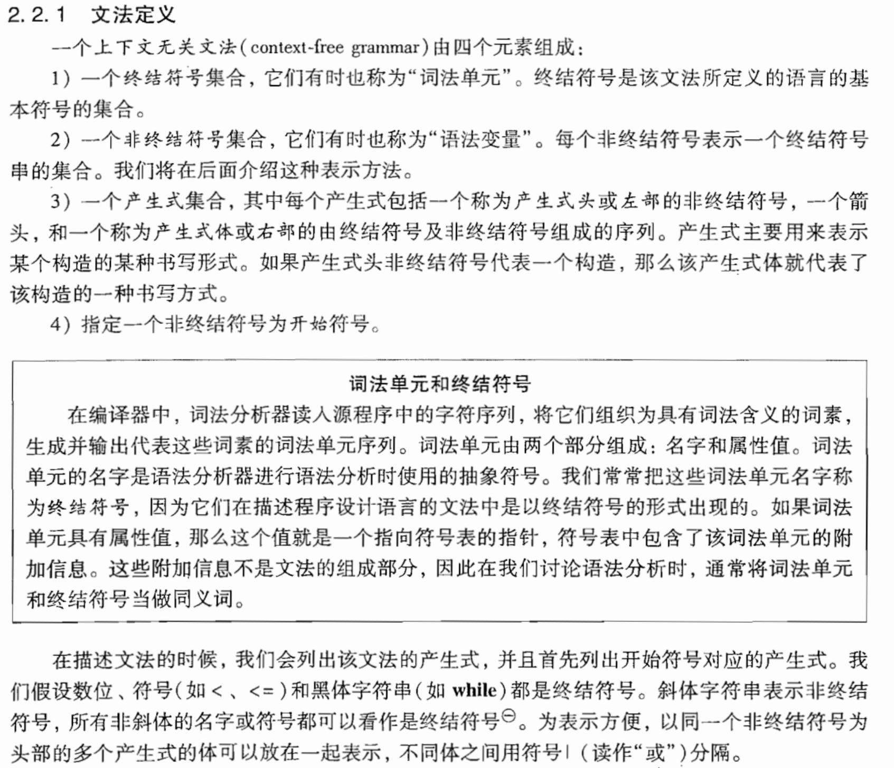
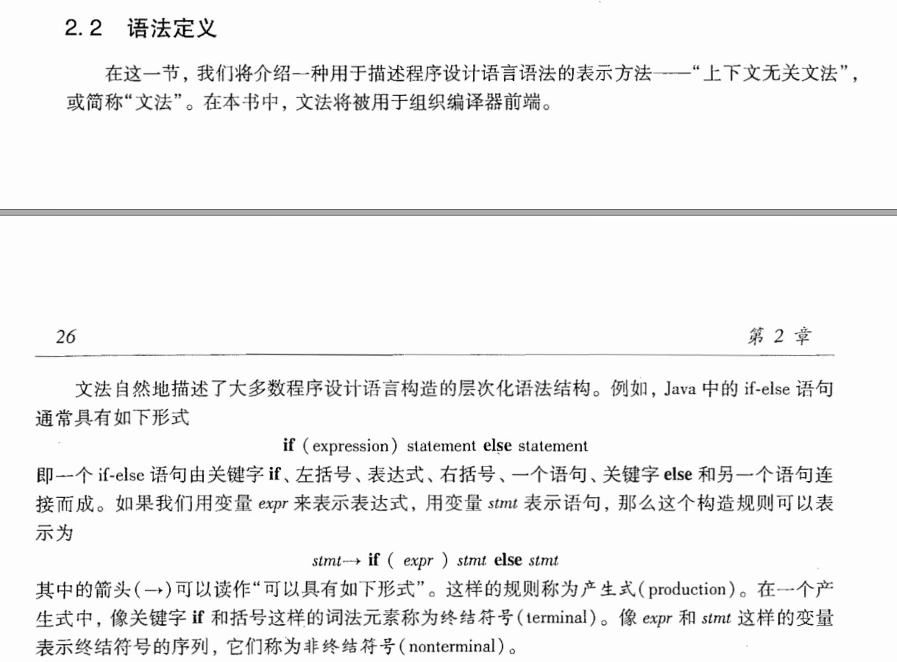
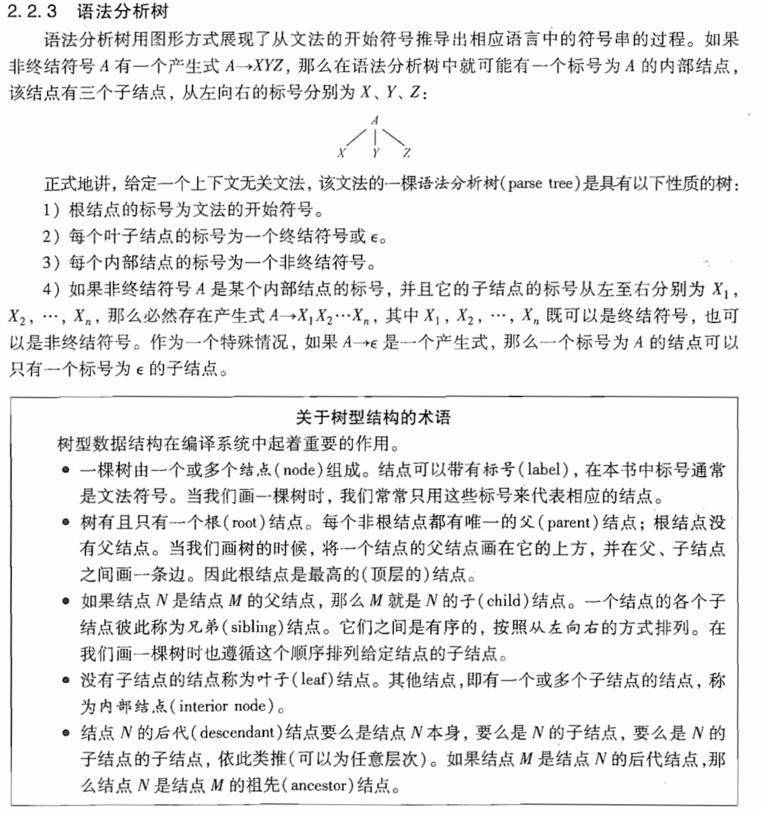
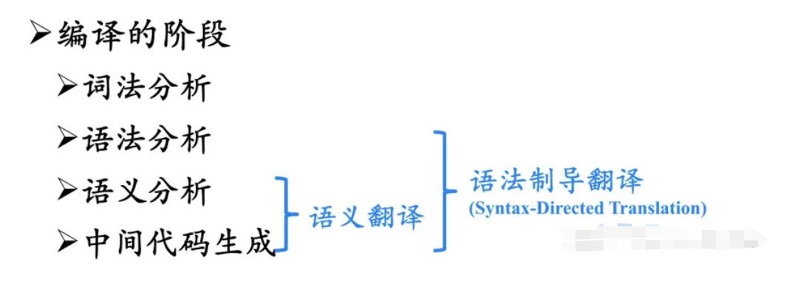
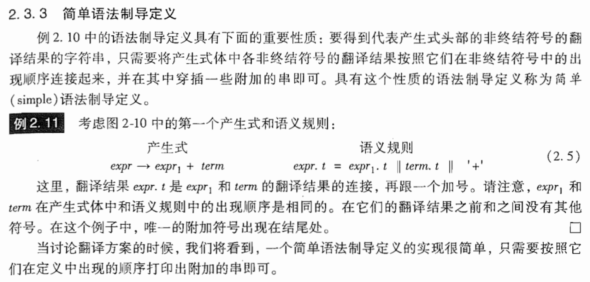

# 上下文无关文法

**文法是用来描述语法的**
举个例子：
产生式：  Sent -> S V O
        S -> 人 | 天
        V -> 吃 | 下
        O -> 雨 | 雪 | 饭 | 肉
其中英文字母都是非终结符（SVO 分别表示主谓宾），汉字都是终结符。这个文法可以生成如下句子（共 2*2*4=16 种组合，懒得写全了，简单写 7 种意思意思）：｛人吃饭，天下雨，人吃肉，天下雪，人下雪，天下饭，天吃肉，……｝可以看到，其中有一些搭配在语义上是不恰当的，例如“天吃肉”。其（最左）推导过程为：Sent -> SVO -> 天VO -> 天吃O -> 天吃肉
但是上下文无关文法里，因为有“V -> 吃 | 下”这样一条产生式，V 就永远都可以推出“吃”这个词，它并不在乎应用“V -> 吃 | 下”这个产生式进行推导时 V 所在的上下文（在这个例子里，就是”天VO“中 V 左右两边的字符串”天“和”O“）。事实上，在 V 推出“吃”这一步，它的左边是“天”这个词，而”天“和”吃“不搭配，导致最后的句子读起来很奇怪。
**上下文无关语法就是每段代码都是可以独立解析的，和上下文无关，C语言的语法是上下文相关**

# 语法分析树

**文语法分析树是用来辅助推导文法到语法的**

# 语法制导翻译

语法指导翻译是通过向一个文法的产生式附加一些规则或程序片段而得到的
为了翻译程序设计语言的某个结构，除了为该结构生成的代码以外，编译器还需要保存许多信息。例如：编译器可能需要知道这个结构的类型、目标代码中第1条指令的位置、生成的指令的个数。
属性可以表示任意的信息，如类型、串、内存位置等。

将语义规则和语法规则（产生式）联系起来涉及两个概念：
    语法制导定义（Syntax-directed definitions，SDD）
    语法制导翻译方案（Syntax-directed Translation Scheme，SDT）（语义）
## 后缀表示
表达式E的后缀形式可以归纳地定义如下：

如果E是一个变量或者常量，则E的后缀表示是E本身
如果E是形如E1 op E2的表达式，其中op是一个二元操作符，则E的后缀表示是E1'E2'op，这里E1'和E2'分别是E1和E2的后缀表示
如果E是形如(E1)的表达式，则E1的后缀表示是E的后缀表示。
因为一个表达式的操作符的位置和每个操作符的操作个数(参数数量)只允许后缀表达式的一种解码方式，所以在后缀表示中不需要括号。例如,(9 - 5) + 2的后缀表示是95-2+, 9 - (5 + 2)的后缀表示是952+-

一个数字记号的后缀形式是该数字本身。
## 综合属性
分析树的某个节点的属性值是由其子节点的属性值确定的。一棵分析树的所有综合属性值的计算只需要分析树的一次自底向上遍历。

## 继承属性
分析树的某个节点的属性值是由其夫节点或则兄弟节点的属性值确定的。

## 简单的语法指导定义

## 树的遍历

## 翻译方案

# 语法分析

## 自顶向下分析方法
为了解释什么是自顶向下分析方法，首先来看一个简单的例子，语法为：

S -> aS | bS | c
需要解析的句子为abac，解析过程如下：

Working-string	 	Production
S	 	            S -> aS
aS	 	            S -> bS
abS	 	            S -> aS
abaS	 	        S -> c
abac	 	        ACCEPT
下面，一步一步跟踪这个解析过程，查看每一步是如何选择出需要的产生式的。首先，我们的目标是将起始符号 S 展开到 最终句子 abac 。把它们写在同一行来进行比较，如下：

Working-string	 	Final-string	 	Production
S	 	            a bac	 	 
假设有一个 strcmp 函数来比较符号串 “S” 和 “abac” ，从左向右一个符号一个符号的比较，找到第一个不匹配的符号，也就是 “S” 和 “a”。

因此，此时必须将中间句子中的 “S” 展开，才能得到最终句子。那如何展开呢？将最终句子中不匹配的这个 “a” ，和 S 的三个产生式的右边 aS 、 bS 和 c 相比，可以看出，只能选择 S -> aS 展开，才可以和 “a” 匹配上，展开后得到中间句子 aS ：

Working-string	 	Final-string	 	Production
S	 	            a bac	 	        S -> aS
a S	 	            a b ac	 	 
再次比较此时的中间句子 “aS” 和最终句子 “abac” ，找到的第一个不匹配的符号分别为 “S” 和 “b” ，将 “b” 和 S 的三个产生式比较，发现只能选择 S -> bS ，展开后得到中间句子 abS ：

Working-string	 	Final-string	 	Production
S	 	            a bac	 	        S -> aS
a S	 	            a b ac	 	        S -> bS
ab S	 	        ab a c	 	 
按以上原则，每次都对中间句子和最终句子进行比较，找到第一个不匹配的符号，然后利用不匹配的符号挑选出需要的产生式，最终展开到最终句子：

Working-string	 	Final-string	 	Production
S	 	            a bac	 	        S -> aS
a S	 	            a b ac	 	        S -> bS
ab S	 	        ab a c	 	        S -> aS
aba S	 	        aba c	 	        S -> c
abac	 	        abac	 	        ACCEPT
因此自顶向下分析方法的基本思路为：

每个推导步中，从左向右比较中间句子和最终句子，找到第一个不匹配的符号，如：中间句子为 u X v 、最终句子为 u a w 。显然，a 一定是终结符， X 则可能为非终结符，也可能为终结符，有以下 4 种情况：

情况 A ： X 为终结符，这种情况表明无论怎么展开都不可能展开到最终句子，即最终句子不合语法，此时终止推导。

情况 B ： X 为非终结符，假设它的所有产生式为 X -> u1 | u2 | ... | un ，将 a 和这些产生式的右边 u1, u2, ... , un 相比较，找出可以和 a 匹配的 ui ，将 ui 代替中间句子 u X v 中的 X ，得到下一个中间句子 u ui v，然后开始下一轮展开。

情况 C ： X 为非终结符，但它的所有产生式的右边 u1, u2, ... , un 中，没有一个可以和 “a” 匹配上，这种情况表明最终句子不合语法，此时终止推导。

情况 D ： X 为非终结符，但它的所有产生式的右边 u1, u2, ... , un 中，有两个或以上的 ui 可以和 “a” 匹配上，这种情况表明此语法不适于用自顶向下分析方法，需要修改语法。

## 预测性分析法
### 文法
### 消除左递归
### FIRST集
### FOLLOW集
### 预测表
### 分析句子

## 何时使用E产生式

## 设计一个预分析器

## 左递归

参考链接：
[自己动手写编译器](https://pandolia.net/tinyc/index.html)
[LL1预测分析法代码](https://blog.csdn.net/m0_54759841/article/details/124001965)
[LL1预测分析法-first-follow-select集](https://blog.csdn.net/CooperNiu/article/details/78524688)
