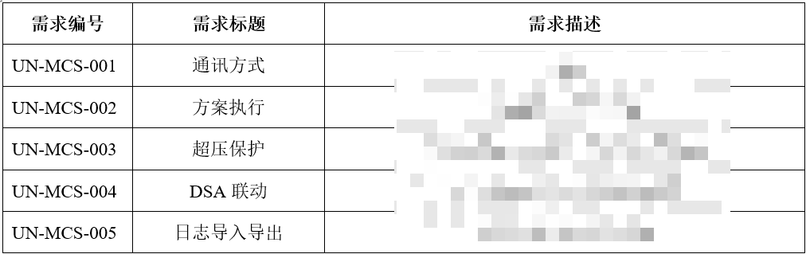
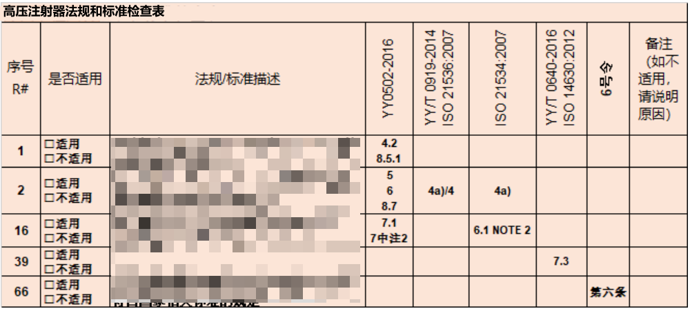
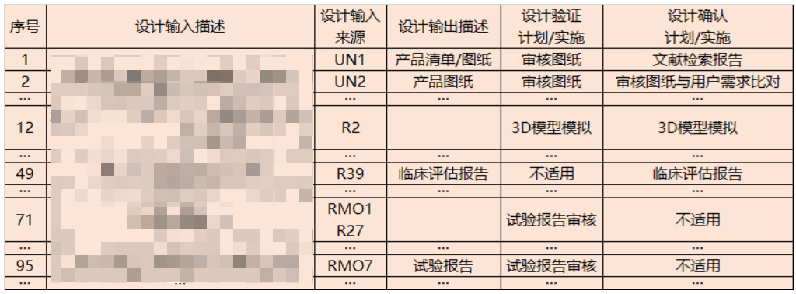
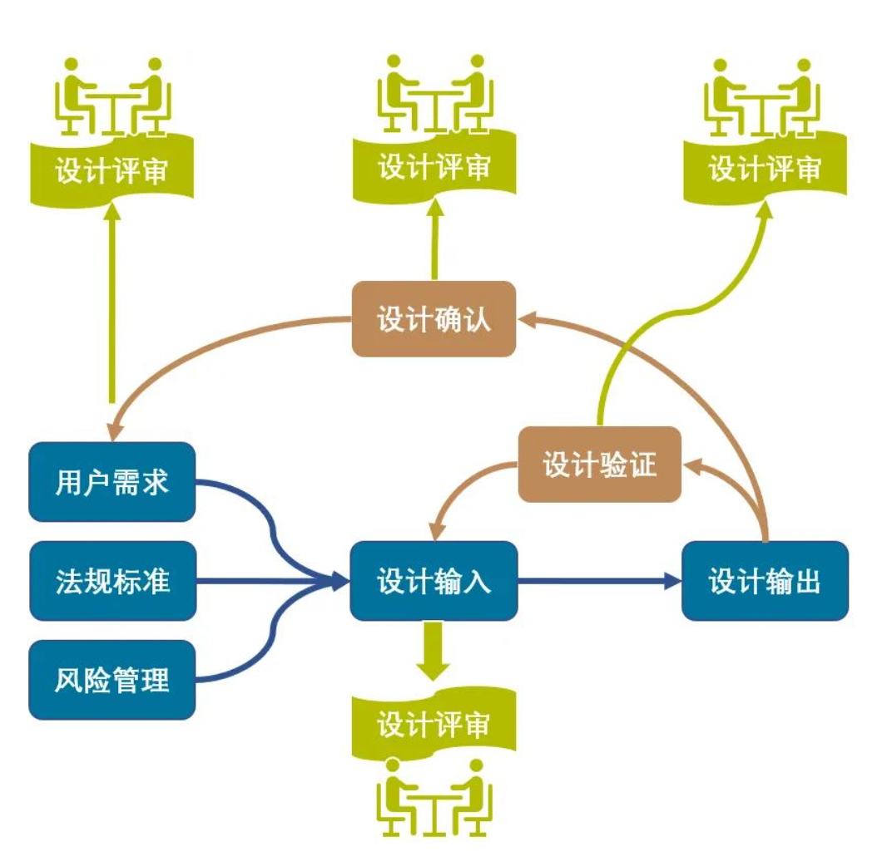

# 医疗器械的软件设计输入
设计输入一般有三个来源:
    1:**用户需求**:每一条用户需求都要对应一条或多条设计输入。用户需求比较笼统时，就要把它分解成容易实施的若干条设计输入。用户需求比较具体时，一条用户需求对应一条设计输入即可。
    2:**法规和标准的要求**:例如GB9706，強制标准的要求，以及注册指导原则等。比较理想的做法是把这些标准和法规的条款列一个表，逐条判定适不适用于正在开发的产品，如果适用，就导入到设计输入里；如果不适用，说明理由为什么不适用。判定的过程应当存档，因为这也是设计历史文档的一部分，同时对今后类似产品的开发也具有参考价值。
    3:**风险管理（风险分析）**。通过分析每个危害的严重度，发生频率和可探测度，计算得到每个风险的RPN值，以判断风险是否可以接受。对于高风险和中风险危害，需要制定风险缓解措施。这些缓解措施就要导入到设计输入列表里逐一跟踪落实。

&emsp;&emsp;风险管理标准通常包含一个附录，其中列出了一些危害的示例，这些示例是基于标准制定者的经验而列出的。在使用这种方法时，工程师需要仔细检查这个附录中的危害，并判断它们是否适用于他们正在开发的新产品。如果某些危害适用，那么它们将被纳入风险分析表中进行详细研究和评估。如果某些危害不适用于新产品，工程师需要记录下不适用的理由并进行归档。此外，对于具体要设计的医疗器械，工程师还需要根据该产品的特性添加和考虑其他可能的危害。这个过程高度依赖于工程师的专业经验和知识。

&emsp;&emsp;另一种风险管理方法是将风险管理标准的宏观原则与具体产品的实际使用情况相结合。仔细分析每一个工作步骤，考虑每一步可能存在的危害，并计算每个危害的风险优先级数（RPN值）。这种方法着重于对产品实际使用情境的深入理解，并强调在设计过程中反复思考哪些步骤与已有产品相似，哪些步骤可能不同，以及每一步可能引发的潜在风险。

&emsp;&emsp;现在我们简单模拟一下如何将这三个输入来源导入到设计输入中

&emsp;&emsp;假定用户需求评审已经完成，用户需求列表已经确定。我们用UN#表示第#个用户需求。例如UN2是用户需求表里的第2条。这里的UN表示User Needs，即用户需求。当然，你也可以不用UN，而用汉语拼音，或者其它方式编号。

&emsp;&emsp;   这时法规和标准清单也已经完成，[法规来源于国标例如:GB9706,标准清单来源于注册标准等例如:医疗器械软件注册审查指导原则]并且每一条是否适用于本产品也已经判断完成。假定用R#表示这个清单里的第#条。例如R16表示清单里的第16条。这里R表示Regulatory，即法规。

&emsp;&emsp;把法规和标准的要求生成这个清单，不是必须的。只是如果有这个清单，一是可以避免遗漏，二是可以用这张表承载判断各项要求是否适用于本产品的记录。要不要生成这样的清单，取决于研发管理者的风格和思路。

&emsp;&emsp;这时，初次风险分析也已经完成。类似地，用RMO#表示第#条风险分析。例如RMO7表示第7条风险分析。这里RMO表示Risk Management Output，即风险管理输出。

&emsp;&emsp;现在我们把它们汇集到下面的设计输入输出追踪表中：

&emsp;&emsp;上表第三列表示该条设计输入所对应的输入的来源。有可能同一条设计输入同时来源于法规和风险分析，例如上表的第71条。每一条设计输入都对应各自的设计输出以及设计输出的验证与确认。

&emsp;&emsp;在设计输入评审阶段，只要定义每个输入对应的输出的类型即可。例如只要定义输出是图纸，产品清单，还是实验报告，或者公差堆积分析等即可。在这个阶段，还要制定每一条设计输出的验证计划和确认计划。

&emsp;&emsp;在设计输出和验证评审阶段，通过更新这个表来核实每一行的设计验证的执行情况，要在设计验证一列里填写图纸号，或实验报告号，或者其它验证文件编号，名称，生效日期，也要填写核实人的姓名等。

&emsp;&emsp;在设计输出确认评审阶段，继续更新这个追踪表来核实每一行的设计确认的完成情况，要在设计确认那一列列出确认文件的编号，名称，生效日期，核实人姓名等。

&emsp;&emsp;每次设计评审前，都要评估风险分析是否需要更新。随着项目的进行，可能会发现有些用户需求不合理，需要调整。有些风险没有考虑到，需要补充。当用户需求或者分析分析更新时，设计输入输出追踪表要随之更新。法规或标准更新一般有至少一年的缓冲期，产品开发时要提前将新的法规和标准导入进来。

&emsp;&emsp;在整个设计开发过程中，设计输入输出追踪表是设计历史文档的灵魂。它往前与用户需求，法律法规以及风险管理相关联，往后与设计验证与确认文档相关联。产品开发的主要历史文档都在这个表里被引用。抓住这个追踪表，就可以感受到整个产品开发的脉络。这个追踪表也是设计开发过程可追溯性的记录。有多少个设计输入，最后就有多少个设计输出，一个不多，一个不少，一目了然。

&emsp;&emsp;最后需要说明两点，第一，这种设计模式适合瀑布性/预测性项目,如果是敏捷项目应该更加注重人与人之间的互动,同时文档的记录也是有必要的。第二，应该注重管理项目知识，利用已有的组织知识来创造或改进项目成果，并使当前项目创造的知识可用于支持组织运营和未来的项目或阶段。本过程需要在整个项目期间开展,以上观点只作为参考。

-----------