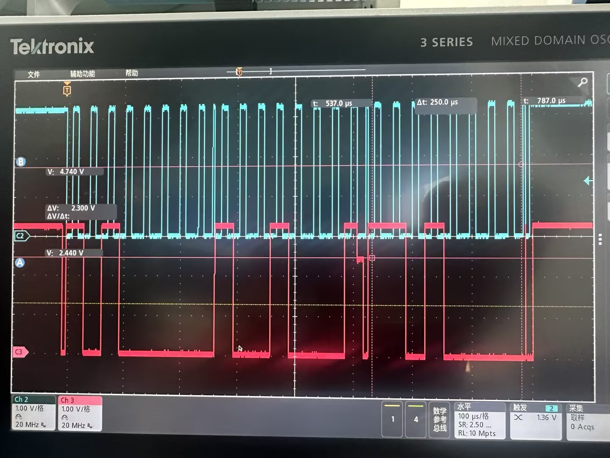
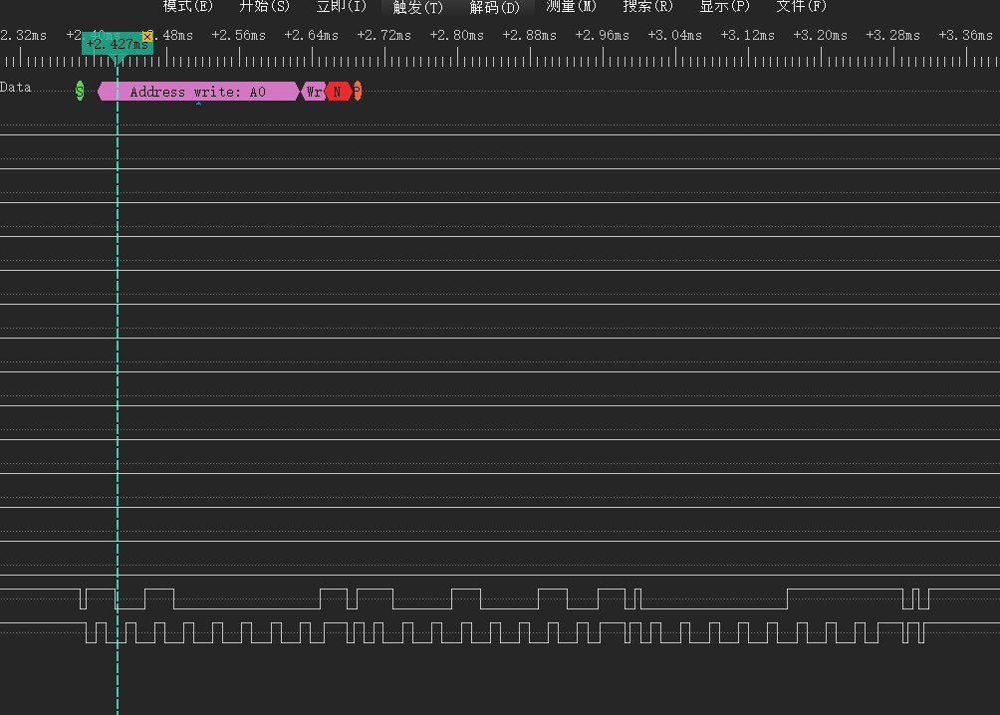
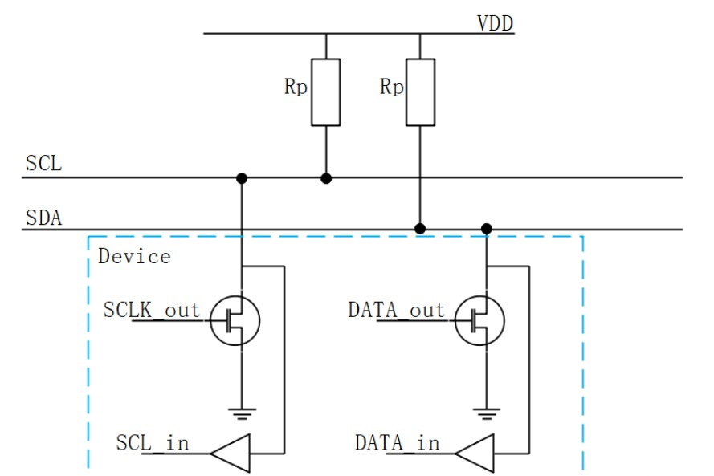
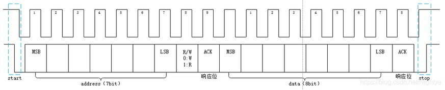
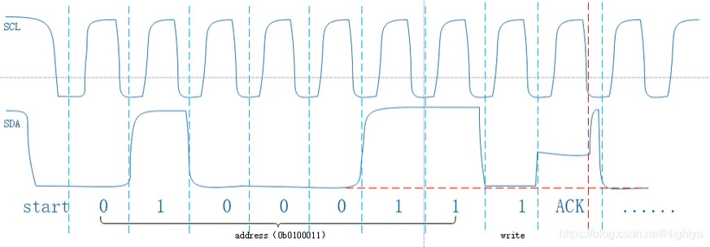

# I2C出现半高电平

# 危害

通过逻辑分析仪的分析，上图中的半高电平是write完0XA0之后等待从I2C设备的ACK,逻辑分析仪没有抓取到ACK的低电平导致的解析中断。虽然逻辑分析仪的电平是正常的但是通过示波器采样才能看出细节。

# 分析
## 硬件结构

IIC的接口是OD/OC结构，因此其本身无法输出高电平。
坏处：
1、不接外部上拉就只能输出低电平，所以设计的时候千万记得把上拉电阻给留上；

好处：
1、外部上拉可以减少IC自身的驱动负担；
2、实现线与（IIC多主机同步时钟和仲裁总线控制权的时候感受就非常明显）；
3、改变信号电平（在手册允许的范围内甚至能把信号电平整的比IC供电电压还要高）。

## 时序波形

## ACK响应位出现半高电平

这种情况说白了就是IIC链路上的器件接口不是纯粹的OD/OC，一般多出在可编程器件上，比如说MCU，CPLD。
如果IIC总线上挂了多个器件，在ACK位的时候，有器件管脚没有配置为OD或者OC，导致芯片内部将该管脚拉高，此时链路上其他的器件又需响应想拉低总线，如果两边链路上都存在串阻，则通过电阻分压会出现中间电平；
如果没有串阻，或者串阻过小，则可能烧坏器件（灌电流）。总之非常危险，这个半高电平可能出现在任何位置，只不过ACK位容易被忽视，更容易出问题。

# 解决方法
在将SDA设置成输入之前不要设置延时，如果传输完数据之后延时一段时间等待ACK的话，这个时候还是输入状态而从设备的ACK已经拉低，就会出现中间电平。一直开漏模式也行，因为SDA引脚是加了上拉电阻的，只要输出你先设为高电平，再去读取该引脚，是能正确读取到的ACK的。

> 如何计算I2C的上拉电阻 https://blog.csdn.net/zhi_Alanwu/article/details/133785325