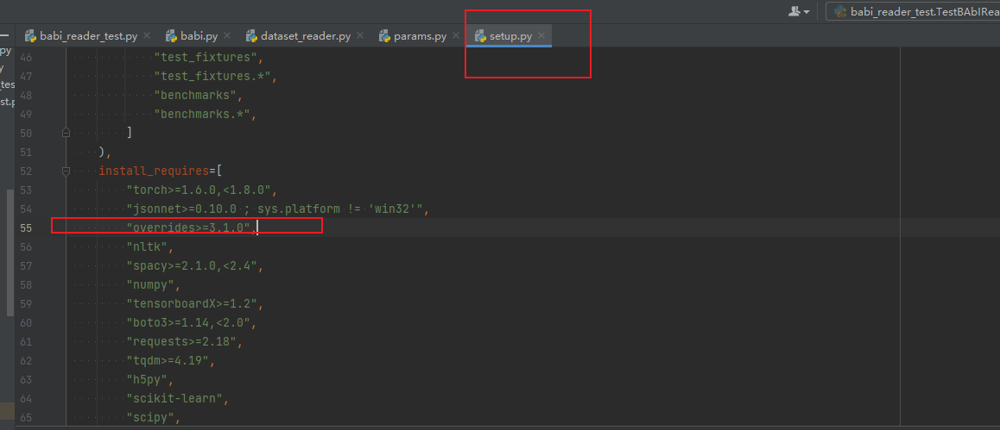

# AllenNLP学习笔记
> 最近我发现了一个非常强大的自然语言处理工具——AllenNLP。它由知名的A2I实验室开发，解决了许多我在处理自然语言时遇到的问题。尽管大部分文档都是英文的，我还是决定仔细阅读它们，因为这个框架真的太棒了！我计划深入研究它们优雅的代码和官方文档，并把我的学习记录下来，相信这对每个从事自然语言处理的人都会有所帮助。

# 前言
AllenNLP 是艾伦人工智能研究院开发的开源 NLP 平台。它的设计初衷是为 NLP 研究和开发（尤其是语义和语言理解任务）的快速迭代提供支持。它提供了灵活的 API、对 NLP 很实用的抽象，以及模块化的实验框架，从而加速 NLP 的研究进展。

AllenNLP API 文档：https://docs.allennlp.org/v1.2.2/

AllenNLP Guide 指南：https://guide.allennlp.org/your-first-model

## 为什么值得研究
工欲善其事，必先利器。在进行自然语言处理的过程中，有个大家都知道的梗–“语料准备3小时，训练模型3分钟”。一般的处理nlp task的流程如下：

1. Firs拿到原始文本
2. 预处理，将文本切成词或者字
3. 将文本转换为index
4. 将文本向量化
5. 编码分布式表示
6. 解码出最终的输出
7. 进行训练

在进行这样的自然语言处理的过程中，我们在不同的任务中重复了很多工作，如读取和缓存，预处理循环，NLP中的padding，各种预训练向量。尽管神经网络在各种任务上都取得了显著的性能提升，但在调整新模型或复制现有结果方面，仍可能存在困难，如模型需要一定训练时间，同时对初始化和超参数设置很敏感。

AllenNLP的出现，就是为了帮助NLPer可以更快的验证自己的idea，将双手从重复的劳动中解放出来，其优势如下：

- 模块化的框架，集成了不少通用的数据处理模块和算法模块，同时具有拓展性。
- 使用json配置文件的方式使实验的调整更为方便
- 拥有灵活的数据API，可以进行智能的batching和padding
- 拥有在文本处理中常用操作的高级抽象

## 研究源码
[Allennlp源码解读](https://github.com/qian-qiang/allennlp.git)

### 版本解决及记录
overrides包读取不到

安装pip install overrides==4.0.0

## allennlp安装
适用版本为allennlp 1.2.2，安装命令如下：
```c
# 首先安装torch环境
pip install -i https://pypi.tuna.tsinghua.edu.cn/simple torch==1.6.0 torchvision==0.6.1 -f https://download.pytorch.org/whl/torch_stable.html

# 安装allennlp
pip install allennlp==1.2.2

# 如果出现Microsoft Visual C++ Redistributable is not installed, this may lead to the DLL load failure.的错误，安装VC_redist.x64即可，下载位置如下：
https://aka.ms/vs/16/release/vc_redist.x64.exe
```

## 学习记录
在看了一堆教程后，决定按这篇博客 [#AllenNLP 使用教程#](https://www.jianshu.com/p/17abfefc1b5b) 进行学习，它对官方提供的一个入门教程进行了翻译。然而实操途中遇到不少错误...后来发现这篇教程是基于allennlp 0.6.1
版本更新：[# AllenNLP Changelog #](https://docs.allennlp.org/main/CHANGELOG/)


## 参考
[# allennlp系列文章：中文分词等 #](https://blog.csdn.net/m0_38133212/category_8640328.html?spm=1001.2014.3001.5482)

[# AllenNLP 使用教程 #](https://www.jianshu.com/p/17abfefc1b5b)

[# AllenNLP框架学习笔记（入门篇）#](https://blog.csdn.net/sinat_33455447/category_10770127.htmlb)

[# 动手学AllenNLP #](https://www.zhihu.com/column/c_1347528007377076224 "注册机制、数据加载、模型调用原理")

[# 深入了解Allennlp细节 #](https://zhuanlan.zhihu.com/p/111563535 "DataReader→Model→Train，介绍了很多细节")

[# AllenNLP入门笔记（一）#](https://blog.csdn.net/weixin_35077119/article/details/104682222 "allennlp常用API介绍、测试模型代码")

[# AllenNLP入门笔记（二）#](https://blog.csdn.net/weixin_35077119/article/details/104702965?spm=1001.2014.3001.5501 "本文的案例实现，细节介绍很具体；allennlp命令")

[# AllenNLP学习之classifier_model #](https://zhuanlan.zhihu.com/p/72584576 "介绍基础分类器和Bert模型、该博主的allennlp系列文章")

[# AllenNLP之入门解读代码 #](https://blog.csdn.net/Findingxu/article/details/91542654)
[# 自然语言处理N天-AllenNLP学习（设定文档解读 #](https://www.jianshu.com/p/25e3b032d2cb)


## GitHub 

[justforyou16007/AllenNLP-Tutorials-Chinese（一个基于allennlp 0.8.4的系列教程](https://github.com/justforyou16007/AllenNLP-Tutorials-Chinese)

[#  nutalk/allennlp_classification（AllenNLP 0.x 实现了基于LSTM、TEXTCNN、BERT的文本分类模型 #](https://github.com/nutalk/allennlp_classification)，对应的博客说明 [用AllenNlp写文本分类模型](https://zhuanlan.zhihu.com/p/83392070) 和 [用AllenNlp写基于LSTM，TEXTCNN，BERT的文本分类模型](https://zhuanlan.zhihu.com/p/84702615)

[dmesquita/easy-deep-learning-with-AllenNLP（一个基于allennlp 0.x 的20 newsgroups分类器](https://github.com/dmesquita/easy-deep-learning-with-AllenNLP)

[mhagiwara/realworldnlp（基于allennlp 1.0.0或以上的语义分析、命名实体识别、词性标注等](https://github.com/mhagiwara/realworldnlp)

## 其他

[深度学习 | 三个概念：Epoch, Batch, Iteration](https://blog.csdn.net/weixin_45798684/article/details/105549286)

[NLP 装桶（Bucketing）和填充（padding）](https://www.cnblogs.com/callyblog/p/9681377.html)


[Seq2seq模型（一）——初窥NLP](https://cloud.tencent.com/developer/news/388798)


