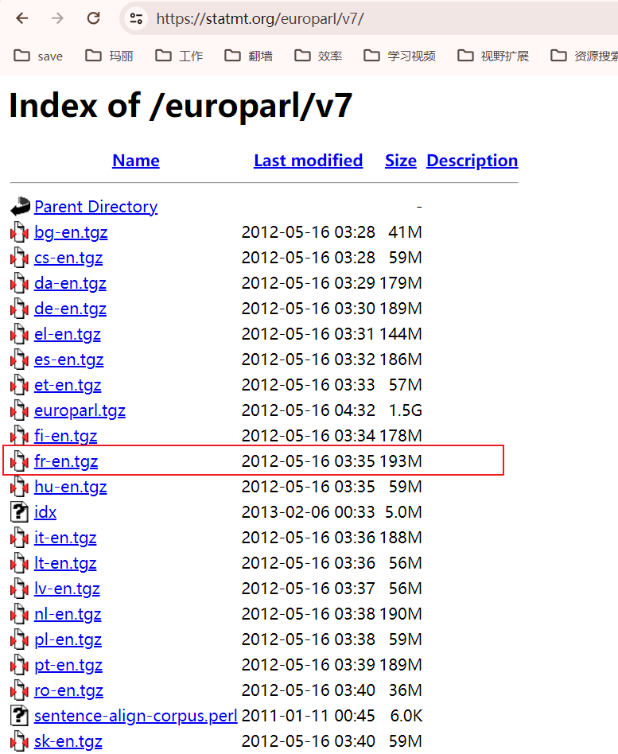
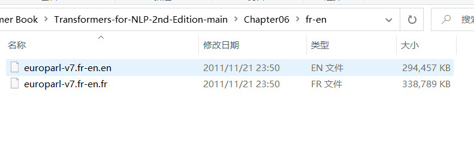
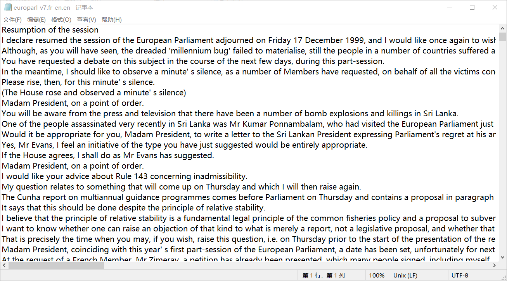
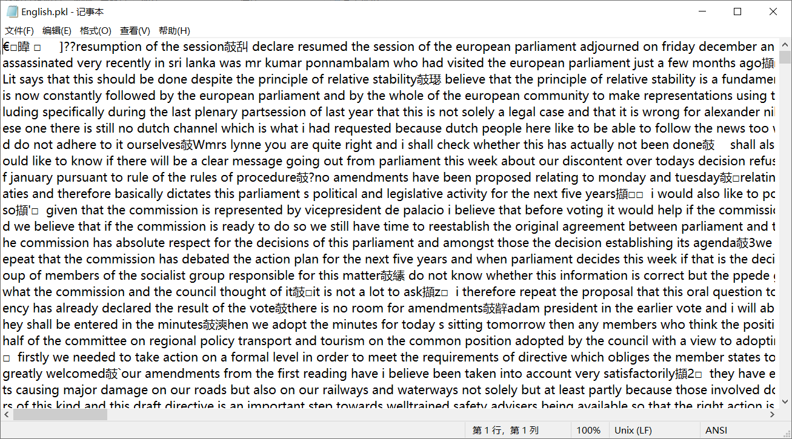
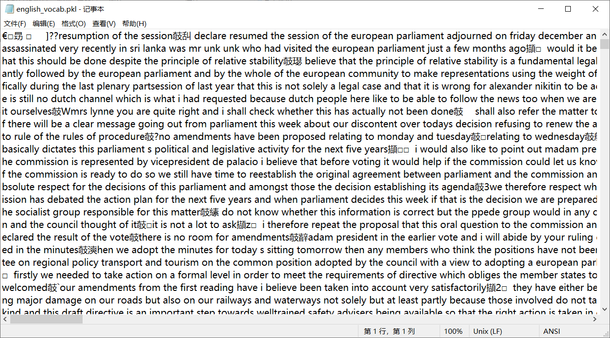

# Q:如何进行数据准备？
# GPT:
数据准备是训练大模型的重要步骤，包括数据的收集、预处理和词元化。以下是详细的步骤和注意事项：

### 数据来源
1. **通用文本数据**：
   - 包括网页、书籍、对话文本等。通用文本数据规模大、种类多且易于获取，是大多数大语言模型预训练的主要来源
   
2. **专用文本数据**：
   - 包括科学论文、代码等。专用文本数据可以增强模型在特定领域的表现。例如，收集 arXiv 论文、科学教材等作为科学文本语料，收集 Stack Exchange 和 GitHub 数据作为代码语料

### 数据预处理
1. **质量过滤**：
   - 使用语种过滤、统计过滤、关键词过滤、分类器过滤等技术，确保数据质量。

2. **敏感内容过滤**：
   - 过滤掉有毒、有害或包含隐私信息的数据，以确保训练数据的安全和合规

3. **数据去重**：
   - 去除重复数据，避免模型在相同数据上多次训练，浪费算力资源。

### 词元化（分词）
1. **BPE分词**：
   - 使用BPE（Byte Pair Encoding）分词技术，将文本分解为词元，适用于处理大规模数据

### 实践中的数据预处理
1. **具体实施**：
   - 通过具体代码示例展示数据预处理的方法，例如使用YuLan-GARDEN进行数据清洗

### 数据调度
1. **课程学习**：
   - 通过使用短到长的训练序列长度数据课程，优化模型的长文本建模能力，并节省训练时间

通过这些步骤，结合多样化的数据来源和严格的数据预处理，可以有效提升大语言模型的训练质量和性能。

**以上是GPT的回答，看着确实很有道理，但是实际上完全没有搞懂，数据哪里来，数据长什么样子，数据整么处理，数据最后的格式是整么样子的？**

# 数据来源
打开网站 https://statmt.org/europarl/v7/ 

 下载下fr-en.tgz。 
 
 

# 数据处理
```python
# 为机器翻译预处理数据集
# 版权 2020 年，Denis Rothman，MIT 许可证
# Denis Rothman 对代码进行了修改以用于教育目的。
# 引用:
# Jason Brownlee 博士，“如何准备用于机器翻译的法语至英语数据集”
# https://machinelearningmastery.com/prepare-french-english-dataset-machine-translation/
# https://statmt.org/europarl/v7/
import pickle
from pickle import dump


# 加载文档到内存
def load_doc(filename):
    # 打开文件只读模式
    file = open(filename, mode='rt', encoding='utf-8')
    # 读取所有文本
    text = file.read()
    # 关闭文件
    file.close()
    return text


# 将加载的文档拆分成句子
def to_sentences(doc):
    return doc.strip().split('\n')


# 最短和最长句子长度
def sentence_lengths(sentences):
    lengths = [len(s.split()) for s in sentences]
    return min(lengths), max(lengths)


# 清理行
import re
import string
import unicodedata


def clean_lines(lines):
    cleaned = list()
    # 准备用于字符过滤的正则表达式
    re_print = re.compile('[^%s]' % re.escape(string.printable))
    # 准备用于去除标点符号的转换表
    table = str.maketrans('', '', string.punctuation)
    for line in lines:
        # 规范化 Unicode 字符
        line = unicodedata.normalize('NFD', line).encode('ascii', 'ignore')
        line = line.decode('UTF-8')
        # 在空格上进行标记化
        line = line.split()
        # 转换为小写
        line = [word.lower() for word in line]
        # 从每个标记中去除标点符号
        line = [word.translate(table) for word in line]
        # 从每个标记中去除不可打印的字符
        line = [re_print.sub('', w) for w in line]
        # 去除带有数字的标记
        line = [word for word in line if word.isalpha()]
        # 保存为字符串
        cleaned.append(' '.join(line))
    return cleaned


# 加载英语数据
filename = 'europarl-v7.fr-en.en'
doc = load_doc(filename)
sentences = to_sentences(doc)
minlen, maxlen = sentence_lengths(sentences)
print('英语数据：句子数=%d，最短=%d，最长=%d' % (len(sentences), minlen, maxlen))
cleanf = clean_lines(sentences)
filename = 'English.pkl'
outfile = open(filename, 'wb')
pickle.dump(cleanf, outfile)  # 将预处理后的英语数据保存到一个 Pickle 文件中
outfile.close()
print(filename, " 已保存")  # 打印确认消息

# 加载法语数据
filename = 'europarl-v7.fr-en.fr'
doc = load_doc(filename)
sentences = to_sentences(doc)
minlen, maxlen = sentence_lengths(sentences)
print('法语数据：句子数=%d，最短=%d，最长=%d' % (len(sentences), minlen, maxlen))
cleanf = clean_lines(sentences)
filename = 'French.pkl'
outfile = open(filename, 'wb')
pickle.dump(cleanf, outfile)  # 将预处理后的法语数据保存到一个 Pickle 文件中
outfile.close()
print(filename, " 已保存")  # 打印确认消息

```

使用python处理之后就是
 

# 数据再处理
```python
# 为机器翻译预处理数据集
# 版权 2020 年，Denis Rothman，MIT 许可证
# Denis Rothman 对代码进行了修改以用于教育目的。
# 引用:
# Jason Brownlee 博士，“如何准备用于机器翻译的法语至英语数据集”
# https://machinelearningmastery.com/prepare-french-english-dataset-machine-translation/

from pickle import load
from pickle import dump
from collections import Counter

# 加载干净的数据集
def load_clean_sentences(filename):
    return load(open(filename, 'rb'))


# 将一组干净的句子保存到文件中
def save_clean_sentences(sentences, filename):
    dump(sentences, open(filename, 'wb'))
    print('已保存: %s' % filename)


# 创建所有单词的频率表
def to_vocab(lines):
    vocab = Counter()
    for line in lines:
        tokens = line.split()
        vocab.update(tokens)
    return vocab


# 删除所有频率低于阈值的单词
def trim_vocab(vocab, min_occurance):
    tokens = [k for k, c in vocab.items() if c >= min_occurance]
    return set(tokens)


# 将所有 OOV（Out of Vocabulary）标记为 "unk"（未知） 对于所有句子
def update_dataset(lines, vocab):
    new_lines = list()
    for line in lines:
        new_tokens = list()
        for token in line.split():
            if token in vocab:
                new_tokens.append(token)
            else:
                new_tokens.append('unk')
        new_line = ' '.join(new_tokens)
        new_lines.append(new_line)
    return new_lines


# 加载英语数据集
filename = 'English.pkl'
lines = load_clean_sentences(filename)
# 计算词汇表
vocab = to_vocab(lines)
print('英语词汇表: %d' % len(vocab))
# 减小词汇表
vocab = trim_vocab(vocab, 5)
print('新的英语词汇表: %d' % len(vocab))
# 标记超出词汇表的单词
lines = update_dataset(lines, vocab)
# 保存更新后的数据集
filename = 'english_vocab.pkl'
save_clean_sentences(lines, filename)
# 检查一些例句
for i in range(20):
    print("第", i, "行:", lines[i])

# 加载法语数据集
filename = 'French.pkl'
lines = load_clean_sentences(filename)
# 计算词汇表
vocab = to_vocab(lines)
print('法语词汇表: %d' % len(vocab))
# 减小词汇表
vocab = trim_vocab(vocab, 5)
print('新的法语词汇表: %d' % len(vocab))
# 标记超出词汇表的单词
lines = update_dataset(lines, vocab)
# 保存更新后的数据集
filename = 'french_vocab.pkl'
save_clean_sentences(lines, filename)
# 检查一些例句
for i in range(20):
    print("第", i, "行:", lines[i])

```
使用python再处理之后就是
 

# 总结
数据处理基本就是这样，首先通过不同的平台获取到大量的数据，再使用python对数据进行格式化增加乱七八糟的标准和格式，数据处理过程会使用到大量的数据平台和格式化工具，基本雷同。