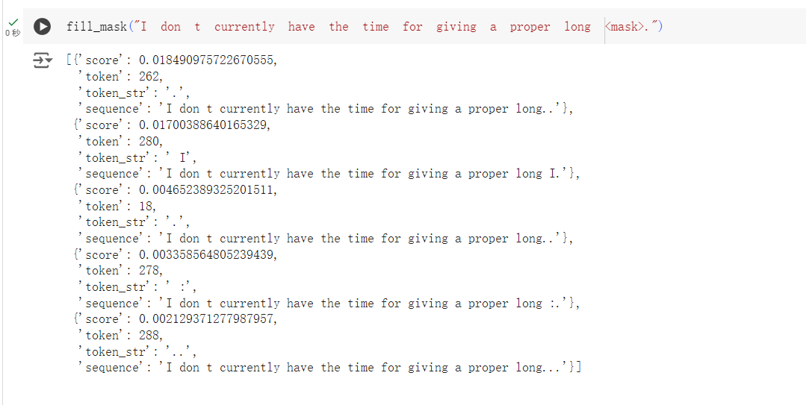

# Q:如何进行大模型训练？
# GPT:
进行大模型训练通常涉及以下几个关键步骤和考虑因素：

1. **数据准备**：
   - **数据清洗和预处理**：确保数据质量和一致性，处理缺失值和异常值。
   - **数据标准化**：将数据统一到相同的尺度或分布，以提高模型训练效果。
   - **数据增强**（对于视觉和文本任务）：通过旋转、裁剪、变换等方式扩充数据量，增加模型泛化能力。

2. **选择合适的硬件基础设施**：
   - **GPU/TPU**：使用图形处理单元（GPU）或张量处理单元（TPU）可以显著加速大模型的训练过程。
   - **分布式训练**：考虑使用多个设备进行分布式训练，如多GPU或多机群集，以减少训练时间。

3. **模型选择和设计**：
   - **选择合适的模型架构**：根据任务的复杂性和数据集的特点选择模型，如深度神经网络（DNN）、卷积神经网络（CNN）、循环神经网络（RNN）等。
   - **模型优化**：优化模型架构和超参数，如学习率、批量大小等，以提高训练效率和性能。

4. **训练过程**：
   - **批量处理**：使用批处理技术来并行处理多个数据点，加速训练过程。
   - **学习率调度**：动态调整学习率以优化模型收敛速度和质量。
   - **监控和调试**：监控训练过程中的指标和损失，及时调整训练策略或中止训练以避免资源浪费。

5. **模型评估和调优**：
   - **验证集评估**：使用验证集评估模型泛化能力，避免过拟合。
   - **超参数调整**：根据验证集的表现调整模型超参数，如层数、节点数等。

6. **部署和推理**：
   - **优化模型**：对模型进行量化、裁剪或转换，以便在生产环境中高效运行。
   - **模型压缩**：使用技术如剪枝、量化等减少模型大小和计算需求。
   - **推理加速**：选择适合部署环境的硬件加速器，如GPU、TPU或专用ASIC。

大模型训练需要充分考虑到硬件资源、数据质量、模型设计和训练优化等多个方面，以确保在合理的时间内达到良好的训练效果和泛化能力。

**以上是GPT的回答，看着确实很有道理，但是实际上也是完全没有搞懂，接下来使用GoogleColab来训练模型**、

# 打开Colab 运行代码
```python
# -*- coding: utf-8 -*-
"""KantaiBERT.ipynb

Automatically generated by Colab.

Original file is located at
    https://colab.research.google.com/drive/1pAmDFL_JQYa44K2e3mWIno80g5dUu4HL

# 如何使用 Transformers 和 Tokenizers 从头开始训练新的语言模型

Denis Rothman。Denis Rothman 参考 Hugging Face 的笔记本，预训练了一个 transformer 模型。接下来的步骤是构建更大的数据集并测试多个 transformer 模型。

推荐理解这个笔记本。GPT-3 引擎的出现提供了一个可以超越许多训练过的 transformer 模型的 API。然而，要让 transformer 知道如何处理输入数据集，理解它们的训练过程是至关重要的。

这个笔记本中的 Transformer 模型名为 ***KantaiBERT***。***KantaiBERT*** 是一个以 RoBERTa Transformer 方式训练的，采用 DistilBERT 架构的模型。数据集是从 [Jiumo Search](https://www.jiumodiary.com/) 下载的Pride+and+Prejudice,To+Kill+A+Mockingbird,THE CATCHER IN THE RYE三本书编译而成的。

***KantaiBERT*** 使用一个具有 8400 万参数的小模型进行预训练，采用了与 DistilBERT 相同的层数和头数，即 6 层、768 隐藏单元和 12 个注意力头。然后，***KantaiBERT*** 被微调用于下游的掩码语言建模任务。

### Hugging Face 原始参考和注释：

笔记本版本（参考博客文章的原始链接 [link](https://huggingface.co/blog/how-to-train)）。

# 步骤1：加载数据集
"""

from IPython.display import Image      # 这是用于在笔记本中渲染图像的

#@title 步骤1：加载数据集
#1.使用 Colab 文件管理器加载 kant.txt
#2.从 GitHub 下载文件
#!curl -L https://github.com/qian-qiang/Good-Study-Day-Day-Up/tree/main/%E5%A4%A7%E6%A8%A1%E5%9E%8B%E5%AD%A6%E4%B9%A0/Book/others/kant.txt --output "kant.txt"

"""#步骤 2：安装 Hugging Face 的 Transformers"""

#@title 步骤 2：2024 年 6 月更新：安装 Hugging Face Transformers
'''
# 这里我们不需要 TensorFlow
!pip uninstall -y tensorflow
# 从 master 分支安装 `transformers`
!pip install git+https://github.com/huggingface/transformers
!pip list | grep -E 'transformers|tokenizers'
# 本笔记本更新时的 transformers 版本 --- 2.9.1
# 本笔记本更新时的 tokenizers 版本 --- 0.7.0

'''

"""2023年6月更新来自 Hugging Face 问题 22816：

https://github.com/huggingface/transformers/issues/22816

“PartialState 导入作为依赖项在昨天添加到 transformers 的开发分支中。PartialState 是在 accelerate 0.17.0 版本中添加的，因此对于 transformers 的开发分支，需要 accelerate >= 0.17.0。

降级 transformers 版本可以移除导入 PartialState 的代码。”

Denis Rothman: 以下代码单元格导入了最新版本的 Hugging Face transformers，而无需降级。

为了适应 Hugging Face 的升级，使用 Google Colab Pro 激活了 GPU 加速器，配备了以下 NVIDIA GPU：
GPU 名称：NVIDIA A100-SXM4-40GB
"""

!pip install transformers

"""#步骤 3：训练一个 tokenizer"""

# Commented out IPython magic to ensure Python compatibility.
# #@title 步骤3：训练一个分词器
# %%time
# from pathlib import Path
# from tokenizers import ByteLevelBPETokenizer
# 
# # 获取所有 .txt 文件的路径
# paths = [str(x) for x in Path(".").glob("**/*.txt")]
# 
# # 初始化分词器
# tokenizer = ByteLevelBPETokenizer()
# 
# # 自定义训练参数
# tokenizer.train(files=paths, vocab_size=52_000, min_frequency=2, special_tokens=[
#     "<s>",
#     "<pad>",
#     "</s>",
#     "<unk>",
#     "<mask>",
# ])
#

"""#步骤4：将文件保存到磁盘"""

#@title 步骤4：将文件保存到磁盘
import os

# 指定保存分词器的目录
token_dir = '/content/KantaiBERT'

# 如果目录不存在，则创建它
if not os.path.exists(token_dir):
    os.makedirs(token_dir)

# 保存分词器
tokenizer.save_model(token_dir)

"""#步骤5：加载训练好的分词器文件"""

#@title 步骤5 加载训练好的分词器文件
from tokenizers.implementations import ByteLevelBPETokenizer
from tokenizers.processors import BertProcessing

tokenizer = ByteLevelBPETokenizer(
    "./KantaiBERT/vocab.json",
    "./KantaiBERT/merges.txt",
)

#然后使用词元分析器对序列进行编码
tokenizer.encode("The Critique of Pure Reason.").tokens

#还可以看看该序列的词元数量：
tokenizer.encode("The Critique of Pure Reason.")

#然后添加开始和结束词元
tokenizer._tokenizer.post_processor = BertProcessing(
    ("</s>", tokenizer.token_to_id("</s>")),
    ("<s>", tokenizer.token_to_id("<s>")),
)
tokenizer.enable_truncation(max_length=512)

"""#步骤 6：检查资源约束：GPU 和 NVIDIA"""

#@title 步骤 6：检查资源约束：GPU 和 NVIDIA
!nvidia-smi

#@title 检查 PyTorch 是否能够使用 CUDA
import torch
torch.cuda.is_available()

"""#步骤 7：定义模型配置"""

#@title 步骤 7：定义模型配置
#词表大小设置为52000,包含12个注意力头和6层：
from transformers import RobertaConfig

config = RobertaConfig(
    vocab_size=52_000,
    max_position_embeddings=514,
    num_attention_heads=12,
    num_hidden_layers=6,
    type_vocab_size=1,
)

print(config)

"""#步骤 8：在 transformers 中重新加载分词器"""

#@title 步骤 8：在 transformers 中重新加载分词器
from transformers import RobertaTokenizer
tokenizer = RobertaTokenizer.from_pretrained("./KantaiBERT", max_length=512)

"""#步骤 9：从头开始初始化模型"""

#@title 步骤 9：从头开始初始化模型
from transformers import RobertaForMaskedLM

model = RobertaForMaskedLM(config=config)
print(model)

"""#探索模型参数"""

print(model.num_parameters())
# => 84,095,008 parameters

#@title 探索模型参数
LP=list(model.parameters())
lp=len(LP)
print(lp)
for p in range(0,lp):
  print(LP[p])

#@title 计算模型参数数量
np=0
for p in range(0,lp):#number of tensors
  PL2=True
  try:
    L2=len(LP[p][0]) #check if 2D
  except:
    L2=1             #not 2D but 1D
    PL2=False
  L1=len(LP[p])
  L3=L1*L2
  np+=L3             # number of parameters per tensor
  if PL2==True:
    print(p,L1,L2,L3)  # displaying the sizes of the parameters
  if PL2==False:
    print(p,L1,L3)  # displaying the sizes of the parameters

print(np)              # total number of parameters

"""#步骤 10：构建数据集"""

# Commented out IPython magic to ensure Python compatibility.
# #@title 步骤 10：构建数据集
# %%time
# from transformers import LineByLineTextDataset
# 
# dataset = LineByLineTextDataset(
#     tokenizer=tokenizer,
#     file_path="./kant.txt",
#     block_size=128,
# )

"""#步骤 11：定义数据收集器"""

#@title 步骤 11：定义数据收集器
from transformers import DataCollatorForLanguageModeling

data_collator = DataCollatorForLanguageModeling(
    tokenizer=tokenizer, mlm=True, mlm_probability=0.15
)

"""#步骤 12：初始化训练器"""

#如果下步骤12初始化训练器失败提示accelerate版本太低就运行此代码，并从新连接
#!pip install accelerate

#import accelerate

#print(accelerate.__version__)

#@title 初始化训练器

from transformers import Trainer, TrainingArguments

training_args = TrainingArguments(
    output_dir="./KantaiBERT",
    overwrite_output_dir=True,
    num_train_epochs=1,
    per_device_train_batch_size=64,
    save_steps=10_000,
    save_total_limit=2,
)

trainer = Trainer(
    model=model,
    args=training_args,
    data_collator=data_collator,
    train_dataset=dataset,
)

"""#步骤 13：预训练模型"""

# Commented out IPython magic to ensure Python compatibility.
# #@title 步骤 13：预训练模型
# %%time
# trainer.train()

"""#步骤 14：将最终模型（包括分词器和配置）保存到磁盘"""

#@title 步骤 14：将最终模型（包括分词器和配置）保存到磁盘
trainer.save_model("./KantaiBERT")

"""#步骤 15：使用 FillMaskPipeline 进行语言建模"""

#@title 步骤 15：使用 FillMaskPipeline 进行语言建模
from transformers import pipeline

fill_mask = pipeline(
    "fill-mask",
    model="./KantaiBERT",
    tokenizer="./KantaiBERT"
)

fill_mask("I don t currently have the time for giving a proper long <mask>.")
```

文件可见[https://github.com/qian-qiang/Good-Study-Day-Day-Up/tree/main/%E5%A4%A7%E6%A8%A1%E5%9E%8B%E5%AD%A6%E4%B9%A0/Book/Google%20Colab/KantaiBERT.ipynb]导入到自己的Colab运行即可

# 效果
 

最后训练的结果很差，说明预料的重要性和数据准备的重要性，训练的过程基本是别人做好的，自己很难改，只能在成熟的模型上，利用模型的参数再微调成自己的模型。