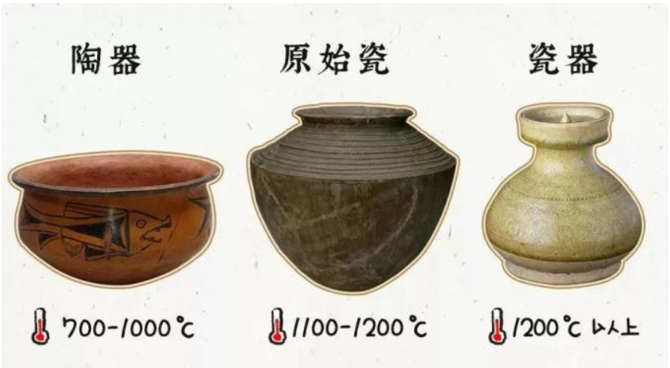
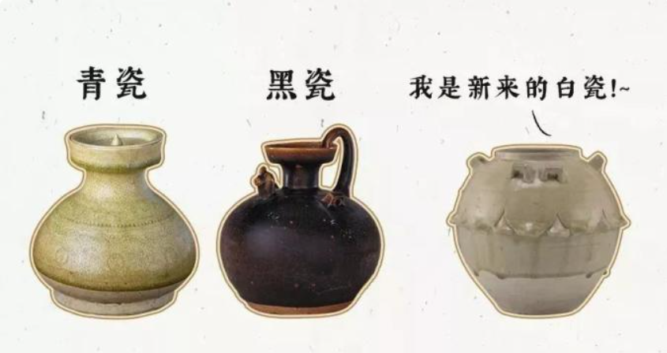
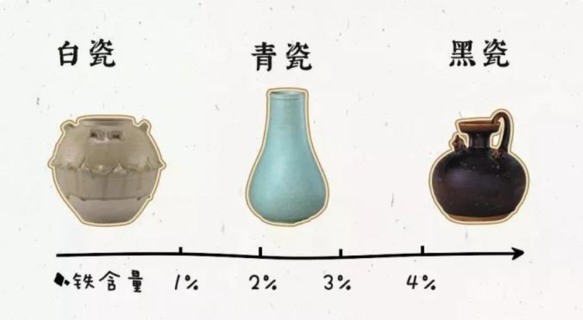
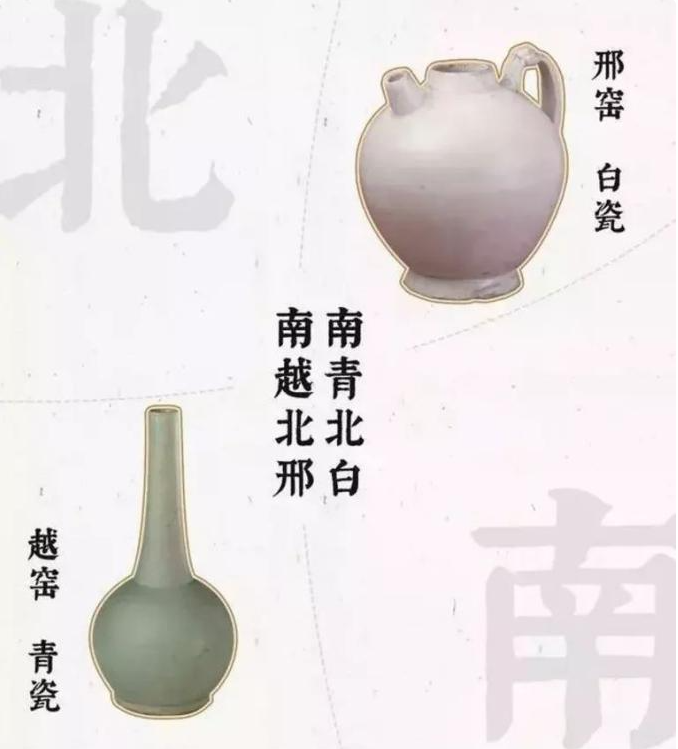
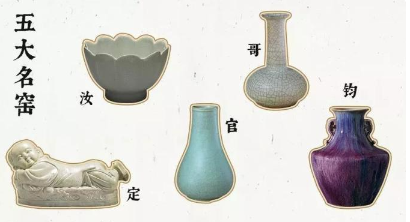
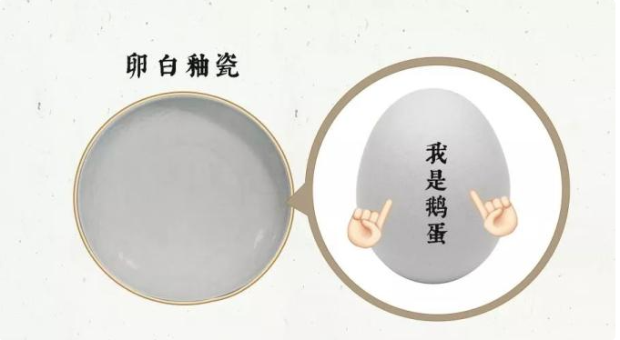
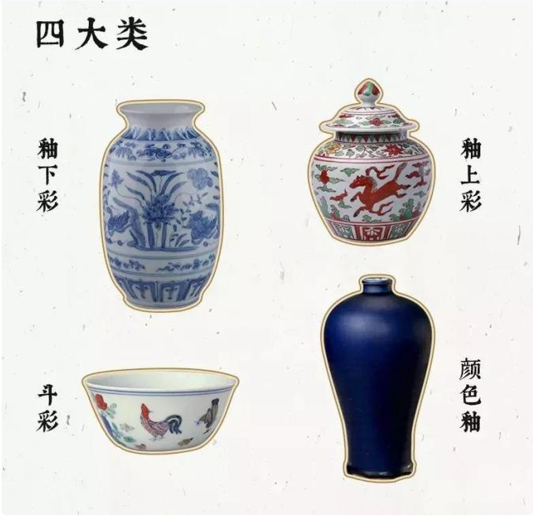

> 家无瓷不贵，室无瓷不雅

# 商 （陶器->瓷器）

瓷器是由陶器发展而来的，大约在商代，我们的祖先就已经能够烧造原始瓷器了。

而瓷器的真正成功烧造，也并非很晚，出现在东汉。烧成陶器、原始瓷器、瓷器，三者之间有个最为重要的[区别](http://www.022meishu.com/Collection/2015/10-22/24142_0.html)，那就是温度。

# 东汉 （青瓷、黑瓷、白瓷）
东汉是瓷器真正烧造而成时，这段时间，还只有[青瓷和黑瓷两种](https://www.sohu.com/a/694704841_121370801)，很单调。

东汉末年分三国，到了三国两晋南北朝时期，家族终于迎来了一位新人，白瓷。

这里的[青瓷](https://www.thepaper.cn/newsDetail_forward_20476643)、[黑瓷](https://www.guanfujianzhan.com/8238.html)、[白瓷](http://www.edehua.com/news.asp?id=7194)，并非是完全单指一种颜色。青瓷里面包含了青绿、青黄、青褐、青灰等；黑瓷里面包含了褐、酱等；白瓷也有可能略黄或略青。它们之间的区别在于釉料中铁的含量。如果釉里面铁的含量低于1%，烧出来就是白瓷；在1%在3%之间，就是青瓷；超过4%，那就是黑瓷。

# 隋代 
历史的车轮滚向了隋代，在此时的瓷器家族里面，青瓷的话语权越来越大，但是刚来的白瓷不甘示弱，它正在慢慢积蓄能量，让自己越来越白，厚积而薄发。

# 唐代 （南越北邢）
发展到了唐代，白瓷终于成功地站起来了，达到了可以跟青瓷抗衡的地步，形成了“南青北白”的局面，南方代表是来自浙江的[越窑](http://www.yueyaomuseum.com/)，北方代表是来自河北邢州的[邢窑](http://www.xingyaomuseum.com/)，所以也有“南越北邢”的说法。

# 宋代 （汝、官、哥、钧、定）
接下来我们来到了宋代，瓷器真正百花齐放的朝代。在这个朝代，有着我们最为著名的“五大名窑”——汝、官、哥、钧、定。

- 汝窑(-河南汝州)
    [汝瓷](https://www.chinaruyao.net/mobile/ruci)历史给予汝瓷的“汝窑为魁”美誉,特有[汝窑开片之美](https://www.sohu.com/a/651186436_121370801)。纵有家财万贯，不抵汝瓷一件
- 官窑(-河南开封)
    是继汝窑后为满足宋朝皇室特别是宋徽宗个人的艺术爱好，汝窑和官窑极为相像，历史认为甚至是同一种窑器，根据[铁壶之家](https://www.tiehu520.com/chadao/songci-ryhgydqb.html)的描述有区别,随便教你一招[官窑辨别之法](https://www.sohu.com/a/566682532_120500588)
- 哥窑(-浙江龙泉)
    [细说各时期“哥窑瓷器”的特征](https://www.sohu.com/a/513904188_120500588) 
- 钧窑(-河南禹县)
    [入窑一色，出窑万彩](https://www.sohu.com/a/390697768_607903)
- 定窑(-河北曲阳)
    [细说定窑瓷器的鉴赏](https://www.sohu.com/a/570159501_120500588),是当时最有名的白瓷窑口,定窑白瓷胎体洁白。

“汝、官、哥、钧”都是属于青瓷系的，而“定”主要是烧白瓷的。其中比较特殊的是钧窑，虽然颜色非常不像青瓷，但是它确实是属于青瓷系的。

# 元代（景德镇一枝独秀）

从元代开始，瓷器的百家争鸣时代结束了，变成了由景德镇一枝独秀的局面。
景德镇在元代时期，在之前青白瓷的基础上，烧成了卵白釉瓷。卵白，顾名思义，就是像卵一样白，具体白的程度，可以参照鹅蛋。
除了蓝色的青花，他们还整出了红色，叫釉里红。还整出了红蓝搭配，叫青花釉里红。景德镇的一家独大，并没有让它停滞不前。 可见[古代景德镇陶瓷业的历史演变](https://www.xhuqk.com/xhdxxbzskb/article/id/e50aff97-e2c4-410c-b4b3-885e128ef9a7?viewType=HTML)

# 明代（釉下彩、釉上彩、斗彩和颜色釉）

《景德镇陶录》卷五“宣窑”条载：“宣窑器物无物不佳，小巧尤妙，此明窑极盛时也。”景德镇更加发力，烧出了各种各样的颜色的瓷器，分为四个大类：釉下彩、釉上彩、斗彩和颜色釉。

[釉下彩，釉上彩](https://www.sohu.com/a/386295229_120613827)，[斗彩](https://www.sohu.com/a/417162945_120145597)，[颜色釉](https://www.sohu.com/a/479168027_120999132)

# 工艺
> 女人化妆如瓷艺

[刻花、划花、印花、剔花等工艺图解](https://www.sohu.com/a/224434001_729761)

