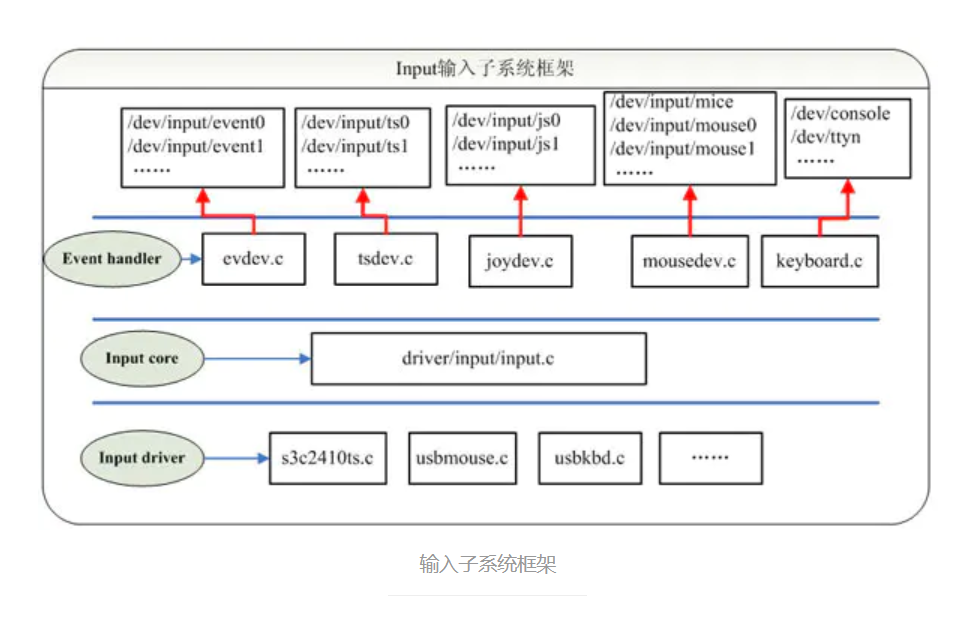
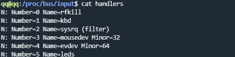

<ul>
<li>
<blockquote>
<h5>Input driver ：主要实现对硬件设备的读写访问，中断设置，并把硬件产生的事件转换为核心层定义的规范提交给事件处理层。</h5>
</blockquote>
</li>
<li>
<blockquote>
<h5>Input core ：承上启下。为设备驱动层提供了规范和接口；通知事件处理层对事件进行处理；</h5>
</blockquote>
</li>
<li>
<blockquote>
<h5>Event handler ：提供用户编程的接口（设备节点），并处理驱动层提交的数据处理。</h5>
</blockquote>
</li>
</ul>

<h1>1输入子系统框架分析</h1>

<h2>1.1设备驱动层（Input driver）</h2>
<ul>
<li>device是纯硬件操作层，包含不同的硬件接口处理，如gpio等</li>
<li>对于每种不同的具体硬件操作，都对应着不同的input_dev结构体</li>
<li>该结构体内部也包含着一个h_list，指向handle</li>
</ul>

<h2>1.2.系统核心层（Input core）</h2>
<ul>
<li>申请主设备号;</li>
<li>提供input_register_device跟input_register_handler函数分别用于注册device跟handler;</li>
<li>提供input_register_handle函数用于注册一个事件处理，代表一个成功配对的input_dev和input_handler;</li>
</ul>

<h2>1.3.事件处理层（Event handler）</h2>
<ul>
<li>不涉及硬件方面的具体操作，handler层是纯软件层，包含不同的解决方案，如键盘，鼠标，游戏手柄等；</li>
<li>对于不同的解决方案，都包含一个名为input_handler的结构体，该结构体内含的主要成员如下：</li>
</ul>
<table>
<thead>
<tr><th>成员</th><th>功能</th></tr>
</thead>
<tbody>
<tr>
<td>.id_table</td>
<td>一个存放该handler所支持的设备id的表（其实内部存放的是EV_xxx事件,用于判断device是否支持该事件）</td>
</tr>
<tr>
<td>.fops</td>
<td>该handler的file_operation</td>
</tr>
<tr>
<td>.connect</td>
<td>连接该handler跟所支持device的函数</td>
</tr>
<tr>
<td>.disconnect</td>
<td>断开该连接</td>
</tr>
<tr>
<td>.event</td>
<td>事件处理函数，让device调用</td>
</tr>
<tr>
<td>h_list</td>
<td>是一个链表，该链表保存着该handler到所支持的所有device的中间站：handle结构体的指针</td>
</tr>
</tbody>
</table>

<h1>2.两条链表连接dev和handler</h1>

<pre>#file pwd: drivers/input/input.c  MODULE_AUTHOR("Vojtech Pavlik &lt;vojtech@suse.cz&gt;");
MODULE_DESCRIPTION("Input core");
MODULE_LICENSE("GPL");

#define INPUT_MAX_CHAR_DEVICES        1024
#define INPUT_FIRST_DYNAMIC_DEV        256
static DEFINE_IDA(input_ida);

static LIST_HEAD(input_dev_list);
static LIST_HEAD(input_handler_list);</pre>

在input.c文件中两个全局链表input_handler_list和input_dev_list，通过handle相互关联：

&nbsp;

<h1>3.输入子系统代码分析</h1>

文件路径：driver/input/input.c （核心层）

<pre> 1 static int __init input_init(void)
 2 {
 3     int err;
 4 
 5     err = class_register(&amp;input_class);  <code class="  language-cpp">//在/sys/class下创建逻辑（input）类，在类下面挂载input设备</code>
 6     if (err) {
 7         pr_err("unable to register input_dev class\n");
 8         return err;
 9     }
10 
11     err = input_proc_init();　　<code class="  language-cpp">//在/proc下面建立相关的虚拟文件，proc下创建的文件可以看作是虚拟文件对内核读写的一种操作</code>
12     if (err)
13         goto fail1;
14 
15     err = register_chrdev_region(MKDEV(INPUT_MAJOR, 0),//在/dev下创建input设备号
16                      INPUT_MAX_CHAR_DEVICES, "input");
17     if (err) {
18         pr_err("unable to register char major %d", INPUT_MAJOR);
19         goto fail2;
20     }
21 
22     return 0;
23 
24  fail2:    input_proc_exit();
25  fail1:    class_unregister(&amp;input_class);
26     return err;
27 }
28 
29 static void __exit input_exit(void)
30 {
31     input_proc_exit();
32     unregister_chrdev_region(MKDEV(INPUT_MAJOR, 0),
33                  INPUT_MAX_CHAR_DEVICES);
34     class_unregister(&amp;input_class);
35 }
36 
37 subsys_initcall(input_init);
38 module_exit(input_exit);</pre>

现在基本框架已经建成，如何往input系统里面注册dev和hanlder呢？

<h2>3.1注册dev</h2>

<pre>  1 /**
  2  * struct input_dev - represents an input device
  3  * @name: name of the device
  4  * @phys: physical path to the device in the system hierarchy
  5  * @uniq: unique identification code for the device (if device has it)
  6  * @id: id of the device (struct input_id)
  7  * @propbit: bitmap of device properties and quirks
  8  * @evbit: bitmap of types of events supported by the device (EV_KEY,
  9  *    EV_REL, etc.)
 10  * @keybit: bitmap of keys/buttons this device has
 11  * @relbit: bitmap of relative axes for the device
 12  * @absbit: bitmap of absolute axes for the device
 13  * @mscbit: bitmap of miscellaneous events supported by the device
 14  * @ledbit: bitmap of leds present on the device
 15  * @sndbit: bitmap of sound effects supported by the device
 16  * @ffbit: bitmap of force feedback effects supported by the device
 17  * @swbit: bitmap of switches present on the device
 18  * @hint_events_per_packet: average number of events generated by the
 19  *    device in a packet (between EV_SYN/SYN_REPORT events). Used by
 20  *    event handlers to estimate size of the buffer needed to hold
 21  *    events.
 22  * @keycodemax: size of keycode table
 23  * @keycodesize: size of elements in keycode table
 24  * @keycode: map of scancodes to keycodes for this device
 25  * @getkeycode: optional legacy method to retrieve current keymap.
 26  * @setkeycode: optional method to alter current keymap, used to implement
 27  *    sparse keymaps. If not supplied default mechanism will be used.
 28  *    The method is being called while holding event_lock and thus must
 29  *    not sleep
 30  * @ff: force feedback structure associated with the device if device
 31  *    supports force feedback effects
 32  * @repeat_key: stores key code of the last key pressed; used to implement
 33  *    software autorepeat
 34  * @timer: timer for software autorepeat
 35  * @rep: current values for autorepeat parameters (delay, rate)
 36  * @mt: pointer to multitouch state
 37  * @absinfo: array of &amp;struct input_absinfo elements holding information
 38  *    about absolute axes (current value, min, max, flat, fuzz,
 39  *    resolution)
 40  * @key: reflects current state of device's keys/buttons
 41  * @led: reflects current state of device's LEDs
 42  * @snd: reflects current state of sound effects
 43  * @sw: reflects current state of device's switches
 44  * @open: this method is called when the very first user calls
 45  *    input_open_device(). The driver must prepare the device
 46  *    to start generating events (start polling thread,
 47  *    request an IRQ, submit URB, etc.)
 48  * @close: this method is called when the very last user calls
 49  *    input_close_device().
 50  * @flush: purges the device. Most commonly used to get rid of force
 51  *    feedback effects loaded into the device when disconnecting
 52  *    from it
 53  * @event: event handler for events sent _to_ the device, like EV_LED
 54  *    or EV_SND. The device is expected to carry out the requested
 55  *    action (turn on a LED, play sound, etc.) The call is protected
 56  *    by @event_lock and must not sleep
 57  * @grab: input handle that currently has the device grabbed (via
 58  *    EVIOCGRAB ioctl). When a handle grabs a device it becomes sole
 59  *    recipient for all input events coming from the device
 60  * @event_lock: this spinlock is is taken when input core receives
 61  *    and processes a new event for the device (in input_event()).
 62  *    Code that accesses and/or modifies parameters of a device
 63  *    (such as keymap or absmin, absmax, absfuzz, etc.) after device
 64  *    has been registered with input core must take this lock.
 65  * @mutex: serializes calls to open(), close() and flush() methods
 66  * @users: stores number of users (input handlers) that opened this
 67  *    device. It is used by input_open_device() and input_close_device()
 68  *    to make sure that dev-&gt;open() is only called when the first
 69  *    user opens device and dev-&gt;close() is called when the very
 70  *    last user closes the device
 71  * @going_away: marks devices that are in a middle of unregistering and
 72  *    causes input_open_device*() fail with -ENODEV.
 73  * @dev: driver model's view of this device
 74  * @h_list: list of input handles associated with the device. When
 75  *    accessing the list dev-&gt;mutex must be held
 76  * @node: used to place the device onto input_dev_list
 77  * @num_vals: number of values queued in the current frame
 78  * @max_vals: maximum number of values queued in a frame
 79  * @vals: array of values queued in the current frame
 80  * @devres_managed: indicates that devices is managed with devres framework
 81  *    and needs not be explicitly unregistered or freed.
 82  */
 83 struct input_dev {
 84     const char *name;
 85     const char *phys;
 86     const char *uniq;
 87     struct input_id id;
 88 
 89     unsigned long propbit[BITS_TO_LONGS(INPUT_PROP_CNT)];
 90 
 91     unsigned long evbit[BITS_TO_LONGS(EV_CNT)];
 92     unsigned long keybit[BITS_TO_LONGS(KEY_CNT)];
 93     unsigned long relbit[BITS_TO_LONGS(REL_CNT)];
 94     unsigned long absbit[BITS_TO_LONGS(ABS_CNT)];
 95     unsigned long mscbit[BITS_TO_LONGS(MSC_CNT)];
 96     unsigned long ledbit[BITS_TO_LONGS(LED_CNT)];
 97     unsigned long sndbit[BITS_TO_LONGS(SND_CNT)];
 98     unsigned long ffbit[BITS_TO_LONGS(FF_CNT)];
 99     unsigned long swbit[BITS_TO_LONGS(SW_CNT)];
100 
101     unsigned int hint_events_per_packet;
102 
103     unsigned int keycodemax;
104     unsigned int keycodesize;
105     void *keycode;
106 
107     int (*setkeycode)(struct input_dev *dev,
108               const struct input_keymap_entry *ke,
109               unsigned int *old_keycode);
110     int (*getkeycode)(struct input_dev *dev,
111               struct input_keymap_entry *ke);
112 
113     struct ff_device *ff;
114 
115     unsigned int repeat_key;
116     struct timer_list timer;
117 
118     int rep[REP_CNT];
119 
120     struct input_mt *mt;
121 
122     struct input_absinfo *absinfo;
123 
124     unsigned long key[BITS_TO_LONGS(KEY_CNT)];
125     unsigned long led[BITS_TO_LONGS(LED_CNT)];
126     unsigned long snd[BITS_TO_LONGS(SND_CNT)];
127     unsigned long sw[BITS_TO_LONGS(SW_CNT)];
128 
129     int (*open)(struct input_dev *dev);
130     void (*close)(struct input_dev *dev);
131     int (*flush)(struct input_dev *dev, struct file *file);
132     int (*event)(struct input_dev *dev, unsigned int type, unsigned int code, int value);
133 
134     struct input_handle __rcu *grab;
135 
136     spinlock_t event_lock;
137     struct mutex mutex;
138 
139     unsigned int users;
140     bool going_away;
141 
142     struct device dev;
143 
144     struct list_head    h_list;
145     struct list_head    node;
146 
147     unsigned int num_vals;
148     unsigned int max_vals;
149     struct input_value *vals;
150 
151     bool devres_managed;
152 };
153 #define to_input_dev(d) container_of(d, struct input_dev, dev)</pre>

&nbsp;

&nbsp;

<pre>  1 /**
  2  * input_register_device - register device with input core
  3  * @dev: device to be registered
  4  *
  5  * This function registers device with input core. The device must be
  6  * allocated with input_allocate_device() and all it's capabilities
  7  * set up before registering.
  8  * If function fails the device must be freed with input_free_device().
  9  * Once device has been successfully registered it can be unregistered
 10  * with input_unregister_device(); input_free_device() should not be
 11  * called in this case.
 12  *
 13  * Note that this function is also used to register managed input devices
 14  * (ones allocated with devm_input_allocate_device()). Such managed input
 15  * devices need not be explicitly unregistered or freed, their tear down
 16  * is controlled by the devres infrastructure. It is also worth noting
 17  * that tear down of managed input devices is internally a 2-step process:
 18  * registered managed input device is first unregistered, but stays in
 19  * memory and can still handle input_event() calls (although events will
 20  * not be delivered anywhere). The freeing of managed input device will
 21  * happen later, when devres stack is unwound to the point where device
 22  * allocation was made.
 23  */
 24 int input_register_device(struct input_dev *dev)
 25 {
 26     struct input_devres *devres = NULL;
 27      /* 输入事件的处理接口指针，用于和设备的事件类型进行匹配 */  
 28     struct input_handler *handler;
 29     unsigned int packet_size;
 30     const char *path;
 31     int error;
 32 
 33     if (dev-&gt;devres_managed) {
 34         devres = devres_alloc(devm_input_device_unregister,
 35                       sizeof(struct input_devres), GFP_KERNEL);
 36         if (!devres)
 37             return -ENOMEM;
 38 
 39         devres-&gt;input = dev;
 40     }
 41 
 42     /* Every input device generates EV_SYN/SYN_REPORT events. */
 43     __set_bit(EV_SYN, dev-&gt;evbit);
 44 
 45     /* KEY_RESERVED is not supposed to be transmitted to userspace. */
 46     __clear_bit(KEY_RESERVED, dev-&gt;keybit);
 47 
 48     /* Make sure that bitmasks not mentioned in dev-&gt;evbit are clean. */
 49     input_cleanse_bitmasks(dev);
 50 
 51     packet_size = input_estimate_events_per_packet(dev);
 52     if (dev-&gt;hint_events_per_packet &lt; packet_size)
 53         dev-&gt;hint_events_per_packet = packet_size;
 54 
 55     dev-&gt;max_vals = dev-&gt;hint_events_per_packet + 2;
 56     dev-&gt;vals = kcalloc(dev-&gt;max_vals, sizeof(*dev-&gt;vals), GFP_KERNEL);
 57     if (!dev-&gt;vals) {
 58         error = -ENOMEM;
 59         goto err_devres_free;
 60     }
 61 
 62     /*
 63      * If delay and period are pre-set by the driver, then autorepeating
 64      * is handled by the driver itself and we don't do it in input.c.
 65      */
 66     if (!dev-&gt;rep[REP_DELAY] &amp;&amp; !dev-&gt;rep[REP_PERIOD]) {
 67         dev-&gt;timer.data = (long) dev;
 68         dev-&gt;timer.function = input_repeat_key;
 69         dev-&gt;rep[REP_DELAY] = 250;
 70         dev-&gt;rep[REP_PERIOD] = 33;
 71     }
 72 
 73     if (!dev-&gt;getkeycode)
 74         dev-&gt;getkeycode = input_default_getkeycode;
 75 
 76     if (!dev-&gt;setkeycode)
 77         dev-&gt;setkeycode = input_default_setkeycode;
 78 
 79     error = device_add(&amp;dev-&gt;dev);
 80     if (error)
 81         goto err_free_vals;
 82 
 83     path = kobject_get_path(&amp;dev-&gt;dev.kobj, GFP_KERNEL);
 84     pr_info("%s as %s\n",
 85         dev-&gt;name ? dev-&gt;name : "Unspecified device",
 86         path ? path : "N/A");
 87     kfree(path);
 88 
 89     error = mutex_lock_interruptible(&amp;input_mutex);
 90     if (error)
 91         goto err_device_del;
 92     
 93     /* 重要:把设备挂到全局的input子系统设备链表input_dev_list上 */    
 94     list_add_tail(&amp;dev-&gt;node, &amp;input_dev_list);
 95 
 96     /* 核心重点，input设备在增加到input_dev_list链表上之后，会查找 
 97      * input_handler_list事件处理链表上的handler进行匹配，这里的匹配 
 98      * 方式与设备模型的device和driver匹配过程很相似*/  
 99     list_for_each_entry(handler, &amp;input_handler_list, node)
100         input_attach_handler(dev, handler);/*遍历input_handler_list，通过input_match_device试图与每一个handler进行匹配 匹配上了就使用connect连接*/
101     /*
102     static int input_attach_handler(struct input_dev *dev, struct input_handler *handler)
103     {
104         const struct input_device_id *id;
105         int error;
106 
107         id = input_match_device(handler, dev);
108         if (!id)
109             return -ENODEV;
110 
111         error = handler-&gt;connect(handler, dev, id);
112         if (error &amp;&amp; error != -ENODEV)
113             pr_err("failed to attach handler %s to device %s, error: %d\n",
114                    handler-&gt;name, kobject_name(&amp;dev-&gt;dev.kobj), error);
115 
116         return error;
117     }
118     */
119     
120     input_wakeup_procfs_readers();
121 
122     mutex_unlock(&amp;input_mutex);
123 
124     if (dev-&gt;devres_managed) {
125         dev_dbg(dev-&gt;dev.parent, "%s: registering %s with devres.\n",
126             __func__, dev_name(&amp;dev-&gt;dev));
127         devres_add(dev-&gt;dev.parent, devres);
128     }
129     return 0;
130 
131 err_device_del:
132     device_del(&amp;dev-&gt;dev);
133 err_free_vals:
134     kfree(dev-&gt;vals);
135     dev-&gt;vals = NULL;
136 err_devres_free:
137     devres_free(devres);
138     return error;
139 }
140 EXPORT_SYMBOL(input_register_device);</pre>

<h2>3.2注册handler</h2>

一般handler不需要我们自己写 内核里面已经有了很多的hanlder基本够用

下面以Evdev为例，来分析事件处理层。 
vim drivers/input/evdev.c

<pre> 1 static const struct input_device_id evdev_ids[] = {
 2     { .driver_info = 1 },    /* Matches all devices */
 3     { },            /* Terminating zero entry */
 4 };
 5 
 6 MODULE_DEVICE_TABLE(input, evdev_ids);
 7 
 8 static struct input_handler evdev_handler = {
 9     .event        = evdev_event,
10     .events        = evdev_events,
11     .connect    = evdev_connect,
12     .disconnect    = evdev_disconnect,
13     .legacy_minors    = true,
14     .minor        = EVDEV_MINOR_BASE,
15     .name        = "evdev",
16     .id_table    = evdev_ids,
17 };
18 
19 static int __init evdev_init(void)
20 {
21     return input_register_handler(&amp;evdev_handler);
22 }
23 
24 static void __exit evdev_exit(void)
25 {
26     input_unregister_handler(&amp;evdev_handler);
27 }
28 
29 module_init(evdev_init);
30 module_exit(evdev_exit);
31 
32 MODULE_AUTHOR("Vojtech Pavlik &lt;vojtech@ucw.cz&gt;");
33 MODULE_DESCRIPTION("Input driver event char devices");
34 MODULE_LICENSE("GPL");</pre>

注册的handler可以在proc/bus/input/danlder中查看到

<pre> 1 /**
 2  * input_register_handler - register a new input handler
 3  * @handler: handler to be registered
 4  *
 5  * This function registers a new input handler (interface) for input
 6  * devices in the system and attaches it to all input devices that
 7  * are compatible with the handler.
 8  */
 9 int input_register_handler(struct input_handler *handler)
10 {
11     struct input_dev *dev;
12     int error;
13 
14     error = mutex_lock_interruptible(&amp;input_mutex);
15     if (error)
16         return error;
17 
18     INIT_LIST_HEAD(&amp;handler-&gt;h_list);
19 　　<code class="  language-rust">/* `重要`:把设备处理器挂到全局的input子系统设备链表input_handler_list上 */ </code>
20     list_add_tail(&amp;handler-&gt;node, &amp;input_handler_list);
21 　　<code class="  language-rust">/*遍历input_dev_list，试图与每一个input_dev进行匹配*/</code>
22     list_for_each_entry(dev, &amp;input_dev_list, node)
23         input_attach_handler(dev, handler); 　　　　/* <code class="  language-objectivec">static int input_attach_handler(struct input_dev *dev, struct input_handler *handler)
{
    const struct input_device_id *id;
    int error;

    /* 利用handler-&gt;id_table和dev进行匹配*/
    id = input_match_device(handler, dev);
    if (!id)
        return -ENODEV;
      /*匹配成功，则调用handler-&gt;connect函数进行连接*/
    error = handler-&gt;connect(handler, dev, id);
    if (error &amp;&amp; error != -ENODEV)
        pr_err("failed to attach handler %s to device %s, error: %d\n",
               handler-&gt;name, kobject_name(&amp;dev-&gt;dev.kobj), error);

    return error;
}</code> 　　　　　　*/
24 
25     input_wakeup_procfs_readers();
26 
27     mutex_unlock(&amp;input_mutex);
28     return 0;
29 }
30 EXPORT_SYMBOL(input_register_handler);</pre>

这个过程和注册dev及其相似

<h2>3.3 handler的connect函数</h2>

<pre> 1 static int evdev_connect(struct input_handler *handler, struct input_dev *dev,
 2              const struct input_device_id *id)
 3 {
 4     struct evdev *evdev;
 5     int minor;
 6     int dev_no;
 7     int error;
 8     
 9     /*申请一个新的次设备号*/
10     minor = input_get_new_minor(EVDEV_MINOR_BASE, EVDEV_MINORS, true);
11 
12     /* 这说明内核已经没办法再分配这种类型的设备了 */ 
13     if (minor &lt; 0) {
14         error = minor;
15         pr_err("failed to reserve new minor: %d\n", error);
16         return error;
17     }
18 
19     /* 开始给evdev事件层驱动分配空间了 */  
20     evdev = kzalloc(sizeof(struct evdev), GFP_KERNEL);
21     if (!evdev) {
22         error = -ENOMEM;
23         goto err_free_minor;
24     }
25 
26         /* 初始化client_list列表和evdev_wait队列 */  
27     INIT_LIST_HEAD(&amp;evdev-&gt;client_list);
28     spin_lock_init(&amp;evdev-&gt;client_lock);
29     mutex_init(&amp;evdev-&gt;mutex);
30     init_waitqueue_head(&amp;evdev-&gt;wait);
31     evdev-&gt;exist = true;
32 
33     dev_no = minor;
34     /* Normalize device number if it falls into legacy range */
35     if (dev_no &lt; EVDEV_MINOR_BASE + EVDEV_MINORS)
36         dev_no -= EVDEV_MINOR_BASE;
37     
38     /*设置设备节点名称，/dev/eventX 就是在此时设置*/
39     dev_set_name(&amp;evdev-&gt;dev, "event%d", dev_no);
40 
41     /* 初始化evdev结构体，其中handle为输入设备和事件处理的关联接口 */  
42     evdev-&gt;handle.dev = input_get_device(dev);
43     evdev-&gt;handle.name = dev_name(&amp;evdev-&gt;dev);
44     evdev-&gt;handle.handler = handler;
45     evdev-&gt;handle.private = evdev;
46 
47       /*设置设备号，应用层就是通过设备号，找到该设备的*/
48     evdev-&gt;dev.devt = MKDEV(INPUT_MAJOR, minor);
49     evdev-&gt;dev.class = &amp;input_class;
50     evdev-&gt;dev.parent = &amp;dev-&gt;dev;
51     evdev-&gt;dev.release = evdev_free;
52     device_initialize(&amp;evdev-&gt;dev);
53 
54      /* input_dev设备驱动和handler事件处理层的关联，就在这时由handle完成 */ 
55     error = input_register_handle(&amp;evdev-&gt;handle);
56     if (error)
57         goto err_free_evdev;
58 
59     cdev_init(&amp;evdev-&gt;cdev, &amp;evdev_fops);
60     evdev-&gt;cdev.kobj.parent = &amp;evdev-&gt;dev.kobj;
61     error = cdev_add(&amp;evdev-&gt;cdev, evdev-&gt;dev.devt, 1);
62     if (error)
63         goto err_unregister_handle;
64 
65     /*将设备加入到Linux设备模型，它的内部将找到它的bus，然后让它的bus
66     给它找到它的driver，在驱动或者总线的probe函数中，一般会在/dev/目录
67     先创建相应的设备节点，这样应用程序就可以通过该设备节点来使用设备了
68     ，/dev/eventX 设备节点就是在此时生成
69     */
70     error = device_add(&amp;evdev-&gt;dev);
71     if (error)
72         goto err_cleanup_evdev;
73 
74     return 0;
75 
76  err_cleanup_evdev:
77     evdev_cleanup(evdev);
78  err_unregister_handle:
79     input_unregister_handle(&amp;evdev-&gt;handle);
80  err_free_evdev:
81     put_device(&amp;evdev-&gt;dev);
82  err_free_minor:
83     input_free_minor(minor);
84     return error;
85 }</pre>

over

<h1>4.应用层的角度分析到底层</h1>

evdev_read（）---------------------------》wait_event_interruptible(evdev-&gt;wait,client-&gt;packet_head != client-&gt;tail || !evdev-&gt;exist || client-&gt;revoked);等待evdev-&gt;wait唤醒

　　evdev_pass_values-----------------------》wake_up_interruptible(&amp;evdev-&gt;wait);

　　　　evdev_events---------------------------》evdev_pass_values(client, vals, count, ev_time); 　　　　　　evdev_event----------------------------》evdev_events(handle, vals, 1);

　　　　　　　　static struct input_handler evdev_handler = { &nbsp;&nbsp; 　　　　　　　　&nbsp;.event&nbsp;&nbsp; &nbsp;&nbsp;&nbsp; &nbsp;= evdev_event, &nbsp;&nbsp; &nbsp;　　　　　　　　.events&nbsp;&nbsp; &nbsp;&nbsp;&nbsp; &nbsp;= evdev_events, &nbsp;&nbsp; 　　　　　　　　&nbsp;.connect&nbsp;&nbsp; &nbsp;= evdev_connect, &nbsp;&nbsp; &nbsp;　　　　　　　　.disconnect&nbsp;&nbsp; &nbsp;= evdev_disconnect, &nbsp;&nbsp; 　　　　　　　　&nbsp;.legacy_minors&nbsp;&nbsp; &nbsp;= true, &nbsp;&nbsp; &nbsp;　　　　　　　　.minor&nbsp;&nbsp; &nbsp;&nbsp;&nbsp; &nbsp;= EVDEV_MINOR_BASE, &nbsp;&nbsp; &nbsp;　　　　　　　　.name&nbsp;&nbsp; &nbsp;&nbsp;&nbsp; &nbsp;= "evdev", &nbsp;&nbsp; &nbsp;　　　　　　　　.id_table&nbsp;&nbsp; &nbsp;= evdev_ids, 　　　　　　　　};

　　　　　　　　input_to_handler-----------------------------》　　 if (handler-&gt;events) &nbsp;&nbsp; &nbsp;&nbsp;&nbsp; &nbsp;　　　　　　　　　　　　　　　　　　　　　　　　　　　　handler-&gt;events(handle, vals, count); &nbsp;&nbsp; &nbsp;　　　　　　　　　　　　　　　　　　　　　　　　　　　else if (handler-&gt;event) &nbsp;&nbsp; &nbsp;&nbsp;&nbsp; &nbsp;　　　　　　　　　　　　　　　　　　　　　　　　　　　　for (v = vals; v != vals + count; v++) &nbsp;&nbsp; &nbsp;&nbsp;&nbsp; &nbsp;&nbsp;&nbsp; 　　　　　　　　　　　　　　　　　　　　　　　　　　　　　　&nbsp;handler-&gt;event(handle, v-&gt;type, v-&gt;code, v-&gt;value);

　　　　　　input_pass_values--------------------------------》count = input_to_handler(handle, vals, count);

　　input_handle_event----------------------------》input_pass_values(dev, dev-&gt;vals, dev-&gt;num_vals);

input_event----------------------------------------》input_handle_event(dev, type, code, value);

显然，就是input_dev通过输入核心为驱动层提供统一的接口，<code>input_event</code>，来向事件处理层上报数据并唤醒。

&nbsp;

&nbsp;

&nbsp;

&nbsp;

&nbsp;

&nbsp;

&nbsp;

&nbsp;

&nbsp;

&nbsp;

&nbsp;

&nbsp;

&nbsp;

&nbsp;

&nbsp;

&nbsp;

&nbsp;

&nbsp;

&nbsp;

&nbsp;

&nbsp;

&nbsp;

&nbsp;

&nbsp;

&nbsp;

&nbsp;

&nbsp;

&nbsp;

&nbsp;

&nbsp;

